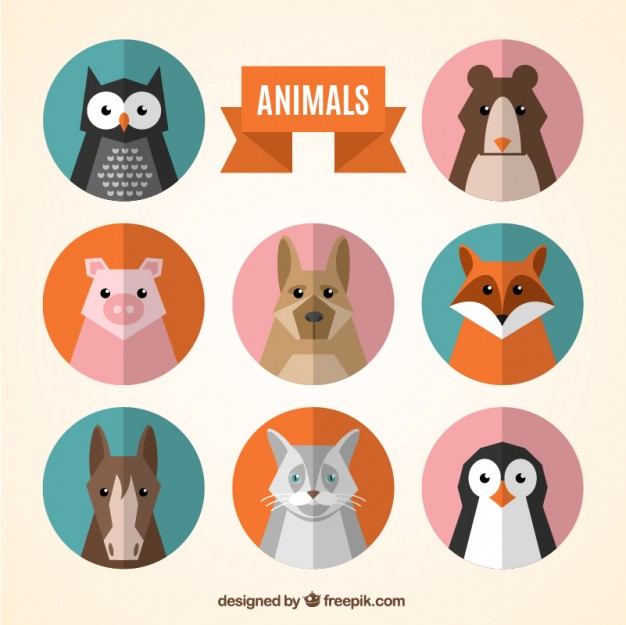

# Assignment 01  

## Avatar icon for Apple

Using your skills to date, illustrate an animal avatar similar to the ones below (draw your own unique graphic). The graphics will be done with Adobe Illustrator in vector format in all 3 major Apple dimensions (3 artboards). Please comply with the college directives [AA34: Copyright](https://www.algonquincollege.com/policies/)

## Icon Requirements

1. The small one:
    - 57 px, iPhone icon 
    - Corner radius 10 px
    - Black and white with few details.

2. The medium one:
    - 144 px, iPad icon
    - Corner radius 24 px
    - In color and with more details.
3. The large one:
    - 512 px, iTunes icon
    - Corner radius 90 px
    - With gradients and much more detail.

The 3 sizes are the same animal with different levels of details.

Each student will upload their design as Ai file or a screen capture with layer view to receive [2 peer reviews](https://brightspace.algonquincollege.com/d2l/le/187946/discussions/List) on Brighspace Discussion to help mark the design. All avatars are copyright via the designer, not to be re-used.

## Submission

::: warning

**Due (Apple Avatar Icons) Sunday October 18 by 11pm**

**Due (Peer Review) Sunday Nov 1 by 11pm**

This (Peer Review) is the last possible day to submit **ANY** work.

:::

- Submit everything in one .ai file.
- File name: firstnameLastname-AppleAvatarIcons.ai
- Open BS LMS and go to the `Activities > Assignments` page.
- Go to the `Avatar icon for Apple` assignment.
- Upolad your Ai file on the assignment page and click the submit button.
- Revew the Assessment Rubric on BS LMS to know how your work will be evaluated.
- See an example: [https://goo.gl/hrU3bS](https://goo.gl/hrU3bS)

Inspiration for the animal avatar:

