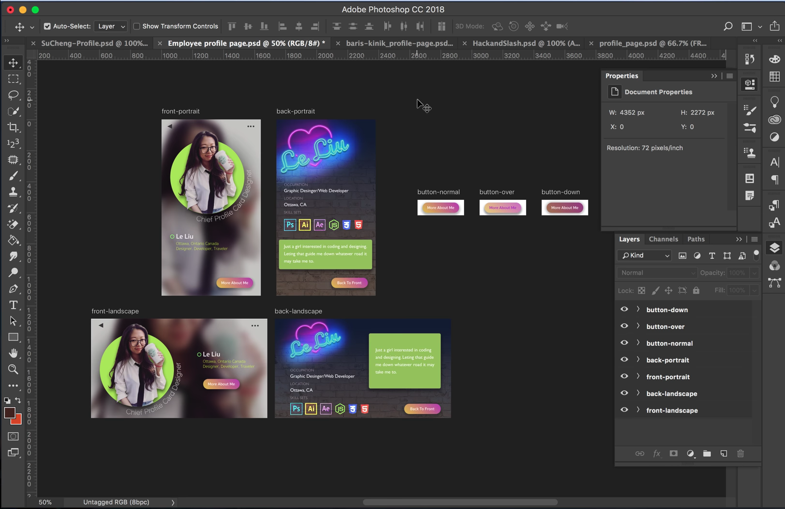

# Assignment 02  

## Employee Profile Page

Create a mobile personal profile page, be creative, including name (nicknames), skills, hobbies, interest, contact, shoe size and special abilities etc. **Note:** Your profile card could be treated as a game profile card, digital business card, or a card-style personal profile. 

## Profile Page Requirements

- You must have a button designed in the layout.
    - Include 3 button state: normal, over and down. 
    - This button is to switch the card from front to back. 
- The layout must be coherent/legible.
- Hand in as .psd file (1 file with multiple Artboards).
- Dimension: iPhone X/XS 1125px X 2436px @72ppi (portrait or landscape).
     - Bonus marks for making a design for portrait and landscape.
- Ensure to name and organize your artboards and LAYERS so I can mark consciously.
- Required features
    - silhouette
    - blending options
    - gradients
    - filter
    - adjustments
    - shadow and highlights

## Submission

::: warning

**Due Sunday November 8 by 11:59pm**

:::

- Submit everything in one _`.psd`_ file.
- Filename: *firstnameLastname-assg02.psd*
- Open BS LMS and go to the `Activities > Assignments` page.
- Go to the `Employee Profile Page` assignment.
- Upolad your Ps file on the assignment page and click the submit button.
- Review the Assessment Rubric on BS LMS to know how your work will be evaluated.
- See an assignment example: 

Inspirations: 
- [eSports Players](https://cdn.dribbble.com/users/894730/screenshots/3941317/dribbble_canvas.png)
- [Soccer Player](https://montreal-mp7static.mlsdigital.net/mp6/Cabrera_Page_EN.jpg)
- [Cyber Robot Game Profile](https://cdn.dribbble.com/users/824097/screenshots/6013675/cyber-robot---game.jpg)