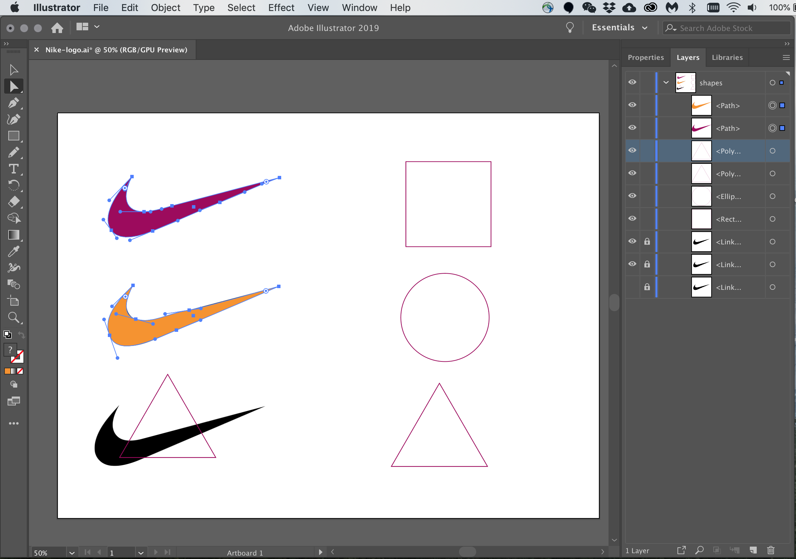

# Hybrid Exercise 1 - Nike recreation

## Description

Recreate the Nike logo in Adobe Illustrator using these 3 shapes: Rectangle/Ellipse/Polygon.

- Each of the resulting logo must be one shape. 
- Challenge: Apply different borders, fills, and styles to the logos.
- Take a screenshot of your Ai workspace to show your logos and layers, and make sure to select all the shapes to show how you achieved the result for submission. (Use `Direct Selection` tool)
- File naming example: *TomSmith-nikelogo.png* [firstnameLastname-nikelogo.png]

*See below for a partially completed Nike Logo Assignment Example

## Submission

::: warning
**Due Sunday September 20 by 11:59pm**
:::

Open BS LMS and go to the `Activities > Assignments` page.

Go to the `Nike recreation` assignment.

Upolad your screenshot on the assignment page in BS LMS and click the submit button.
