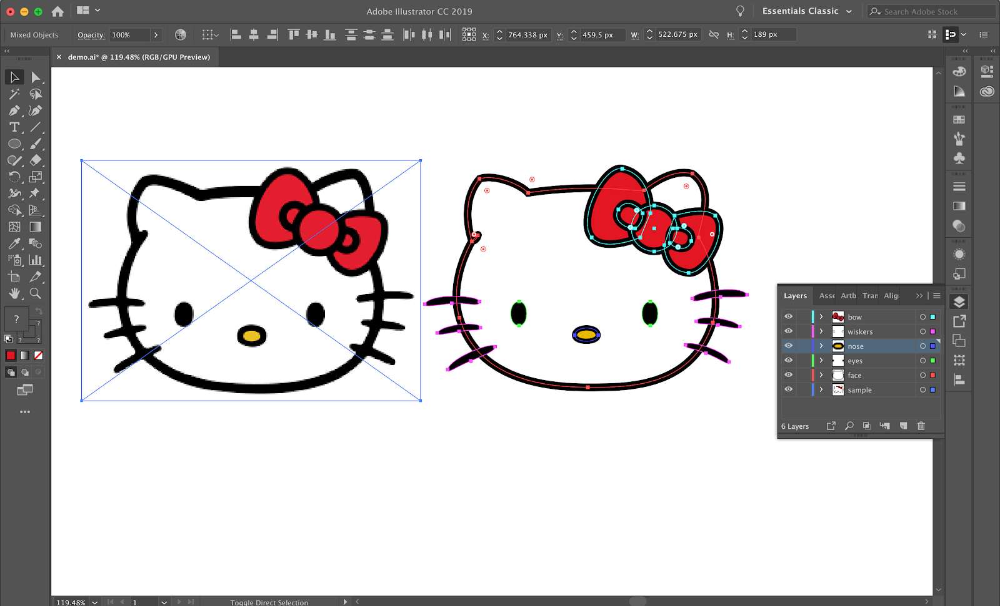

# Hybrid Exercise 3 - Character vectorization

## Description

Vectorize your favorite character in Adobe Illustrator.

- Select one of your favorite characters. 
- Vectorize it!
- Keep the original character beside your newly drawn/coloured character for submission.
- When the work is completed, screen capture the work of your Ai workspace including the layer view and select the shapes in your version.
- File naming example: *TomSmith-vectorization.png* [firstnameLastname-vectorization.png]

Partially completed Character Vectorization Assignment Example: 

[See an in-clas exercise result](https://drive.google.com/file/d/1eLbVOrUTxzpRPuPwh8J_uJVP2LEiMIg3/view?usp=sharing)

## Submission

::: warning
**Due Sunday October 4 by 11:59pm**
:::

Open BS LMS and go to the `Activities > Assignments` page.

Go to the `Character vectorization` assignment.

Upolad your screenshot on the assignment page in BS LMS and click the submit button.