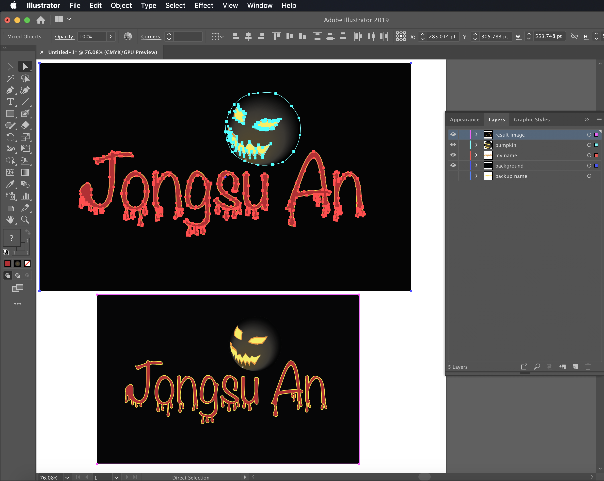

# Hybrid Exercise 4 - In-class Exercise: Typography

## Description

Based on Week 05's lesson, each student is to design their name *uniquely* in Illustrator.

- The fonts must be outlined with a fill and stroke, plus effects.
- When the work is completed, take a screen capture of your Ai workspace including the layer view and selecting the shapes you created for submission at the end of the class.
- File naming example: TomSmith-010-typography.png [fullname-section#-typography.png]

## Submission

::: warning
**Due Thursday October 8 by 12pm for Group One**
:::

::: warning
**Due Wednesday SepteOctober 7 by 10am for Group two**
:::

Open BS LMS and go to the `Activities > Assignments` page.

Go to the `Character vectorization` assignment.

Upolad your screenshot on the assignment page in BS LMS and click the submit button.