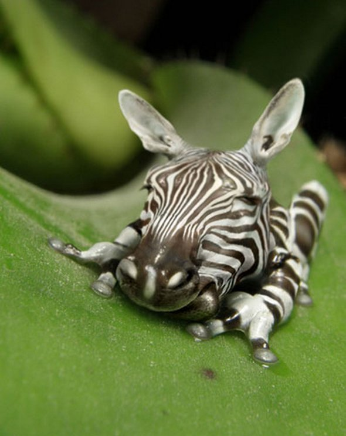
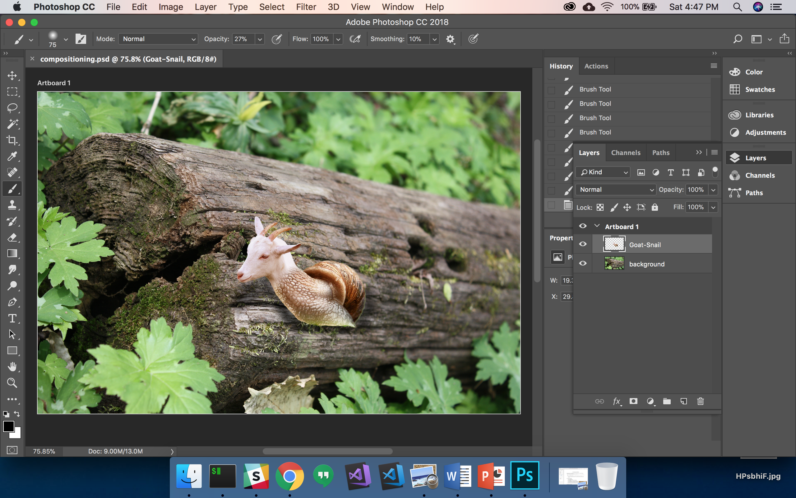

# Hybrid Exercise 6 - Compositing an image

## Description

Composite(blend) your animal on a *UNIQUE* background in Adobe Photoshop.

- All visual elements must have a common look and feel. 
- When the work is completed, screen capture your artwork in Ps workspace including the layer view.
- Upload your screen capture file for submission.
- File naming example: *TomSmith-010-composite.png* [fullname-section#-composite.png]

## Submission

::: warning
**Due Sunday October 25 by 11pm**
:::

Open BS LMS and go to the `Activities > Assignments` page.

Go to the `Compositing an image` assignment.

Upolad your screenshot on the assignment page in BS LMS and click the submit button.