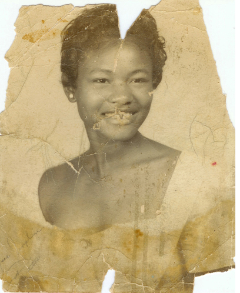

# Hybrid Exercise 7 - In-class Exercise: Clean me up

## Description

Based on Week 10's lesson, you are to restore one of the photos provided below in Adobe Photoshop.

 

- Download one of the photos
- Restore the photo with the tools you have learned in Ps.
- When the work is completed, screen capture your artwork in Ps workspace including the layer view.
- Upload your screen capture file for submission.
- File naming example: *TomSmith-010-restoration.png* [fullname-section#-restoration.png]

## Submission

::: warning
**Due in class (Group one) Thursday November 5 by 12pm**
:::

::: warning
**Due in class (Group two) Wednesday November 4 by 10am**
:::

Open BS LMS and go to the `Activities > Assignments` page.

Go to the `Clean me up` assignment.

Upolad your screenshot on the assignment page in BS LMS and click the submit button.