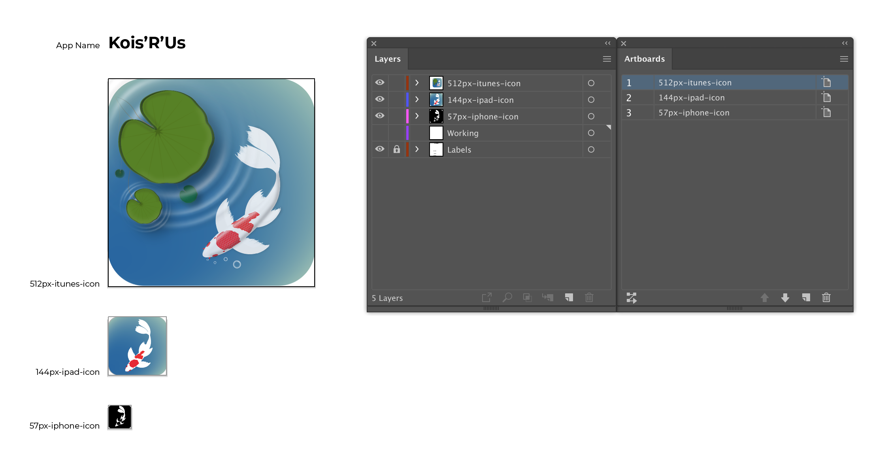
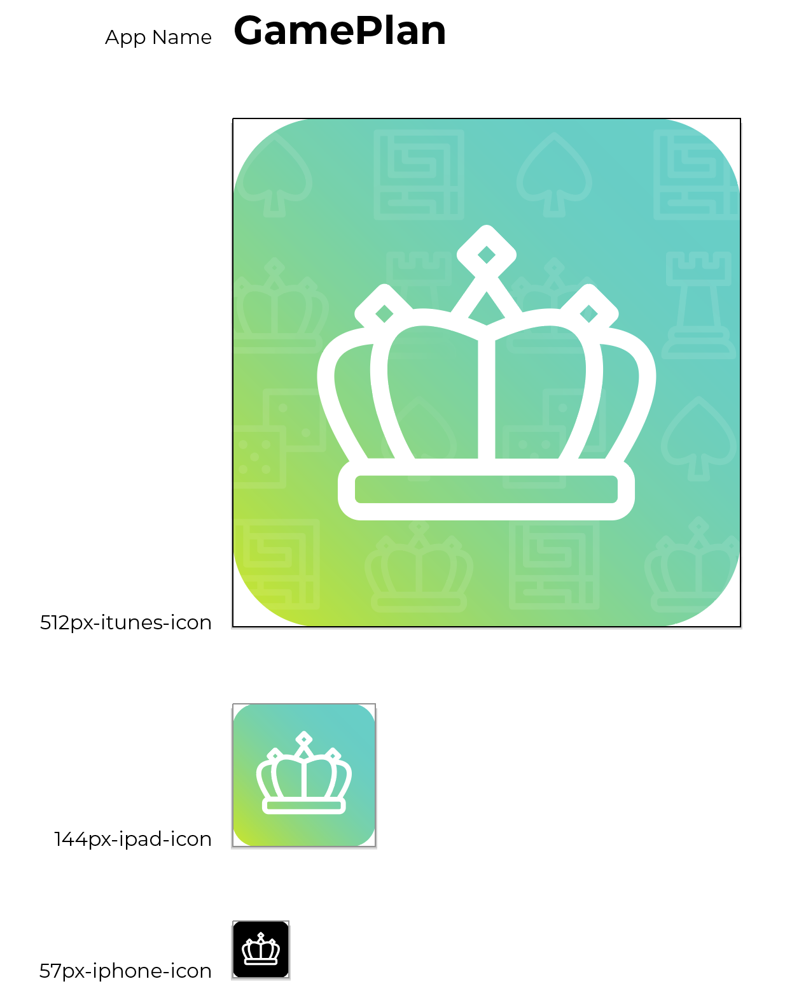
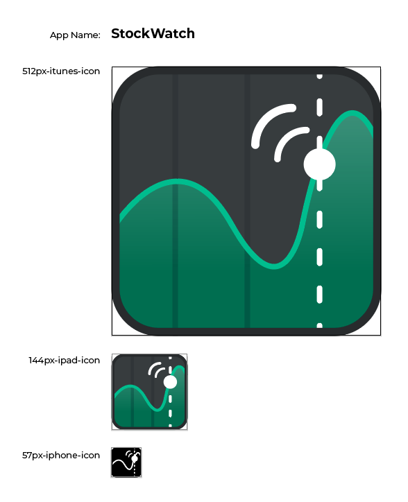
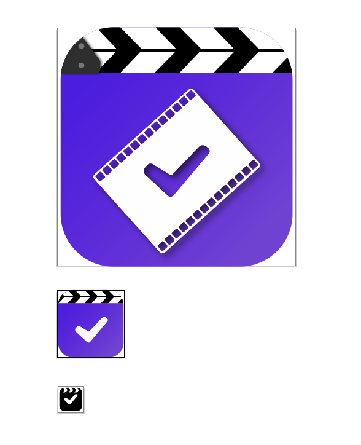
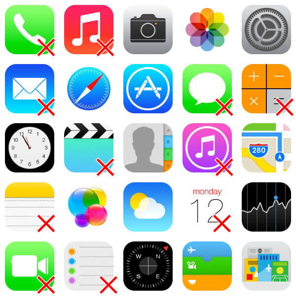
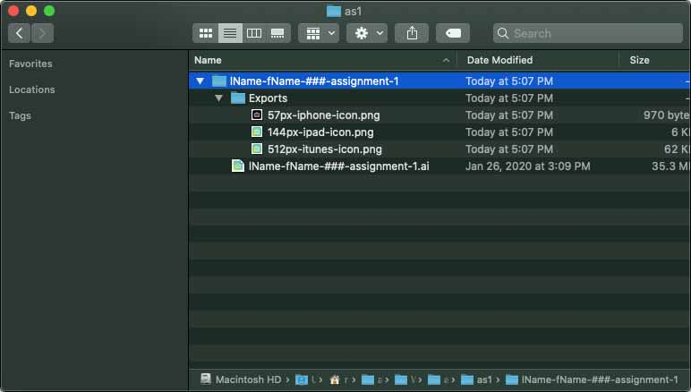

# Assignment 1 - App Icon

## Introduction

This is the final assignment for the Illustrator portion of the course and will provide you an opportunity to show all of the skills you have learned so far. You will be creating a set of App Icons for an imaginary app of your creation.

## Instructions

You will create one Illustrator file containing three different versions of the same app icon.

- iPhone – 57x57 px, corner radius 10 px
  - Black and white, minimal detail
- iPad – 144x144 px, corner radius 24 px
  - Full colour, medium detail
- iTunes – 512x512 px, corner radius 90 px
  - Full colour, high level of detail

All three versions should feel unified in their design and belong in a set together. Each icon should be created on its own layer and artboard properly named as per the example below. Don't forget to also include the name of your app for reference.

### Export Your Icons

Once your icons are complete, use the `Export for Screens` dialogue to export each of icon as a **PNG** at the correct size listed above. Assuming you have sized your artboards properly to the above listed sizes, a simply 1x scale export should work perfectly. Name each export appropriately and place the export in an **Exports** folder. Review the proper folder structure in the [Submission Requirements](#submission-requirements) below for exact details.

### Examples

### Level of Detail

Your app icon should contain enough detail at the largest size to clearly show the skills you have learned this semester. However, do not go overboard with the amount of detail in your design. The level of detail should feel appropriate to the theme of your app. Take some time to look at the app icons on your devices and do some online research to get some direction for creating a modern, well designed icon.

Below are some of the basic icons from iOS 7. I have marked the icons that I would consider **not** detailed enough for this assignment with a red X.

## Submission Requirements

To successfully complete this assignment you must submit a **lName-fName-section#-assignment-1.zip** folder to Brightspace with the following folder structure:

- lName-fName-section#-assignment-1
  - **Exports** folder
    - 57px-iphone-icon
    - 144px-ipad-icon
    - 512px-itunes-icon
  - lName-fName-section#-assignment-1.ai

## Feedback Discussion

As part of this assignment, you must submit the first draft of your icon concept, design, and color scheme to the App Icon Feedback discussion to receive feedback from your peers and professor. You must also provide feedback to a minimum of two other students on their discussion posts.

This must be completed by the start of class of **Week 9** to allow time to implement the feedback received.

## Grading

  <table class="rubric">
    <thead>
      <tr>
        <th scope="col">Criteria</th>
        <th scope="col">0 points</th>
        <th scope="col">1 point</th>
        <th scope="col">2 Points</th>
        <th scope="col">3 Points</th>
        <th scope="col">Score</th>
      </tr>
    </thead>
    <tbody>
      <tr>
        <th scope="row">Use of Shapes</th>
        <td>Did not demonstrate use of shapes and/or pen tool to create icon designs.</td>
        <td>Demonstrated minimal use of shapes and/or pen tool to create icon designs.</td>
        <td>Demonstrated basic use of shapes and/or pen tool to create icon designs.</td>
        <td>Demonstrated effective use of shapes and/or pen tool to create icon designs.</td>
        <td>/ 3</td>
      </tr>
      <tr>
        <th scope="row">Use of Colour</th>
        <td>Colour requirements were not followed.</td>
        <td>Colours and/or gradients were used minimally without following an effective colour pallet.</td>
        <td>Demonstrated basic use of colours and/or gradients fitting within an effective colour pallet and followed colour requirements.</td>
        <td>Demonstrated an effective use of colours and/or gradients fitting within an effective colour pallet and followed colour requirements.</td>
        <td>/ 3</td>
      </tr>
      <tr>
        <th scope="row">Visual Design</th>
        <td>Design does not reflect application theme and/or is unprofessional.</td>
        <td>Icon features a design that minimally reflects the application theme to a low professional standard.</td>
        <td>Icon features a design that appropriately reflects the application theme to an acceptable professional standard.</td>
        <td>Icon features a strong design that reflects the application theme to a high professional standard.</td>
        <td>/ 3</td>
      </tr>
      <tr>
        <th scope="row">Work revisions based on peer feedback</th>
        <td>Did not make updates based on peer reviews</td>
        <td>Reviewed peer feedback and made few updates</td>
        <td>Reviewed peer feedback and made some updates based on feedback</td>
        <td>Reviewed peer feedback and made clear improvements based on feedback</td>
        <td>/ 3</td>
      </tr>
      <tr>
        <th scope="row">Fill organization, naming, and submission.</th>
        <td>No layers, artboards, or files are properly labeled and was submitted incorrectly with many errors.</td>
        <td>Some layers, artboards, and files are properly labeled and submitted properly with many errors.</td>
        <td>Most layers, artboards, and files are properly labeled and submitted properly with few errors.</td>
        <td>All layers, artboards, and files are properly labeled and submitted properly with no errors.</td>
        <td>/ 3</td>
      </tr>
    </tbody>
    <tfoot>
      <tr>
        <th scope="row" colspan="5"><strong>Total</strong></th>
        <td><strong>/ 15</strong></td>
      </tr>
    </tfoot>
  </table>

## Submission

::: warning Due Date

Section 010: Thursday, November 3, 2021 @ 5pm

Section 020: Wednesday, November 2, 2021 @ 7pm

Submit on Brightspace under Assignments > Assignment 1 - App Icon
:::
