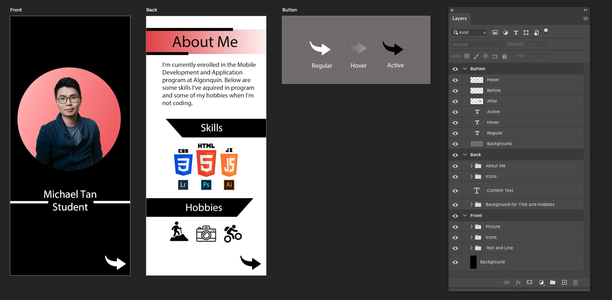
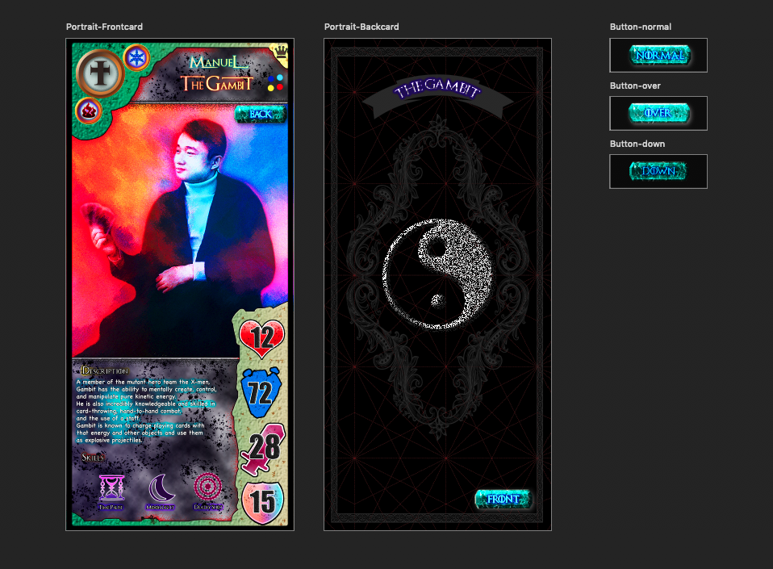

# Assignment 2 - Profile Card

## Introduction

For this assignment we will use the Photoshop skills learned this semester to create a double sided digital profile card. The theme and content of the card are up to you. You can make a business card, a sports card, trading card game card, or any other theme that works within the requirements below.

When planning the design and content of your card, imagine that it will be displayed on a website and will be interactive. Your card must feature a button or interactive element used to flip it over to view the other side.

### Past Student Examples

## Instructions

Create a digital profile card in Photoshop. Your digital profile card will have a design for **both the front and the back** of the card, created in two side by side artboards within the same Photoshop file. Your card design must include a button or interactive element used to flip it over and view the other side. The button should be in the **same location on both the front and back** to ensure ease of usability.

### File Set Up

#### Artboards

Your file should contain two artboards using the **iPhone X/XS dimensions of 1125px X 2436px @72ppi** (portrait or landscape, your choice) for the front and back of the card

Your file should have a third artboard demonstrating the interactivity of your button. The interactivity should be demonstrated by showing your button in 3 states: **regular, hovered, and active** (on click). The size of this artboard is dependent on the size and design of your button. Your button should be displayed on this artboard at the same size as on the card.

#### Layers

Your layers should be properly labeled and well organized. Grouping and labelling your layers should be used to simplify and organize your layers. Any extra unused or hidden layers should be deleted to ensure your file is organized and to keep the file size down.

## Required Elements

Your digital profile card must include the following:

- Minimum one (1) use of Masking
- Minimum one (1) Adjustment Layer
- Minimum one (1) Layer Effect
- Minimum one (1) placed raster image\*
- Minimum one (1) placed vector graphic\*
- Minimum one (1) vector shape created in Photoshop
- Minimum one (1) point text box (heading text)
- Minimum one (1) area text box (paragraph text)
- Button used to flip card over (located in the same spot on both sides of card)

\*All placed raster images and vector graphics must be properly sourced from stock photo websites, art you have been given permission to use, or original artwork you have created. Exceptions include social media icons and brand logos when used in the same manner as in the example to list off relevant skills or experience. If you are unsure if you should be using any image or graphic, do not hesitate to contact me and forward the image and where you sourced it from and I will let you know.

## Submission

Submit your compressed **lName-fName-section#-profile** folder to Brightspace. Your folder should include:

- lName-fName-section#-profile.psd
- Links folder containing original images
- Support folder containing any support files (Illustrator, text files, etc.)
- Exports folder containing:
  - lName-fName-section#-profile-front.jpg - 72dpi, 1125px OR 2436px wide (depending on if you choose to make a landscape or portrait card)
  - lName-fName-section#-profile-back.jpg - 72dpi, 1125px OR 2436px wide (depending on if you choose to make a landscape or portrait card)

## Grading

  <table class="rubric">
    <thead>
      <tr>
        <th scope="col">Criteria</th>
        <th scope="col">0 points</th>
        <th scope="col">1 point</th>
        <th scope="col">2 Points</th>
        <th scope="col">3 Points</th>
        <th scope="col">Score</th>
      </tr>
    </thead>
    <tbody>
      <tr>
        <th scope="row">Use of Masking, Adjustment Layers, and Layer Effects</th>
        <td>Did not demonstrate use of Masking, Adjustment Layers, and Layer Effects.</td>
        <td>Demonstrated minimal use of Masking, Adjustment Layers, and Layer Effects or used in a way that distracted or took away from the design.</td>
        <td>Demonstrated basic use of Masking, Adjustment Layers, and Layer Effects.</td>
        <td>Demonstrated effective use of Masking, Adjustment Layers, and Layer Effects</td>
        <td>/ 3</td>
      </tr>
      <tr>
        <th scope="row">Use of Placed Raster Images, Placed Vector Graphic, Photoshop Vector Graphics, and Type</th>
        <td>Placed Raster Images, Placed Vector Graphic, Photoshop Vector Graphics, and Type were not used as instructed in the assignment instructions.</td>
        <td>Placed Raster Images, Placed Vector Graphic, Photoshop Vector Graphics, and Type were used minimally without following the assignment instructions.</td>
        <td>Demonstrated basic use of Placed Raster Images, Placed Vector Graphic, Photoshop Vector Graphics, and Type.</td>
        <td>Demonstrated an effective use of Placed Raster Images, Placed Vector Graphic, Photoshop Vector Graphics, and Type</td>
        <td>/ 3</td>
      </tr>
      <tr>
        <th scope="row">Visual Design</th>
        <td>
Design does not reflect card theme and/or presents the card information in unprofessional manner.

        
Card design fulfills few required elements outlined in assignment instructions.
</td>
        <td>
Card features a design that minimally reflects the card theme and presents the card information to a low professional standard.

        
Card design fulfills some required elements outlined in assignment instructions.
</td>
        <td>
Card features a design that appropriately reflects the card theme and presents the card information to an acceptable professional standard.

        
Card design fulfills most required elements outlined in assignment instructions.
</td>
        <td>
Card features a strong design that reflects the card theme and effectively presents the card information to a high professional standard.

        
Card design fulfills all required elements outlined in assignment instructions.
</td>
        <td>/ 3</td>
      </tr>
      <tr>
        <th scope="row">Work revisions based on peer feedback</th>
        <td>Did not make updates based on peer reviews</td>
        <td>Reviewed peer feedback and made few updates</td>
        <td>Reviewed peer feedback and made some updates based on feedback</td>
        <td>Reviewed peer feedback and made clear improvements based on feedback</td>
        <td>/ 3</td>
      </tr>
      <tr>
        <th scope="row">Fill organization, naming, and submission.</th>
        <td>No layers, artboards, or files are properly labeled and was submitted incorrectly with many errors.</td>
        <td>Some layers, artboards, and files are properly labeled and submitted properly with many errors.</td>
        <td>Most layers, artboards, and files are properly labeled and submitted properly with few errors.</td>
        <td>All layers, artboards, and files are properly labeled and submitted properly with no errors.</td>
        <td>/ 3</td>
      </tr>
    </tbody>
    <tfoot>
      <tr>
        <th scope="row" colspan="5"><strong>Total</strong></th>
        <td><strong>/ 15</strong></td>
      </tr>
    </tfoot>
  </table>

## Submission

::: warning Due Date

Section 300: Tuesday, November 16, 2021 @ 7pm

Section 310: Wednesday, November 17, 2021 @ 7pm

Submit on Brightspace under Assignments > Assignment 2 - Profile Card
:::
