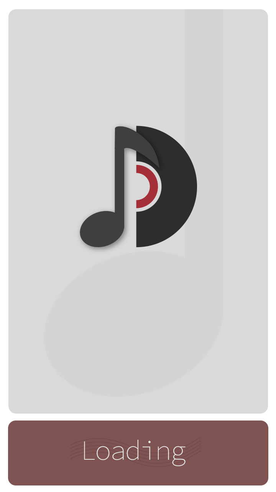
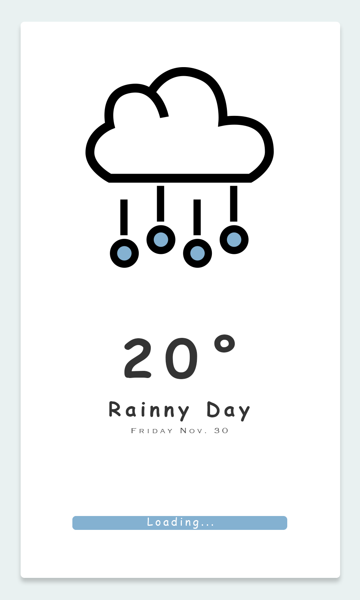
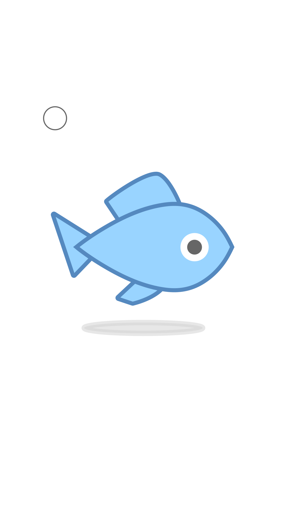

# Final Project - App Branding

## Introduction

In this assignment, you will be applying all of the knowledge gained this semester to create the brand of a mobile application. The assignment is broken down into four parts, each related to a unit in this course.

### Some things to consider when planning your project:

- Don't make your icon overly complex as it will increase the difficulty of the animation.
- When designing your splash screen, keep it simple and focused on the icon.
- Make your animation, eye catching, but not over the top. Keep to one or two simple animations.
- Each part of the assignment is for the same app! Make sure each piece you design fits together as a unified whole.
- Keep your prototype simple and focused on a simple task. Don't make it more complicated than necessary!
- Do the assignment in order! Each part is meant to build on each other with the icon design influencing the splash screens, which influence the svg loader and prototype. This will help to plan your designs and keep them unified.

## Part 1: App Icon

You will be creating a new original app icon in **Adobe Illustrator**. Your **lName-fName-section#-app-icon.ai** file should contain **one (1) artboard** that is **512x512px** containing your icon design. Your icon should be **512x512px** with **90px corner radius**. You only need to design one size for this icon. Once you have completed your design, use the **Export for Screens** dialogue to export your icon into the **01-app > exports** folder at the following sizes:

- 57x57px
- 144x144px
- 512x512px

**Note:** This is a new, different icon from the app icon made for the Illustrator App Icon assignment. It must only contain original vector artwork, no sourced images and/or raster images.

## Part 2: App Splash Screens

You will create a splash screen design for your app. This is what appears when your app is first starting up and loading. Your splash screen must include app icon's main symbol (for example, the crown from the GamePlan app icon), however the rest of the design is up to you. The splash screen is an extension of the app's brand created with the icon, so it should feel similar and connected to the icon. Your splash screens may include original and/or properly sourced raster images and artwork, however it is not a requirement.

You will create the splash screen designs in **Adobe Photoshop**. Your **lName-fName-section#-splash-screens.psd** will contain **five (5) artboards** to design the splash screen for multiple screen sizes. The design of your splash screens may change from screen size to screen size, however this is **not** required. Any changes should be made in order to make the design work best for that screen size.

The screen sizes are:

- Pixel 4 - 1440x2960px, 72dpi
- iPhone X - 1125x2436px, 72dpi
- iPad Pro - 1668x2226px, 72dpi
- Laptop - 1366x768px, 72dpi
- Web Large - 1920x1080, 72dpi

Your completed splash screens will be exported using the **Export As...** dialogue into the **02-splash-screens > exports** folder.

#### Student Examples

  

  

  

  

## Part 3: Animated SVG Loader

You will create an animated SVG Loader based on the icon and splash screens you have previously created. Your SVG Loader will feature a looping animation that is 1 - 5 seconds in length. Your SVG Loader will be coded within an `index.html` file and styled in a linked `main.css` file (make sure to review the proper folder set-up). You only need to include the SVG icon and animation in your coded files. No other coding or styling is required\*. However, if you wish to challenge yourself and code your entire splash page, you are welcome to do so\*\*.

\*If your icon is white, please add a background colour in your CSS to make it possible to see your icon animation.

\*\*Fully coding your splash page will neither positively nor negatively affect your mark.

#### Student Examples

  

  

  

  

## Part 4: UI Prototype

Create an Adobe Xd prototype that contains **three (3) screens** of your application. You may design the prototype for any Android or iOS device size that you wish and you may use the Material Design or the Human Interface Design UI kits to simplify the design process.

Screens that must be designed in Xd:

- Splash Screen
- Home Screen
- One other page that features a key task of your app (for example: if you create a messaging app, show the screen that has a message thread between users)

Your prototype should be set up correctly so that it can be previewed and the user can navigate between the pages with proper use of the prototype panel. You should have the Splash Screen set as the start of the flow and you should set up an automatic transition from the Splash Screen to the Home Screen that does not require any interaction to trigger.

For this part, you must submit both your **lName-fName-section#-ui-prototype.xd** file and the shareable link in a `prototype-link.txt` file.

#### Student Examples

<strong class="text-upper">Please Note:</strong> the requirements have changed slightly from when these examples were submitted. Make sure to properly review the requirements above.

- [Example 1](https://xd.adobe.com/view/606c51a5-ab33-4413-8ba5-08196f9ee742-353f/) (missing 3rd screen)
- [Example 2](https://xd.adobe.com/view/bcd341fd-5fb4-46e2-a769-16bbfbe40023-e980/) (includes more screens than required)

## File Set Up

The final submission contains a number of deliverables so it is incredibly important to keep your files organized. Your submitted lName-fName-section#-app-branding.zip file should contain the following file structure:

- 01-app-icon
  - lName-fName-section#-app-icon.ai
  - exports
    - appName-icon-57.png
    - appName-icon-144.png
    - appName-icon-512.png
- 02-splash-screens
  - lName-fName-section#-splash-screens.psd
  - exports
    - appName-pixel-1440x2960.jpg
    - appName-iphone-1125x2436.jpg
    - appName-ipad-1668x2226.jpg
    - appName-laptop-1366x768.jpg
    - appName-web-large-1920x1080.jpg
- 03-svg-loader
  - css
    - main.css
  - index.html
- 04-ui-prototype
  - lName-fName-section#-ui-prototype.xd
  - prototype-link.txt
- support
  - This folder will contain any supporting items and assets such as sourced images, drafts, pre-processed SVGs, etc.

**Note:** Proper file structure will be reflected in your final grade.

## Feedback Discussion

As part of this assignment, you must submit the first draft of your assignment to the App Branding Feedback discussion to receive feedback from your peers and professor. You must also provide feedback to a minimum of two other students on their discussion posts.

This must be completed by the start of class of **Week 14** to allow time to implement the feedback received.

## Grading

  <table class="rubric">
    <thead>
      <tr>
        <th scope="col">Criteria</th>
        <th scope="col">0 points</th>
        <th scope="col">1 point</th>
        <th scope="col">2 Points</th>
        <th scope="col">3 Points</th>
        <th scope="col">Score</th>
      </tr>
    </thead>
    <tbody>
      <tr>
        <th scope="row">Part 1: App Icon</th>
        <td>
          
App Icon is designed to an unacceptable standard and/or meets little to none of the design specs.

          
Student demonstrates minimal knowledge of Adobe Illustrator.

        </td>
        <td>
          
App Icon is designed to a low standard and meets few of the design specs.

          
Student demonstrates basic knowledge of Adobe Illustrator.

        </td>
        <td>
          
App Icon is designed to an acceptable standard and meets most of the design specs.

          
Student demonstrates acceptable knowledge of Adobe Illustrator.

        </td>
        <td>
          
App Icon is designed to a high professional standard and meets all of the design specs.

          
Student demonstrates skilled knowledge of Adobe Illustrator.

        </td>
        <td>/ 3</td>
      </tr>
      <tr>
        <th scope="row">Part 2: Splash Screens</th>
        <td>
          
Splash Screens are designed to an unacceptable professional standard and/or meets little to none of the design specs.

          
Student demonstrates minimal knowledge of Adobe Photoshop.

        </td>
        <td>
          
Splash Screens are designed to a low professional standard and meets few of the design specs.

          
Student demonstrates basic knowledge of Adobe Photoshop.

        </td>
        <td>
          
Splash Screens are designed to an acceptable professional standard and meets most of the design specs.

          
Student demonstrates acceptable knowledge of Adobe Photoshop.

        </td>
        <td>
          
Splash Screens are designed to a high professional standard and meets all of the design specs.

          
Student demonstrates skilled knowledge of Adobe Photoshop.

        </td>
        <td>/ 3</td>
      </tr>
      <tr>
        <th scope="row">Part 3: SVG Loader</th>
        <td>
          
SVG Loader design is not animated.

          
SVG code is improperly written, organized, and with many bugs or is incomplete.

        </td>
        <td>
          
SVG Loader design and animation is of low quality.

          
SVG code is poorly written, organized, and with many bugs.

        </td>
        <td>
          
SVG Loader design and animation is of good quality.

          
SVG code is properly written, organized, and with few of bugs.

        </td>
        <td>
          
SVG Loader design and animation is of high quality.

          
SVG code is well written, organized, and free of bugs.

        </td>
        <td>/ 3</td>
      </tr>
      <tr>
        <th scope="row">Part 4: UI Prototype</th>
        <td>
          
UI Prototype is designed to an unacceptable professional standard, meets little to none of the design specs, and/or is not interactive .

          
Student demonstrates minimal knowledge of Adobe Xd.

        </td>
        <td>
          
UI Prototype is designed to a low professional standard, meets few of the design specs and is not interactive.

          
Student demonstrates basic knowledge of Adobe Xd.

        </td>
        <td>
          
UI Prototype is designed to an acceptable professional standard, meets most of the design specs, and is interactive.

          
Student demonstrates acceptable knowledge of Adobe Xd.

        </td>
        <td>
          
UI Prototype is designed to a high professional standard, meets all of the design specs and is interactive.

          
Student demonstrates skilled knowledge of Adobe Xd.

        </td>
        <td>/ 3</td>
      </tr>
      <tr>
        <th scope="row">Work Revisions and File Organization</th>
        <td>
          
Did not make updates based on peer and professor reviews.

          
No layers, artboards, or files are properly labeled and was submitted incorrectly with many errors.
          
          
No Icon and Splash Screen sizes were exported and organized properly.

        </td>
        <td>
          
Reviewed peer and professor feedback and made few updates.

          
Some layers, artboards, and files are properly labeled and submitted properly with many errors.
          
          
Few Icon and Splash Screen sizes were exported and organized properly.

        </td>
        <td>
          
Reviewed peer and professor feedback and made some updates based on feedback.

          
Most layers, artboards, and files are properly labeled and submitted properly with few errors.
          
          
Most Icon and Splash Screen sizes were exported and organized properly.

        </td>
        <td>
          
Reviewed peer and professor feedback and made clear improvements based on feedback.

          
All layers, artboards, and files are properly labeled and submitted properly with no errors.
          
          
All Icon and Splash Screen sizes were exported and organized properly.

        </td>
        <td>/ 3</td>
      </tr>
    </tbody>
    <tfoot>
      <tr>
        <th scope="row" colspan="5"><strong>Total</strong></th>
        <td><strong>/ 15</strong></td>
      </tr>
    </tfoot>
  </table>

## Submission

::: warning Due Date

Section 300: Friday, December 17, 2021 @ 11:59pm

Section 310: Friday, December 17, 2021 @ 11:59pm

Submit on Brightspace under Assignments > Assignment 3 - App Branding
:::
