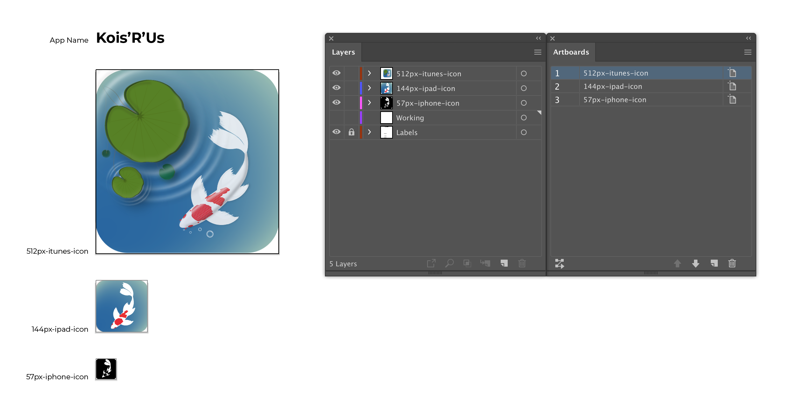

# Midterm - App Icon

## Introduction

Welcome to the final assignment of the Illustrator portion of this course. This project offers you an exciting opportunity to showcase the skills you have acquired so far by creating a set of innovative and visually captivating App Icons for an imaginary app of your own invention.

<ClientOnly>
  <Countdown date="2023-09-25">

## Progress Check-ins

| Week   | Expectations                     |
| ------ | -------------------------------- |
| Week 4 | (Introduction)                   |
| Week 5 | Illustrator File Setup Steps 1-3 |
| Week 6 | Design is 50% complete           |
| Week 7 | Posted for peer-feedback         |

## Guidelines

In this assignment, you will design three versions of the same app icon, each optimized for different devices:

- **iPhone – 57x57 px, corner radius 10 px**

  - **Design:** Create a minimalist black and white icon with a focus on simplicity and clarity.

- **iPad – 144x144 px, corner radius 24 px**

  - **Design:** Craft a vibrant, full-color icon with medium detail to captivate the audience's attention.

- **iTunes – 512x512 px, corner radius 90 px**

  - **Design:** Create a high-fidelity icon with intricate details to convey the full potential of your app.

Ensure that all three versions share a cohesive design language, forming a unified set of app icons.

## Instructions

1. **Begin by Crafting Your Illustrator File:**

   - Create a new Illustrator file, and thoughtfully name it as lName-fName-Midterm-AppIcon.

2. **Artboard and Layer Creation:**

   - Within your Illustrator file, establish three artboards following the provided guidelines. Create dedicated layers for each artboard, ensuring a clear organization. Remember to name your artboards and layers as follows:
     - Artboard/Layer: iPhone_57x57
     - Artboard/Layer: iPad_144x144
     - Artboard/Layer: iTunes_512x512

3. **Artboard Background Setup:**

   - Set up the background for each icon with the appropriate corner radii as specified.

4. **Bringing Your Icons to Life:**

   - Utilize the range of tools available, including shapes and the precise pen tool, to breathe life into your icon designs.

5. **Colors and Gradients Mastery:**

   - Exhibit mastery in the use of colors and gradients. Adhere to a carefully chosen color palette that harmonizes with your app's theme.

6. **Balancing Skill and Purpose:**

   - Strive for a harmonious blend between showcasing your design prowess and maintaining the essence of simplicity aligned with the app's intended purpose.

7. **Originality and Reference:**

   - Important: Refrain from incorporating elements traced from others' work. If you require reference, consider using a photograph of the real subject, as noted. This ensures the authenticity and originality of your creations.

## Examples

## Feedback Discussion

As part of this assignment, you must submit the first draft of your icon concept, design, and color scheme to the App Icon Feedback discussion to receive feedback from your peers and professor in Brightspace. You must also provide feedback to a minimum of two other students on their discussion posts.

1. **Discussion Post:** In your post start by share your initial concept for the app icon, explaining the ideas and inspiration behind your design. Be sure to mention the animal you have chosen for your app icon.

2. **Provide Feedback:** You must comment on at least two (2) other students postings. Provide feedback for them to improve their design.

3. **Feedback Implementation:** Review the feedback you received from your peers and professor improve your app icon designs.

<Badge type="error" text="This must be completed by the start of class of Week 7 to allow time to implement the feedback received." />

## Grading

| Category          | Criteria                                                                                                                                                                                                  | Weight |
| ----------------- | --------------------------------------------------------------------------------------------------------------------------------------------------------------------------------------------------------- | ------ |
| Formatting        | - Did you properly created the required artboards with correct sizes and naming?   - Did you ensured each icon has the correct corner radius?   - Did you ensured each icon has a solid background? | 3      |
| Peer-feedback     | - Did you provide constructive feedback on the work of at least 2 other students?   - Did you post your icons for review?   - Was the work you posted at least 75% complete?                        | 3      |
| iPhone Icon       | - Did you created a minimalist black and white icon with a focus on simplicity and clarity?                                                                                                               | 3      |
| iPad Icon         | - Did you created a vibrant, full-color icon with medium detail to captivate the audience's attention?                                                                                                    | 3      |
| iTunes Icon       | - Did you created a high-fidelity icon with intricate details to convey the full potential of your app?                                                                                                   | 3      |
| Overview          | - Did you ensure that all three versions share a cohesive design language, forming a unified set of app icons?                                                                                            | 3      |
| File Organization | - Submitted a well-structured Illustrator file with organized layers and proper labeling.   - Was your Submission folder well-organized?                                                               | 1      |
| Image Export      | - Did you properly export your icons following the guidelines listed above?                                                                                                                               | 1      |
| **Total**         |                                                                                                                                                                                                           | **20** |

## Submission

1. Upon completing your icon designs, use the "Export for Screens" feature to export each icon as a PNG file at the correct sizes specified above.

2. Organize your exports within an "Exports" folder as follows:

- Exports Folder:
  - iPhone_57x57.png
  - iPad_144x144.png
  - iTunes_512x512.png

3. Prepare a compressed folder named "lName-fName-Midterm-AppIcon.zip" for submission on Brightspace.

- Include:
  - Exports Folder
  - lName-fName-Midterm-AppIcon.ai

**Due Dates:**

**Peer Feedback Due:**  
<Badge text="Section 300: Tuesday October 17th @3:00pm" />
<Badge type="error" text="Section 310: Monday October 16th @4:00pm" />

**Final Submission:**  
<Badge text="Section 300: Tuesday October 31st @3:00pm" />
<Badge type="error" text="Section 310: Monday October 30th @4:00pm" />

- Open BS LMS and go to the Activities > Assignments page.
- Go to Midterm — App Icon
- Upload your compressed folder on the assignment page in BS LMS and click the submit button.

  </Countdown>
</ClientOnly>
