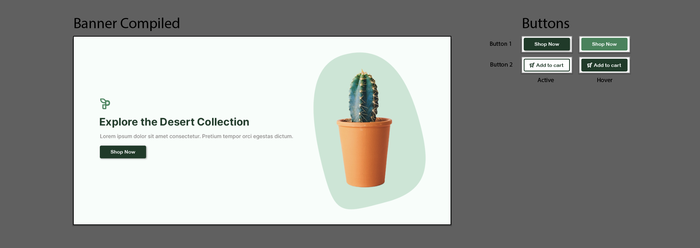

# Midterm - Web Design Assets

::: tip Files
[Download your starter files here.](./assets/midterm-starter-files.zip)

**Folder Structure:**

```

midterm-starter-files/
├── submission-1/
└── submission-2/

```

:::

## Introduction

For your midterm project, you'll craft a comprehensive suite of web design assets, encompassing everything from optimized images to bespoke icons, leveraging the capabilities of both Adobe Photoshop and Illustrator. This project is designed to challenge your design skills and creativity, encouraging you to create visually appealing and functional digital assets for a hypothetical website.

You will utilize Adobe Photoshop for image optimization and manipulation, and Adobe Illustrator for creating vector-based graphics such as icons and logos. The assets you develop, including web banners, UI buttons, icons, animated loaders, and a logo design, should follow a consistent theme and aesthetic to ensure cohesiveness across the web experience.

**Submission 1:**

1. [Web Banners](#web-banners)
2. [UI Button Set](#ui-button-set)

**Submission 2:**

3. [UI Icon Set](#ui-icon-set)
4. [Animated Loader](#animated-loader)
5. [Logo Design](#logo-design)

## Instructions

### Web Banners

For the Web Banner portion of your midterm, you will be creating a series of banners that scale to three different sizes. The challenge is to design your banners in such a way that the main subject remains visible and impactful across all sizes, despite the varying aspect ratios.

Here is an example, you can probably do better! :D


**Instructions**

1. Using the file provided, select an image that aligns with your chosen website theme (e.g., if your theme is gardening, select an image related to gardening).
2. Ensure your chosen image has a clear main subject that can remain the focal point across different banner sizes.
3. Place your image within the provided artboards. Scale and adjust your image to fit nicely within the frames. Use content-aware fill or any other tool we learned in class to fill in gaps within your artboard.
4. Ensure that your edits are non-destructive, allowing for adjustments and changes without permanently altering the original image.
5. Export your banners as .PNGs at their respective sizes at 72ppi, ensuring they are optimized for quick loading times without sacrificing visual quality.

**File organization:**

```

submission-1/
├── web-banner/
│   ├── web-banner.psd
│   └── exports/
│       ├── web-banner-1200x600.png
│       ├── tablet-banner-768x400.png
│       └── mobile-banner-480x200.png

```

### UI Button Set

In this part, you will design a set of UI buttons, each with an active and hover state. Additionally, integrate these buttons into your web banner design for a practical application scenario.



**Instructions:**

1. Design two sets of buttons (e.g., "Read More" and "Subscribe") each with an alternate state (active & hover).
2. Use consistent design elements (colors, fonts, shapes, gradients and effects ) that match your website's theme.
3. Ensure the buttons are visually distinct in both states, using design cues to communicate their functionality.
4. Consider the size of your buttons.
5. Integrate your buttons into the desktop version of your web banner. Place them strategically so they complement the banner's design and encourage user interaction. Feel free to add text to your banner to help complete the look of your banner.
6. Export your compiled web banner and buttons as .PNG

**Resources:**

- [Material Design Buttons](https://m2.material.io/components/buttons)
- [7 Basic Rules for Button Design](https://uxplanet.org/7-basic-rules-for-button-design-63dcdf5676b4)
- [UI/UX tips: A guide to creating buttons](https://makeitclear.com/ux-ui-tips-a-guide-to-creating-buttons/)

**File organization:**

```

submission-2/
├── ui-button-set/
│   ├── ui-button.ai
│   └── exports/
│       ├── web-banner/
│       │   └── compiled-web-banner.png
│       └── buttons/
│           ├── button-1-active.png
│           ├── button-1-hover.png
│           ├── button-2-active.png
│           └── button-2-hover.png
├── ui-icon-set/
├── animated-loader/
└── logo-design/

```

### UI Icon Set

Create a set of 5 custom icons that will be used throughout your website. These should be relevant to your website's theme and designed for clarity and easy recognition. Ensure that your icons feel like a cohesive set.


**Instructions:**

1. Start by created your icons within the 24x24px artboard. Each artboard is labeled with the icon you are to create.
2. Once you have created your 24x24px icons, scale them to 48x48 px. ensure that your font weights and corner radii scale accordingly.
3. Finishing steps:
   - Organize your layers by grouping and labeling.
   - Make sure you save your .ai file.
   - Be sure to hide the **keyline** layers before exporting
   - Export your artboards using `export for Screens` dialogue.

**File organization:**

```

submission-2/
├── ui-button-set/
├── ui-icon-set/
│   ├── ui-icon.ai
│   └── exports/
│       ├── user_24x24.svg
│       ├── settings_24x24.svg
│       ├── notifications_24x24.svg
│       ├── delete_24x24.svg
│       └── home_24x24.svg
├── animated-loader/
└── logo-design/

```

### Animated Loader

Design an animated loader that will be displayed while your website's content is loading. This should be thematic and engaging.

You can do much better :D


**Instructions:**

1. Conceptualize an animation that reflects your website's theme and can entertain or engage users during load times.
2. Utilize Adobe Illustrator to design your loader. Pay attention to optimizing your layers for web export during this process.
3. Export your loader design as SVG using the 'Export as...' option in Illustrator. Make sure your file is properly optimized for web use.
4. Embed the SVG code directly into the index.html file of your project. This step involves copying the exported SVG code into the HTML file.
5. Clean up the SVG code by removing any unnecessary xml tags. Also, ensure that all styles are externalized to a CSS file rather than being inline within the SVG code.
6. Craft a CSS animation sequence that integrates several keyframes, creating a compelling and engaging motion effect.

**File organization:**

```

submission-2/
├── ui-button-set/
├── ui-icon-set/
├── animated-loader/
│   ├── loader.ai
│   ├── index.html
│   └── css/
│       └── main.css
└── logo-design/

```

### Logo Design

Create a logo for your hypothetical website. This logo should encapsulate your website's theme and be memorable to visitors.


**Instructions:**

1. Brainstorm ideas that symbolize your website's theme and purpose.
2. Sketch several logo concepts before selecting the most promising one.
3. Design your logo using Adobe Illustrator, ensuring it is scalable and versatile for different uses.
4. Choose colors and fonts that align with your website's design language.
5. Export your logo as and SVG.

**File organization:**

```

submission-2/
├── ui-button-set/
├── ui-icon-set/
├── animated-loader/
└── logo-design/
    ├── logo.ai
    └── exports/
        └── logo.svg

```

## Submission

**Submission 1:**

<br>

<Badge type="error" text="Due: Tuesday, February 20th @9:00 pm" />

- By the end of today's theory class, you will make your fist submission on Brightspace.
- Compress `submission-1` folder and upload it to Brightspace

**Submission 2:**

<br>

<Badge type="error" text="Due: Sunday, February 25th @11:59 pm" />

- Submit the remaining assets ( UI icon set, animated loader, logo design) through Brightspace.
- Compress `submission-2` folder and upload it to Brightspace

::: tip Submission on Brightspace

- Open BS LMS and go to the `Activities` > `Assignments page`.
- Go to `Midterm: Web Design Assets`
- Upload your compressed folder on the assignment page in BS LMS and click the submit button.

:::
