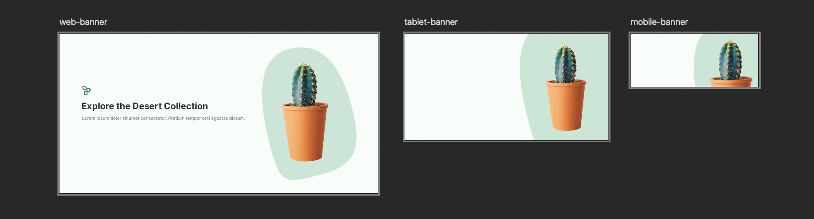
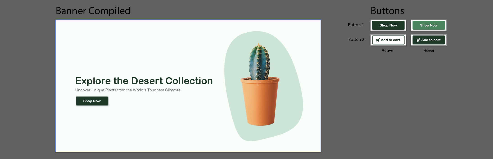
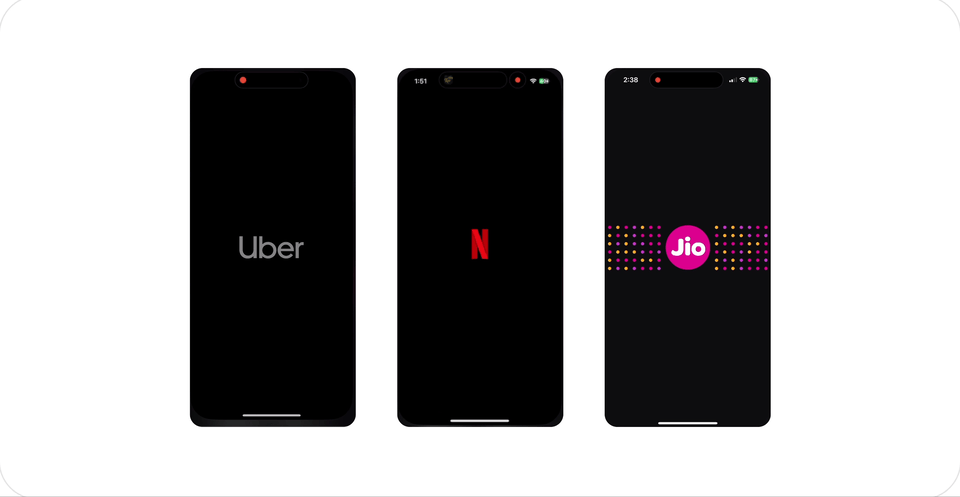

# Midterm Alternate

::: tip Files
[Download your starter files here.](https://drive.google.com/file/d/1mfzRf8yJb1TNgbNntcEFaGkVl_tO8OWv/view?usp=sharing)

**Folder Structure:**

```
midterm-starter-files/
├── submission-1/
└── submission-2/
```

:::

## Introduction

For your alternate midterm project, you'll craft a comprehensive suite of mobile design assets, encompassing everything from optimized images to bespoke icons, leveraging the capabilities of both Adobe Photoshop and Illustrator. This project is designed to challenge your design skills and creativity, encouraging you to create visually appealing and functional digital assets for a hypothetical mobile app.

You will utilize Adobe Photoshop for image optimization and manipulation, and Adobe Illustrator for creating vector-based graphics such as icons and logos. The assets you develop—including promotional banners, UI buttons, icons, an animated splash screen, and a logo design—should follow a consistent theme and aesthetic to ensure cohesiveness across the entire experience.

**Submission 1:**

1. [Promotional Banners](#promotional-banners)
2. [UI Button Set](#ui-button-set)

**Submission 2:**

3. [UI Icon Set](#ui-icon-set)
4. [Animated Splash Screen](#animated-splash-screen)
5. [Logo Design](#logo-design)

::: danger Due Dates

**Submission 1**
<br>
<Badge type="error" text="October 9th @7:00pm / @9:00pm" />

- By the end of today's Lab class, you will make your first submission on Brightspace.
- Compress `submission-1` folder and upload it to Brightspace.

---

**Submission 2**
<br>
<Badge type="error" text="November 3rd @11:59pm" />

- Submit the remaining assets (UI Icon Set, Animated Splash Screen, Logo Design) through Brightspace.
- Compress `submission-2` folder and upload it to Brightspace.

:::

### Promotional Banners

For the Promotional Banners portion of your midterm, you will create a series of banners that scale to three different sizes. The challenge is to design your banners so that the main subject and accompanying text remain visible and impactful across all sizes, despite varying aspect ratios.

Here is an example—you can probably do better! :D  


**Instructions**

1. Using the provided files, select an image that aligns with your chosen app theme (e.g., if your theme is gardening, select an image related to gardening).
2. Ensure your chosen image has a clear main subject that can remain the focal point across different banner sizes.
3. Add a short and impactful message or slogan to your banners. Make sure the text is legible and maintains proper hierarchy, even when scaled down to smaller sizes.
4. Consider where a **call-to-action (CTA) button** may be added in the future. Allow for necessary spacing to accommodate the button without obstructing the main subject or text.
5. Place your image and text within the provided artboards. Scale and adjust your elements to fit nicely within each frame.
6. Utilize the tools we covered during the Photoshop portion of the course, such as **Masking** and **Layer Adjustments**, to make non-destructive edits that maintain flexibility for future changes.
7. Export your banners as .PNG files at their respective sizes.

> Although we did not explore the Text tool in Photoshop, it functions similarly to Illustrator's Text tool.

**File organization:**

```
submission-1/
├── promotional-banners/
│   ├── promotional-banners.psd
│   └── exports/
│       ├── banner-1200x600.png
│       ├── tablet-banner-768x400.png
│       └── mobile-banner-480x200.png
└── ui-button-set/
```

### UI Button Set

In this part, you will design a set of UI buttons, each with an active and hover state. Additionally, integrate these buttons into your promotional banner design for a practical application scenario.



**Instructions:**

1. Design two sets of buttons (e.g., "Read More" and "Subscribe") each with an alternate state (active & hover).
2. Use consistent design elements (colors, fonts, shapes, **gradients**, and effects) that match your app's theme. Incorporate gradients to help create a sense of depth and make your buttons stand out more effectively.
3. Ensure the buttons are visually distinct in both states, using design cues like color shifts, shadows, or subtle animations to communicate their functionality.
4. Consider the size of your buttons to ensure they are large enough to be easily tappable but not overpowering in the overall design.
5. Integrate your buttons into the desktop version of your promotional banner. Place them strategically so they complement the banner's design and encourage user interaction, while ensuring the text and images are still clear and impactful.
6. Export your compiled promotional banner and buttons as .PNG files using the `Export for Screens` dialogue.

**Resources:**

- [Material Design Buttons](https://m2.material.io/components/buttons)
- [7 Basic Rules for Button Design](https://uxplanet.org/7-basic-rules-for-button-design-63dcdf5676b4)
- [UI/UX tips: A guide to creating buttons](https://makeitclear.com/ux-ui-tips-a-guide-to-creating-buttons/)

**File organization:**

```
submission-1/
├── promotional-banners/
├── ui-button-set/
│   ├── ui-button.ai
│   └── exports/
│       ├── promotional-banner/
│       │   └── compiled-promotional-banner.png
│       └── buttons/
│           ├── button-1-active.png
│           ├── button-1-hover.png
│           ├── button-2-active.png
│           └── button-2-hover.png
```

### UI Icon Set

Create a set of 5 custom icons that will be used throughout your app. These should be relevant to your app's theme and designed for clarity and easy recognition. Ensure that your icons feel like a cohesive set.


**Instructions:**

1. Start by creating your icons within the **24x24px artboard**. Each artboard is labeled with the icon you are to create. Ensure you utilize the **keylines and grid** to maintain proper alignment and consistency in the proportions of your icons.
2. Once you have created your 24x24px icons, scale them to **48x48px**. Make sure your stroke weights, corner radii, and other elements scale proportionally. Using the **keylines and grid** will help ensure your icons scale accurately and remain visually consistent.
3. Finishing steps:
   - Organize your layers by grouping and labeling them properly for easier management.
   - Make sure to save your `.ai` file regularly.
   - Hide the **keyline** layers before exporting your icons.
   - Export your 24x24 artboards using the `Export for Screens` dialogue as SVGs for optimal quality.

**File organization:**

```
submission-2/
├── ui-icon-set/
│   ├── ui-icon.ai
│   └── exports/
│       ├── user_24x24.svg
│       ├── settings_24x24.svg
│       ├── notifications_24x24.svg
│       ├── delete_24x24.svg
│       └── home_24x24.svg
├── animated-splash-screen/
└── logo-design/
```

### Animated Splash Screen

Design an animated splash screen that will be displayed while your app's content is loading. This should be thematic and engaging.

These are just examples, your splash screen animation should fit with your chosen them.


**Instructions:**

1. Conceptualize an animation that reflects your app's theme and can entertain or engage users during load times.
2. Utilize Adobe Illustrator to design your loader. Pay attention to optimizing your layers for web export during this process.
3. Export your loader design as SVG using the 'Export as...' option in Illustrator. Make sure your file is properly optimized for web use.
4. Embed the SVG code directly into the index.html file of your project. This step involves copying the exported SVG code into the HTML file.
5. Clean up the SVG code by removing any unnecessary xml tags. Also, ensure that all styles are externalized to a CSS file rather than being inline within the SVG code.
6. Craft a CSS animation sequence that integrates several keyframes, creating a compelling and engaging motion effect.

**File organization:**

```
submission-2/
├── ui-icon-set/
├── animated-splash-screen/
│   ├── loader.ai
│   ├── index.html
│   └── css/
│       └── main.css
└── logo-design/
```

### Logo Design

Create a logo for your hypothetical app. This logo should encapsulate your app's theme and be memorable to visitors.


**Instructions:**

1. Brainstorm ideas that symbolize your app's theme and purpose.
2. Sketch several logo concepts before selecting the most promising one.
3. Design your logo using Adobe Illustrator, ensuring it is scalable and versatile for different uses.
4. Choose colors and fonts that align with your app's design language.
5. Export your logo as an SVG.

**File organization:**

```
submission-2/
├── ui-icon-set/
├── animated-splash-screen/
└── logo-design/
    ├── logo.ai
    └── exports/
        └── logo.svg
```
