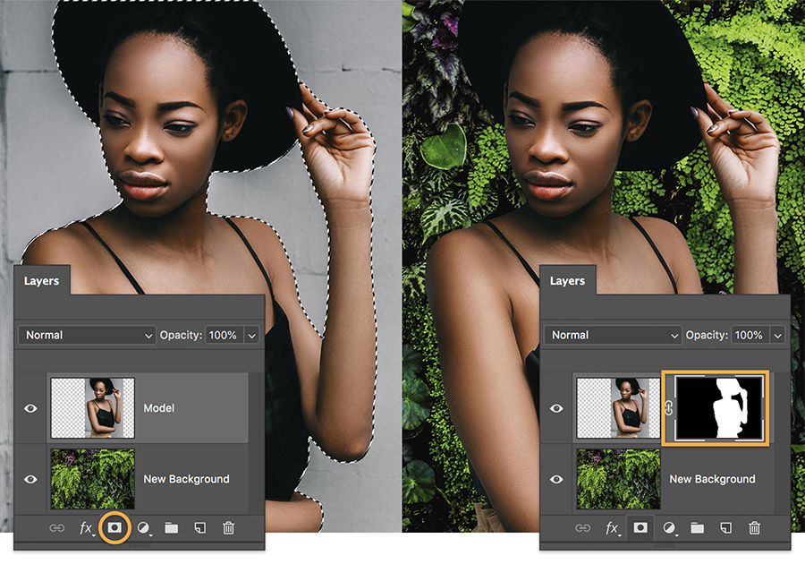

# Exercise 1 — Select & Mask

## Instructions

Select an image and use the masking techniques learned in class to remove the original background of an image. Once the original background is removed find a new image and place it as the new background. You can find free stock images for the background at [Unsplash](https:://unsplash.com), [Pixabay](https://pixabay.com), or another stock image site (just make sure your stock image does not have a watermark on it). Once you have completed masking your subject and replacing the background, export your image using the Export As... dialogue into an Exports folder.

## Example

## File Set Up

Your Photoshop file should be named fName-lName-section#-select-and-mask.psd. The size of your artboard will be dependent on your original subject image. Your file should have a layer named "Subject" containing your foreground image that is masked and a layer named "Background" featuring your new background image.

## Grading

| Category               | Weight |
| ---------------------- | ------ |
| Masking Technique      | 2      |
| Background Replacement | 1      |
| Exporting Image        | 1      |
| File Organization      | 1      |
| **Total**              | **5**  |

## Submission

Compress and submit your lName-fName-section#-select-and-mask folder. The folder should contain:

- lName-fName-section#-select-and-mask.psd Photoshop file
- Links folder containing original images
- Exports folder containing:
  - lName-fName-section#-select-and-mask.jpg - 1000px wide

::: warning Due Date

Section 010: Thursday, September 15, 2022 @ 5pm

Section 020: Wednesday, September 14, 2022 @ 7pm

Submit on Brightspace under Assignments > Exercise 1 — Select & Mask
:::
