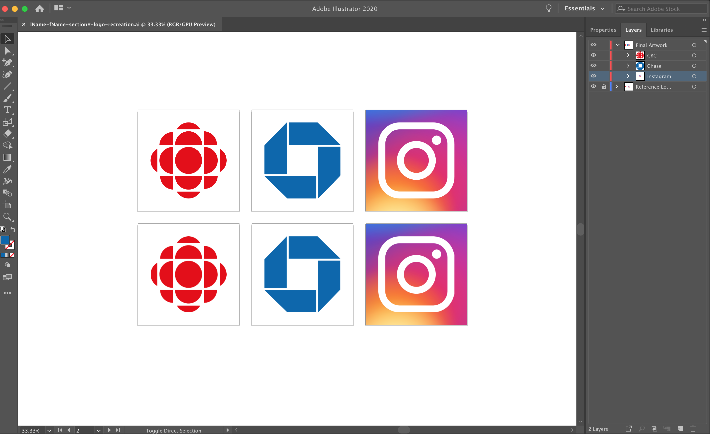

# Exercise 1 — Logo Recreation

::: tip Files
[Exercise file download](https://drive.google.com/uc?export=download&id=1Orqe3IpIUOCBo2ZLrgctsJgryYfjTqw3)
:::

## Introduction

The goal of this assignment is to learn how basic shapes can be used to create logos and other designs. You will be recreating the three logos provided in the attached starter file. Create your version of the logos in the corresponding labeled Artboards on the "Final Artwork" layer. The logos can all be created using simple shapes to start and then using the pathfinder tools and manipulating the anchor points to get the final shapes.

## Requirements

Save and upload your Illustrator file to BrightSpace named as follows: **lName-fName-section#-logo-recreation.ai**. You do not need to export or upload JPG versions of the files. All you need to submit is your Illustrator file with the completed logo recreation. Your file should like something like this when I open it:

## Grading

| Category          | Weight |
| ----------------- | ------ |
| 3 Logos           | 3      |
| File Organization | 1      |
| **Total**         | **4**  |

## Submission

::: warning Due Date

Section 300: Tuesday, September 21, 2021 @ 7pm

Section 310: Wednesday, September 22, 2021 @ 7pm

Submit on Brightspace under Assignments > Exercise 1 — Logo Recreation

:::
