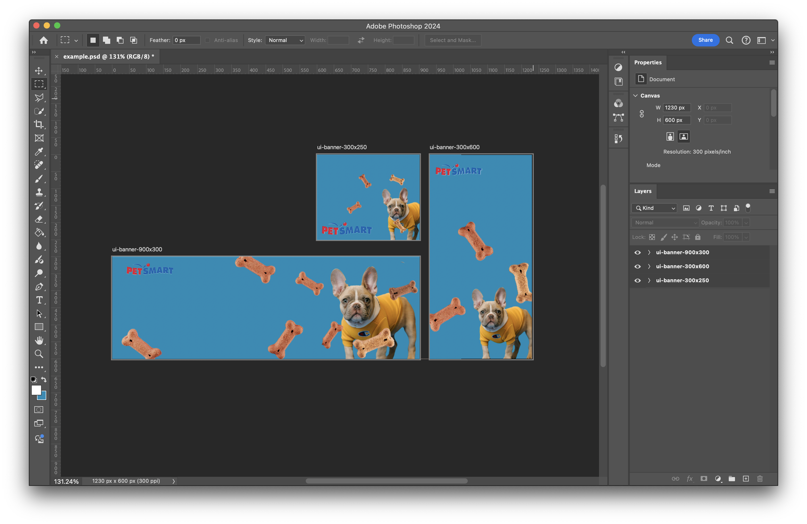

# Exercise 1 — UI Banners

## Overview

In this exercise, you'll learn how to use selection tools and layer masks to create a set of banners for a mock product launch, organized across multiple artboards. By the end of this exercise, you'll have designed three different banner sizes while practicing masking and compositing skills in Photoshop.

## Introduction to UI Banners

[Lab 1 Slides](https://drive.google.com/file/d/1atM6JWSPp_tuLOXKollE4eqbZI_tztqu/view?usp=sharing)

## Exercise Steps:

1. **Set Up Artboards:**

   - Create a new document in Photoshop and set up 3 artboards of standard advertising banner sizes:
     - **Size 1**: 300x250px
     - **Size 2**: 300x600px
     - **Size 3**: 900x300px
   - Name each artboard appropriately for easy organization.

2. **Choose a theme:**

   Select one of the following advertising themes:

   - **Pet Store:** Promote pet products like food, toys, or grooming services.
   - **Tech Gadget:** Advertise a new smartphone, laptop, or tech device.
   - **Fashion Sale:** Create banners for a seasonal clothing sale or new collection.
   - **Fitness & Wellness:** Promote a gym, fitness class, or health product.
   - **Travel:** Advertise a vacation package or travel service.
   - **Food Delivery:** Showcase a food delivery app or restaurant special.
   - **Eco-Friendly Products:** Promote sustainable, environmentally friendly products.
   - **Beauty & Skincare:** Advertise beauty or skincare products.

3. **Selecting Images:**

   - Find and import images related to your chosen theme (e.g., product photos, backgrounds, or textures).
   - You need to include at least 3 images.
   - Use the Quick Selection Tool or Magic Wand to isolate specific elements, such as the product or model in the image.
   - Practice refining your selection using the "Select and Mask" workspace to get precise edges.

   **Free stock photos**

   - [Unsplash](https://unsplash.com/)
   - [Pixabay](https://pixabay.com/)
   - [Pexels](https://www.pexels.com/)

4. **Masking:**

   - Once you've selected the object, apply a layer mask to hide the original background.
   - Use Refine Edge and feathering to smooth out any rough edges, especially around areas like hair or fine details.

   

5. **Design Layout:**

   - Use the artboards to create a consistent design for all banners, with the product or subject in focus.
   - Use smart objects and adjustment layers to maintain non-destructive editing.

   > Think about where text or other design elements might be placed in your design and adjust the layout to accommodate them. It is not required to add text or other design elements beyond what is being asked.

   

6. **Final Touches:**

   - Use adjustment layers (e.g., brightness/contrast, hue/saturation) to enhance the overall look.
   - Make sure the composition is balanced, and that the subject blends well with the background.
   - Double-check that all banners follow the same design theme with appropriate spacing and alignment.

   

## Example

Another example!

## Helpful Tutorials

Watch/Read these tutorials to help you perform the masking techniques in Photoshop:

- [Quick Selection Tool](https://helpx.adobe.com/ca/photoshop/how-to/use-quick-selection-tool.html)
- [Refine Edge](https://www.adobe.com/products/photoshop/refine-edge.html)
- [Select & Mask](https://www.adobe.com/products/photoshop/masking.html)

## Troubleshooting Tips

Common issues and solutions you might encounter during the exercise:

- If the edges of the selection are rough, use the Refine Edge tool to smooth them out.
- If the subject looks disconnected from the new background, adjust the color balance and lighting.
- For better integration, ensure the lighting direction in all images matches.

## File Setup and Submission

Compress and submit your `lName-fName-section#-ui-banner` folder containing:

- `lName-fName-section#-ui-banner.psd` (Photoshop file with organized layers).
- 'Originals' folder with original images used.
- 'Exports' folder with the final images:
  - `ui-banner-300x250.png`
  - `ui-banner-300x600.png`
  - `ui-banner-900x300.png`

## Submission

 

<Badge text="Section 010: Tuesday September 10th @9:00pm" />
<Badge type="error" text="Section 020: Tuesday September 10th @7:00pm" />

- Open BS LMS and go to the Activities > Assignments page.
- Go to Exercise 1 — UI Banners
- Upload your compressed folder on the assignment page in BS LMS and click the submit button.

## Marking Rubric for Exercise 1 — UI Banners

| **Criteria**                          | **Excellent (4 points)**                                                                                            | **Good (3 points)**                                                               | **Satisfactory (2 points)**                                                                | **Needs Improvement (1 point)**                                               | **Unsatisfactory (0 points)**                                                | **Max Points** |
| ------------------------------------- | ------------------------------------------------------------------------------------------------------------------- | --------------------------------------------------------------------------------- | ------------------------------------------------------------------------------------------ | ----------------------------------------------------------------------------- | ---------------------------------------------------------------------------- | -------------- |
| **Artboard Setup & Organization**     | 3 artboards created with correct dimensions, named properly, and well-organized layers.                             | 3 artboards created with minor dimension or naming issues, well-organized layers. | Artboards created but noticeable issues with dimensions or layer organization.             | Artboards not properly set up, incorrect dimensions, poor layer organization. | Missing artboards or incorrect dimensions, disorganized layers.              | **4**          |
| **Theme Selection & Appropriateness** | Strong theme choice clearly reflected in image selection and overall design.                                        | Theme mostly consistent with image and design elements.                           | Theme selected but inconsistencies in execution.                                           | Theme chosen but poorly executed or hard to discern.                          | No clear theme or theme not represented in the design.                       | **4**          |
| **Image Selection & Masking**         | High-quality image selection with precise masking and smooth edges using tools like Refine Edge.                    | Good image selection with minor masking issues (e.g., small rough edges).         | Image selection is average, noticeable masking issues (e.g., rough edges or missed areas). | Image selection does not fully align with theme, masking is poorly done.      | Poor image selection, masking not used or done incorrectly.                  | **4**          |
| **Design Layout & Consistency**       | Consistent design across banners, effective use of space, smart objects used for non-destructive editing.           | Consistent design with minor layout issues, some smart object usage.              | Design somewhat consistent but with noticeable layout issues, minimal smart object usage.  | Inconsistent design, poor layout, little to no use of smart objects.          | Incoherent design, poor layout, no smart objects or non-destructive editing. | **4**          |
| **Application of Adjustment Layers**  | Effective use of adjustment layers to enhance composition and theme.                                                | Adjustment layers used, minor issues in enhancing composition.                    | Some adjustment layers applied, minimal impact on final composition.                       | Adjustment layers applied poorly, causing an imbalanced composition.          | No adjustment layers used, or they detract from the composition.             | **4**          |
| **File Setup & Submission**           | Correctly named files, well-organized layers, appropriate folders for images and exports.                           | Minor issues with naming or organization of layers and folders.                   | Mostly organized, but noticeable naming and folder issues.                                 | Poor file organization, incorrect naming, missing folders.                    | Incorrect or incomplete file submission, disorganized layers.                | **4**          |
| **Creativity & Overall Impact**       | Exceptional creativity, cohesive and visually engaging banner design.                                               | Shows creativity, visually appealing design but could be stronger.                | Some creativity displayed, but design lacks cohesion or impact.                            | Minimal creativity, resulting in a less engaging or unoriginal design.        | Lacks creativity or is a poor execution of the theme.                        | **4**          |
| **Adherence to Instructions**         | All instructions followed precisely, including correct dimensions, theme selection, masking, and submission format. | Minor issues in following instructions but adheres to core requirements.          | Some significant deviations, but meets most core requirements.                             | Multiple instructions not followed, impacting overall quality.                | Instructions not followed, resulting in incomplete or incorrect work.        | **4**          |

---

| **Demo**                                                                                                            | **Excellent (4 points)** | **Unsatisfactory (0 points)** | **Max Points** |
| ------------------------------------------------------------------------------------------------------------------- | ------------------------ | ----------------------------- | -------------- |
| **Live demonstration completed on time, showing an understanding of the tools and process used to create banners.** | **4**                    | **0**                         | **4**          |

---

**Total Points Available:** 36
