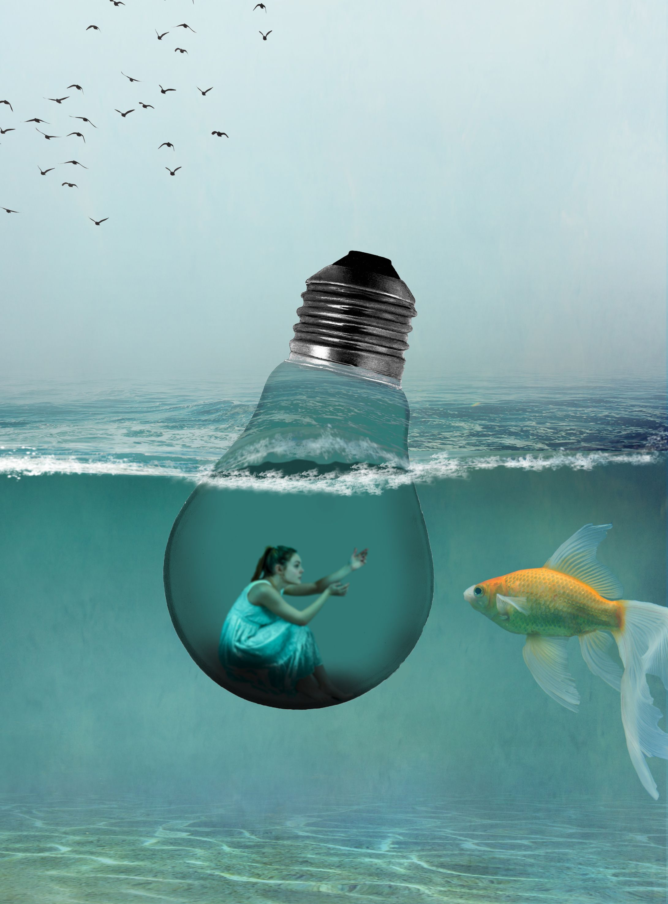

# Exercise 1 — Select & Mask: Non-Destructive Image Editing and Composition

::: danger Todo

- Update tutorial links
- Add samples
- Update due dates for both sections

:::

## Introduction

Select an image and use the masking techniques learned in class to remove the original background of the image. Utilize tools such as Quick Selection, Refine Edge, or Select & Mask to achieve precise selections. Ensure a non-destructive workflow by using layers and adjustment layers for editing.

Once you have completed masking your subject and replacing the background, take it a step further and create a visually appealing composition. Incorporate more than one image to blend elements together and form a cohesive composition.

## Instructions

1. Choose an image that you would like to work with for this exercise. Make sure it has a distinct subject that you can mask and place in a new background.

2. Open the image in Photoshop.
3. **Selection and Masking:**

   - Use the Quick Selection Tool to select your subject.
   - Refine the selection's edges using tools like the Refine Edge or Select & Mask tools.

4. **Non-Destructive Editing:**

   - Create a mask to separate your subject from the background.
   - Improve the subject's appearance using adjustment layers like Brightness/Contrast or Color Balance.

5. **Background Replacement:**

   - Find a new background image that matches your subject.
   - Place this background below your subject layer.
   - Adjust sizes and positions to make the subject fit naturally.
   - Blend subject and background by considering lighting and color.

6. **Composition and Image Blending:**

   - Add other images that work with your subject and background.
   - Select and place elements from these images into your composition.
   - Arrange, scale, and rotate to create a pleasing composition.
   - Adjust lighting and color for consistency.

7. **File Organization:**

   - Keep your Photoshop project organized by using well-labeled layers, adjustment layers, and groups for different elements.
   - Ensure your layers are logically organized in the Layers panel for easier navigation and editing.

8. **Exporting:**

   - Once you are satisfied with your composition, save your work and then export it as a PNG file with a width of 1000 pixels.
   - Create a folder named lName-fName-section#-select-and-mask and include your Photoshop file and the exported PNG file in an "Exports" subfolder. Include the original images within your "Links" subfolder

## Example

## Helpful Tutorials

Watch/Read these tutorials to help you perform the masking techniques in Photoshop:

- [Quick Selection Tool](https://helpx.adobe.com/ca/photoshop/how-to/use-quick-selection-tool.html)
- [Refine Edge](https://www.adobe.com/products/photoshop/refine-edge.html)
- [Select & Mask](https://www.adobe.com/products/photoshop/masking.html)

## Troubleshooting Tips

Common issues and solutions you might encounter during the exercise:

- If the edges of the selection are rough, use the Refine Edge tool to smooth them out.
- If the subject looks disconnected from the new background, adjust the color balance and lighting.

## Grading Rubric

| Category                     | Criteria                                                                                                                          | Weight |
| ---------------------------- | --------------------------------------------------------------------------------------------------------------------------------- | ------ |
| Selection & Masking          | - Accurate and detailed selection of the subject, with clean edges and smooth transitions between the subject and the background. | 2      |
| Background Replacement       | - Skillful integration of the subject into the new background, considering lighting, color balance, and overall realism.          | 2      |
| Non-Destructive Editing      | - Effective use of adjustment layers and layer masks for non-destructive image editing.                                           | 1      |
| Composition & Image Blending | - Creative and seamless blending of multiple images to create a compelling and visually balanced composition.                     | 2      |
| File Organization            | - Well-structured Photoshop file with organized layers and properly labeled / organized submission folders.                       | 1      |
| **Total**                    |                                                                                                                                   | **8**  |

## Submission

Compress and submit your work in a folder named lName-fName-section#-select-and-mask. The folder should contain the following:

- Your Photoshop file: lName-fName-section#-select-and-mask.psd
- A "Links" folder containing original images (if applicable)
- An "Exports" folder containing:
  - lName-fName-section#-select-and-mask.png (1000px wide)

**Due Dates:**

<Badge text="Section 300: Tuesday September 12th @5:00pm" />
<Badge type="error" text="Section 310: Monday September 11th @6:00pm" />

- Open BS LMS and go to the Activities > Assignments page.
- Go to Exercise 1 — Select & Mask
- Upload your compressed folder on the assignment page in BS LMS and click the submit button.
