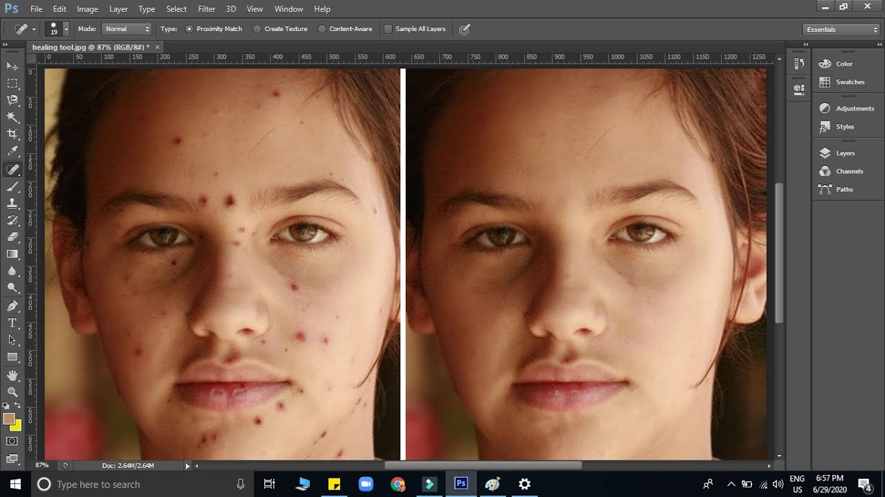

# Exercise 2 — Retouching

## Introduction

In this exercise, you will have the opportunity to employ the retouching techniques that you have acquired through classroom instruction. Your task is to apply these techniques to two Photoshop files that have been provided for your practice.

## Instructions

1. Download the provided Photoshop files for this exercise [here.](./files/lName-fName-retouching.zip)

2. **File 1: 01-photoshop-repairing-blemishes:**

   - Open the Photoshop file named "01-photoshop-repairing-blemishes.psd".
   - Your task is to remove all blemishes on the model in the photo.
   - Utilize the retouching tools you've learned in class to make these edits non-destructive.
   - Ensure that the original layer remains untouched.

3. **File 2: 02-photoshop-content-aware-fill:**

   - Open the Photoshop file named "02-photoshop-content-aware-fill.psd".
   - Your goal is to use the content-aware fill technique to remove the microphone and light fixture from the scene.
   - Pay close attention to the brick texture, making sure the area looks convincingly filled with a realistic brick pattern.
   - Ensure that the original layer remains untouched.

4. **Exporting Images:**

   - Export both retouched images as PNG files using the "Export As..." dialogue in Photoshop.
   - For "01-photoshop-repairing-blemishes.psd," export it as "01-photoshop-repairing-blemishes.png" with the following specifications:
     - Resolution: 72dpi
     - Width: 1500px
   - For "02-photoshop-content-aware-fill.psd," export it as "02-photoshop-content-aware-fill.png" with the following specifications:
     - Resolution: 72dpi
     - Width: 1000px

5. **File Organization:**
   - Keep your Photoshop files well-structured with organized layers.
   - Create an "Exports" folder within your submission folder and place the exported PNG files there.

## Example

## Grading Rubric

| Category           | Criteria                                                                                                                                                       | Weight |
| ------------------ | -------------------------------------------------------------------------------------------------------------------------------------------------------------- | ------ |
| Retouching Image 1 | - Effective removal of blemishes using non-destructive techniques.  - Skillful application of class-learned tools.                                          | 2      |
| Retouching Image 2 | - Successful elimination of microphone and light fixture using content-aware fill.  - Maintenance of a realistic and visually appealing brick texture.      | 2      |
| Exporting Images   | - Export the retouched images as PNG files using the "Export As..." dialogue.  - Ensure that your exports have the correct file type, resolution and width. | 2      |
| File Organization  | - Well-structured Photoshop file with organized layers and properly labeled / organized submission folders                                                     | 2      |
| **Total**          |                                                                                                                                                                | **8**  |

## Submission

Compress and submit your work in a folder named lName-fName-select-and-mask. The folder should contain the following:

- 01-photoshop-repairing-blemishes.psd
- 02-photoshop-content-aware-fill.psd
  - "Exports" folder with exported JPEGs using Export As... dialogue:
    - 01-photoshop-repairing-blemishes.png - 72dpi, 1500px wide
    - 02-photoshop-content-aware-fill.png - 72dpi, 1000px wide

**Due Dates:**

<Badge text="Section 300: Tuesday September 19th @5:00pm" />
<Badge type="error" text="Section 310: Monday September 18th @6:00pm" />

- Open BS LMS and go to the Activities > Assignments page.
- Go to Exercise 2 — Retouching
- Upload your compressed folder on the assignment page in BS LMS and click the submit button.
