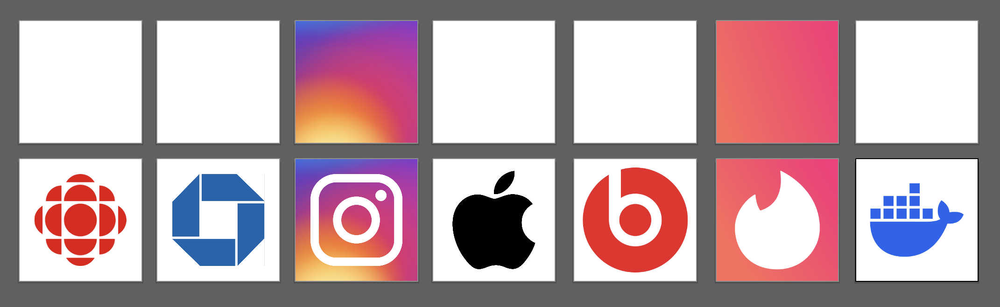

# Exercise 3 — Logo Recreation

::: tip Files
[Exercise file download](https://drive.google.com/file/d/1n-2R4H-8QnDmxTcWhPtSx9v_gQC-NZMV/view?usp=sharing)
:::

## Introduction

In this exercise, you’ll learn how basic shapes can be the building blocks of professional logo design. Recreating these logos will help you understand how to deconstruct complex designs into simpler forms. You will apply shape tools, the Pathfinder panel, and anchor point manipulation to refine your logos and achieve clean, polished results. This process mirrors what professional designers do when creating logos from scratch or updating existing designs.

## Instructions

1. Download and open the provided Illustrator file for this exercise from above.

2. Navigate to the "Final Artwork" layer in the Illustrator file, where you'll find the corresponding labeled artboards for each logo.

3. Begin by using simple shapes (rectangles, ellipses, polygons, etc.) to create the basic structure of the logos. Use Illustrator’s **Shape Builder Tool** and **Pathfinder Tools** to combine or subtract shapes as needed.

4. Fine-tune your design by manipulating anchor points using the **Direct Selection Tool (A)** for more precise control over curves and angles.

5. Pay attention to details: proportions, smoothness of curves, and alignment. Use **Smart Guides** (`Ctrl/Cmd + U`) for precision in aligning and snapping elements.

6. Ensure you match the colors of the provided logos by using the **Eyedropper Tool (I)** to sample colors.

7. Review and finalize your work for clean lines, smooth curves, and accurate proportions, ensuring a polished and professional result.

## File Setup

Save your Illustrator file as `lName-fName-logo-recreation.ai`. Ensure your file is organized with layers labeled clearly, and all logos are recreated on the "Final Artwork" layer. You do not need to export JPG versions.

## Using Pathfinder with Strokes

<Slideshow
  :key="'PathfinderAndStrokes'"
  :images="[
    { label: '1', src: '/f2024/moduleImages/week3/pathfinderStrokes/1.png' },
    { label: '2', src: '/f2024/moduleImages/week3/pathfinderStrokes/2.png' },
    { label: '3', src: '/f2024/moduleImages/week3/pathfinderStrokes/3.png' },
    { label: '4', src: '/f2024/moduleImages/week3/pathfinderStrokes/4.png' },
    { label: '5', src: '/f2024/moduleImages/week3/pathfinderStrokes/5.png' }
  ]"
/>

## Submission

<Badge text="Section 010: Tuesday September 24th @9:00pm" />
<Badge type="error" text="Section 020: Tuesday September 24th @7:00pm" />

Submit your `.ai` file by uploading it to Brightspace under `Activities > Assignments > Exercise 3 — Logo Recreation`. Ensure the file is properly named and uploaded before the deadline.

## Marking Rubric for Exercise 3 — Logo Recreation

| **Logo**            | **Excellent (4 points)**                                                              | **Good (3 points)**                                                       | **Satisfactory (2 points)**                                     | **Needs Improvement (1 point)**                                 | **Unsatisfactory (0 points)**        | **Max Points** |
| ------------------- | ------------------------------------------------------------------------------------- | ------------------------------------------------------------------------- | --------------------------------------------------------------- | --------------------------------------------------------------- | ------------------------------------ | -------------- |
| **CBC Logo**        | Shape is perfectly recreated with accurate curves and proportions.                    | Shape closely resembles the original with minor inaccuracies.             | Shape is generally correct but with noticeable inaccuracies.    | Shape differs significantly from the original.                  | Logo is incomplete or not recreated. | 4              |
| **Chase Bank Logo** | Shape is perfectly recreated with clean, sharp edges and accuracy.                    | Shape is mostly correct, with some minor inaccuracies.                    | Shape has noticeable inaccuracies but resembles the original.   | Shape is off and differs significantly from the original.       | Logo is incomplete or not recreated. | 4              |
| **Instagram Logo**  | Logo is accurately recreated with attention to shape, color, and alignment.           | Logo is close to the original, with small inaccuracies.                   | Shape and color are generally correct but with some errors.     | Proportions and colors are noticeably incorrect.                | Logo is incomplete or not recreated. | 4              |
| **Beats Logo**      | Shape and curves are perfectly recreated with clean, smooth edges.                    | Shape closely resembles the original, with minor inaccuracies.            | Shape is generally correct but has rough edges or inaccuracies. | Shape is off, with significant differences from the original.   | Logo is incomplete or not recreated. | 4              |
| **Tinder Logo**     | The logo is perfectly recreated, with precise curves and proportions.                 | Logo is mostly correct with minor proportional differences.               | Shape is recognizable but lacks precision and has inaccuracies. | Shape is significantly off from the original design.            | Logo is incomplete or not recreated. | 4              |
| **Apple Logo**      | Apple logo is recreated with accurate proportions, smooth lines, and proper symmetry. | Logo closely resembles the original, with minor proportional differences. | Shape is generally correct, with some noticeable inaccuracies.  | Shape is significantly incorrect.                               | Logo is incomplete or not recreated. | 4              |
| **Docker Logo**     | Docker logo is recreated with accurate proportions and sharp details.                 | Logo is mostly correct but with minor inaccuracies in the details.        | Shape is generally correct, with noticeable differences.        | Shape is off, and the details do not match the original design. | Logo is incomplete or not recreated. | 4              |

---

| **Demo**                                                                                                              | **Excellent (4 points)** | **Unsatisfactory (0 points)** | **Max Points** |
| --------------------------------------------------------------------------------------------------------------------- | ------------------------ | ----------------------------- | -------------- |
| **Live demonstration completed on time, showing an understanding of the tools and process used for logo recreation.** | **4**                    | **0**                         | **4**          |

**Total Points Available: 32**
