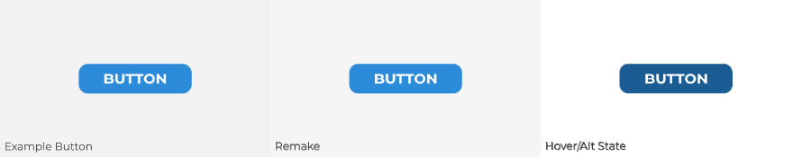

# Exercise 4: Button Design

::: tip Files
[Exercise file download](https://drive.google.com/uc?export=download&id=1qCluUJsQzGHeM975oVEqPeP8YdRx8NM6)
:::

## Instructions

In the starter file provided, recreate the three buttons shown. Then, create a hover/alternate state for each button. To create the hover state, you can play around with the fill, stroke, opacity, or any other styling you wish. Lastly, create you own unique button and a hover state. Be creative with it! Experiment with different colours, sizes, text, and elements.

## Grading

| Category          | Weight |
| ----------------- | ------ |
| 4 Buttons         | 4      |
| File Organization | 1      |
| **Total**         | **5**  |

## Submission

::: warning Due Date

Section 300: Tuesday, September 28, 2021 @ 7pm

Section 310: Wednesday, September 29, 2021 @ 7pm

Submit on Brightspace under Assignments > Exercise 2 — Button Design
:::
