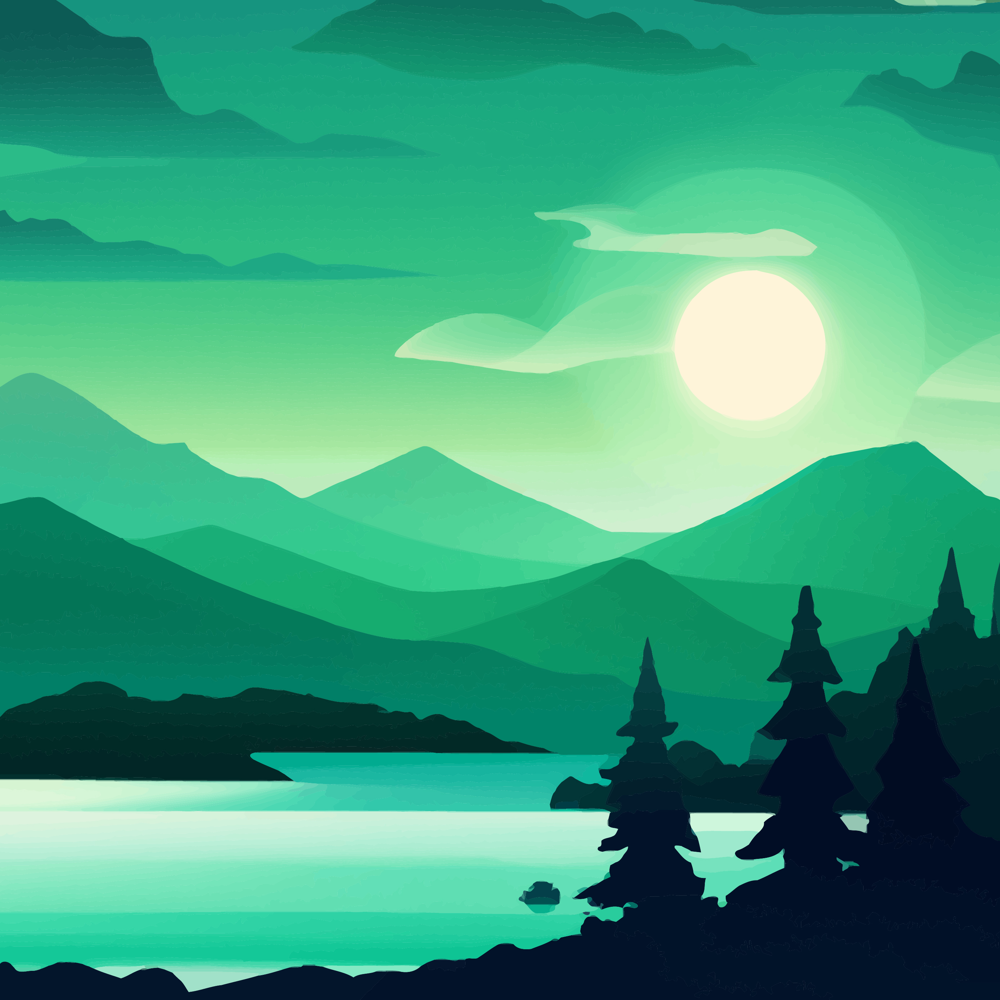

# Exercise 4 - Gradients in Nature

## Introduction

In this exercise, you will showcase your proficiency in creating and manipulating gradients in Adobe Illustrator. You will work on a poster design, applying various gradient techniques to achieve visual depth, dimension, and creativity.

<ClientOnly>
  <Countdown date="2023-10-02">

## Instructions

1. **Research:** Start by researching various natural landscapes such as mountains, forests, oceans, or sunsets. Gather reference images to inspire your poster design.

2. **Document Setup:** Create a new Adobe Illustrator document with the dimensions of 18 inches by 24 inches (portrait or landscape). Set the color mode to RGB.

3. **Background Gradient:** Choose a scenic landscape as your background and use gradients to create a smooth transition of colors. Experiment with radial or linear gradients to emulate the natural lighting and atmospheric effects of the chosen scene.

4. **Foreground Elements:** Add various natural elements to the poster, such as mountains, trees, water, or clouds. Apply gradients to these elements to give them a realistic and three-dimensional appearance.

5. **Color Harmony:** Pay attention to color harmony and choose a complementary color palette that enhances the mood and atmosphere of the poster. Use the Color Guide or Color Themes panel in Illustrator to help with color selection.

6. **Transparency and Blending Modes:** Utilize transparency and blending modes to create subtle overlays or soft transitions between gradients, adding depth and complexity to the design.

7. **Refining Details:** Pay attention to details, ensuring smooth transitions and well-defined shapes. Refine the placement and size of each element to create a balanced and visually appealing composition.

## Example

<a href="https://www.freepik.com/free-vector/nature-scene-with-river-hills-forest-mountain-landscape-flat-cartoon-style-illustration_33398506.htm#page=2&query=landscape%20illustration&position=0&from_view=keyword&track=ais">Image by tohamina</a> on Freepik

## Helpful Tutorials

Watch/Read these tutorials to help you create/use gradients in Illustrator:

- [Create color gradients](https://helpx.adobe.com/illustrator/how-to/color-basics.html#create_color_gradients)

## Submission

Save and upload your Illustrator file to BrightSpace named as follows: lName-fName-gradients-in-nature.ai. You do not need to export or upload JPG versions of the files. All you need to submit is your Illustrator file.

**Due Dates:**

<Badge text="Section 300: Tuesday October 3rd @5:00pm" />
<Badge type="error" text="Section 310: Monday October 2nd @6:00pm" />

- Open BS LMS and go to the Activities > Assignments page.
- Go to Exercise 4 - Gradients in Nature
- Upload your compressed folder on the assignment page in BS LMS and click the submit button.

  </Countdown>
</ClientOnly>
