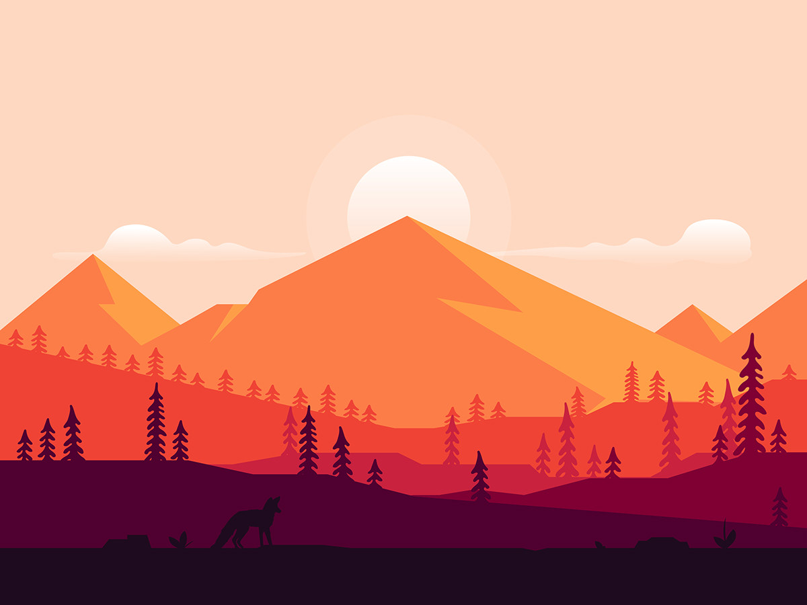

# Exercise 4: Gradients in Nature

## Overview

In this exercise, you will leverage Adobe Illustrator's gradient tools to transform a real-life landscape photograph into a vibrant, gradient-rich illustration. This task will enhance your understanding of gradient techniques, color blending, and vector illustration principles. By tracing over an actual photo, you'll learn how to apply gradients effectively to convey depth, dimension, and natural color variations, resulting in a visually appealing and cohesive landscape design.

## Instructions

### 1. Select Your Reference Photo

- **Choose a Suitable Photo:**
  - Select a high-resolution photograph of a landscape that includes clear elements such as sky, mountains, trees, water bodies, etc.
  - Ensure the photo has distinct color variations and lighting to effectively practice gradient application.
  - **Important:** Use an actual photo, not a vector image or pre-created illustration.

### 2. Set Up Your Workspace in Adobe Illustrator

- **Create a New Document:**
  - Open Adobe Illustrator and create a new document (e.g., 1920x1080 pixels).
- **Import the Reference Photo:**
  - Go to `File > Place`, select your chosen photo, and position it on the artboard or drag and drop your image into your newly created file.
- **Embed Image**
  - With your image selected, click the (`Embed`) button on the control panel. This will incorporate the linked image directly into your Illustrator file, ensuring it remains accessible even if the original file is moved or deleted.
- **Lock the Photo Layer:**
  - Open the Layers panel (`Window > Layers`).
  - Lock the layer containing the photo to prevent accidental edits by clicking the lock icon next to the layer.

### 3. Outline the Major Elements

- **Create a New Layer for Tracing:**
  - In the Layers panel, create a new layer above the photo layer for your illustration.
- **Trace the Main Shapes:**
  - Use the **Pen Tool (P)** to trace the primary elements of the landscape, such as the horizon line, mountains, trees, and water bodies.
  - Focus on capturing the overall shapes and proportions without adding intricate details at this stage.

### 4. Apply Gradients to Each Element

- **Select a Shape to Apply Gradient:**
  - Click on a traced shape to select it.
- **Open the Gradient Panel:**
  - Go to `Window > Gradient` to open the Gradient panel.
- **Choose Gradient Type:**
  - Select either **Linear Gradient** or **Radial Gradient** based on the element you're working on.
- **Customize Gradient Colors:**
  - Click on the gradient slider to add or adjust color stops.
  - Choose colors that reflect the natural hues of the landscape (e.g., blues and oranges for the sky, greens and browns for trees).
- **Adjust Gradient Direction:**
  - Use the **Gradient Tool (G)** to drag the gradient direction and length, enhancing the sense of depth and lighting.

### 5. Refine Gradient Settings

- **Fine-Tune Gradient Stops:**
  - Double-click on each color stop to modify the exact color and opacity.
- **Experiment with Gradient Angles:**
  - Adjust the angle of the gradient to mimic the natural light direction in the photograph.
- **Use Multiple Gradients:**
  - Apply different gradients to various parts of the same element to add complexity and realism.

### 6. Enhance the Illustration with Additional Details

- **Add Secondary Elements:**
  - Create additional shapes for finer details like smaller trees, rocks, or water ripples.
- **Apply Gradients to New Elements:**
  - Repeat the gradient application process for these secondary shapes to maintain consistency.
- **Utilize Opacity and Blending Modes:**
  - Adjust the opacity levels and experiment with blending modes in the **Transparency panel (`Window > Transparency`)** to create more nuanced effects.

### 7. Finalize and Export Your Artwork

- **Review and Adjust:**
  - Zoom in to inspect each element, ensuring gradients transition smoothly and accurately represent the photograph.
- **Hide the Reference Photo:**
  - In the Layers panel, hide or delete the photo layer to view your final illustration without distractions.
- **Save Your Work:**
  - Save the Illustrator file (`File > Save As`) for future edits.

## Additional Tips

- **Color Consistency:** Ensure that gradient colors harmonize across different elements to maintain a unified look.
- **Layer Management:** Organize your layers logically (e.g., sky, mountains, trees) to streamline the editing process.
- **Use Gradient Libraries:** Explore Illustrator’s gradient libraries for inspiration and to apply pre-set gradients effectively.
- **Practice Gradients:** Spend time experimenting with different gradient types and settings to understand their impact on your design.

## File Setup & Submission

<Badge text="Section 010: Tuesday October 1st @9:00pm" />
<Badge type="error" text="Section 020: Tuesday October 1st @7:00pm" />

Submit your `.ai` file by uploading it to Brightspace under `Activities > Assignments > Exercise 4 — Gradients in Nature`. Ensure the file is properly named and uploaded before the deadline.
