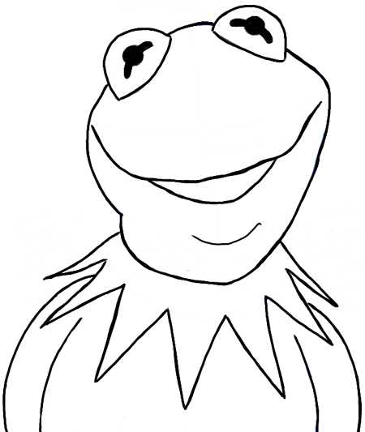

# Exercise 5 — Character Vectorization

## Introduction

The goal for this assignment is to get comfortable using the pen tool. Focus on creating good lines and curves. You can apply colours and other effects if you like, but it is not required, you will only be marked based on how well you recreate the line work of the image. If you find your own image, it must have a similar level of detail, or more, than the Kermit the frog example below.

<ClientOnly>
  <Countdown :weekNumber="5">

## Instructions

1. **Character Selection:**

   - Begin by selecting an image of a character that you'd like to recreate using the pen tool in Illustrator. Choose an image that provides a similar level of detail or more detail than the provided Kermit the Frog example.
   - The primary focus of this assignment is to practice creating clean lines and curves using the pen tool.

2. **Illustrator File Setup:**

   - Create a new Illustrator file and title it as fName-lName-character-vectorization.ai.
   - Organize your Illustrator file using two separate layers:
     - **Template Layer:** Place the reference image of the character you're recreating on this layer. Label it as "Template".
     - **Final Artwork Layer:** Trace and recreate the character image using the pen tool on this layer. Label it as "Final Artwork".

3. **Recreating Lines and Curves:**

   - Trace over the lines of the character image using the pen tool in Illustrator. Your objective is to accurately capture the features, shapes, and details of the character image.
   - While optional, you can apply colors and other effects to your recreation. However, your main evaluation will be based on how well you recreate the line work of the image.

4. **Export and Submission:**

   - Inside the folder containing your Illustrator file, create a subfolder named "Exports".
   - Export your completed artwork as a PNG at a width of 800px (height may vary) using the "Export for Screens" dialogue in Illustrator.
   - Ensure your artwork fits neatly within the Artboard for optimal export.
   - Package the Illustrator file, the reference image, and the "Exports" subfolder into a single folder.
   - Compress the folder into a zip file and title it as fName-lName-character-vectorization.zip.

## Example

## Grading Rubric

| Category                    | Criteria                                                                                                                         | Weight |
| --------------------------- | -------------------------------------------------------------------------------------------------------------------------------- | ------ |
| Recreating Lines and Curves | - How well the student has traced over the lines of the character image, accurately capturing its features, shapes, and details. | 2      |
| Pen Tool Proficiency        | - Assessing the student's skill in using the pen tool to create smooth lines, curves, and transitions.                           | 2      |
| Level of Detail             | - Evaluating the intricacy and complexity of the recreated image in comparison to the provided example (Kermit the Frog).        | 2      |
| Layer Organization          | - Did you appropriately organize your Illustrator file with two distinct artboards (Template and Final Artwork).                 | 1      |
| File Organization           | - Well-structured Illustrator file with organized layers and properly labeled / organized submission folders                     | 1      |
| **Total**                   |                                                                                                                                  | **8**  |
| (Bonus) Creativity          | - Recognizing any creative additions like colors or effects that enhance the overall presentation of the final artwork.          | 1      |

## Submission

**Due Dates:**

<Badge text="Section 300: Tuesday October 10th @5:00pm" />
<Badge type="error" text="Section 310: Monday October 9th @6:00pm" />

- Open BS LMS and go to the Activities > Assignments page.
- Go to Exercise 5 — Character Vectorization
- Upload your compressed folder on the assignment page in BS LMS and click the submit button.

  </Countdown>
</ClientOnly>
