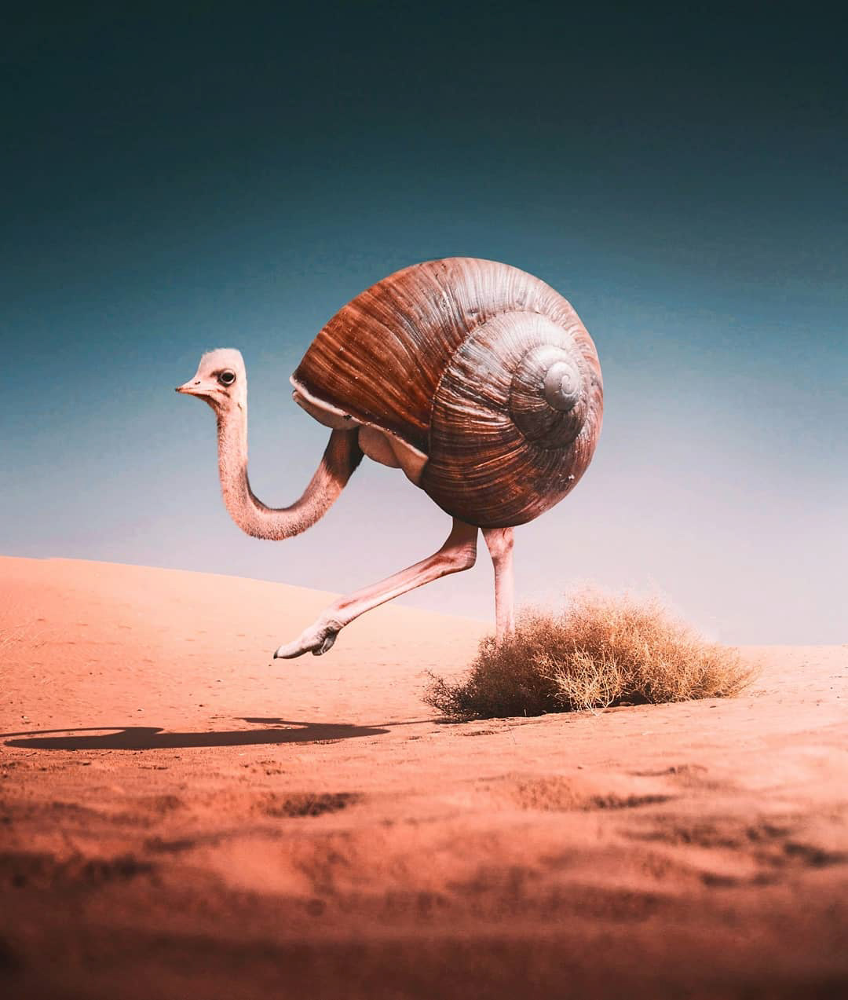

# Exercise 7 — Photo Composite

## Instructions

Use the compositing techniques we learned in class to create a composite image combining the features of animals to create a new fun hybrid animal.

Remember the transition area is the key to selling the composition!

### Examples

## Submission

Submit your compressed lName-fName-section#-compositing folder to Brightspace. Your folder should include:

- lName-fName-section#-compositing.psd
- Links folder containing original images
- Exports folder containing:
  - lName-fName-section#-compositing.jpg - 72dpi, 750px wide

## Grading

| Category             | Weight |
| -------------------- | ------ |
| Composite Techniques | 2      |
| Exporting Image      | 1      |
| File Organization    | 1      |
| **Total**            | **4**  |

## Submission

::: warning Due Date

Section 300: Tuesday, November 9, 2021 @ 7pm

Section 310: Wednesday, November 10, 2021 @ 7pm

Submit on Brightspace under Assignments > Exercise 7 — Photo Composite
:::
