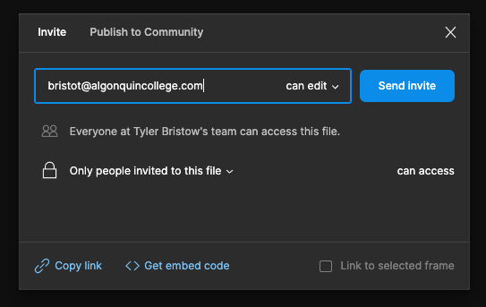

# Final Project Overview

## Introduction

The end is in sight!

For your final project, you will be working in groups of three to design a mobile application using Figma which will make up **35%** of your final mark.

As we move through the final 7 weeks, each week we will cover material relevant to each part of the final project.

The total 35% will be divided up into 5 parts:

1. Wireframes
2. Design System
3. Visual Design
4. Interactive Visual Prototype
5. Presentation

## Groups

Through Brightspace,

## App Themes

1. Music App
2. Car Rental App
3. Banking App
4. Travel Agency App
5. Food Delivery App
6. Shopping App
7. Chat App
8. Social Media App
9. Other: if you have an idea that is not listed here, please check with your prof for approval.

## Submission Requirements

For your final project you will not be submitting a file. Instead you will be using Figma's sharing feature. Please review each weeks part for any specific submission requirements.

### You Must!!!

You must invite your prof to your Figma file before starting your project.

email: bristot@algonquincollege.com

## Grading

Each weeks deliverable will have it's own grading scheme.

## Submission

Please review each weeks deliverable for submission dates.

## Getting Started
