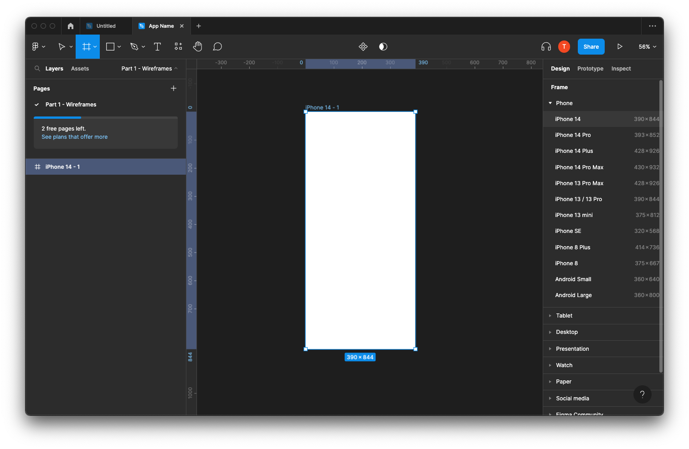

# Final Project Overview

## Introduction

The end is in sight!

For your final project, you will be working in groups of three to design a mobile application using Figma, which will make up **35%** of your final mark.

As we move through the final 7 weeks, each week, we will cover material relevant to each part of the final project.

The total 35% will be divided up into 5 parts:

1. Wireframes
2. Design System
3. Visual Design
4. Interactive Visual Prototype
5. Presentation

## App Themes

1. Music App
2. Car Rental App
3. Banking App
4. Travel Agency App
5. Food Delivery App
6. Shopping App
7. Chat App
8. Social Media App
9. Other: if you have an idea that is not listed here, please check with your prof for approval.

## Groups

Through choose a group through Brightspace > Activities > Groups

## Submission Requirements

For your final project, you will not be submitting a file. Instead, you will be using Figma's sharing feature. Please review each week's part for any specific submission requirements.

### You Must!!!

You must invite your prof to your Figma file before starting your project.
Email: bristot@algonquincollege.com

## Grading

Each weeks deliverable will have it's own grading scheme.

## Submission

Please review each weeks deliverable for submission dates.

## Getting Started

1. One team member will create a project in their Figma.

2. The team member who created the project will than invite their team members to the project along with the prof.

   (Make sure you invite them using the emails they registered under, which should be their student emails.)

3. Name your page "Part 1 - Wireframes"

4. Determine which phone size you will be designing in.

5. Organize your Figma File.

It may look something like this.

