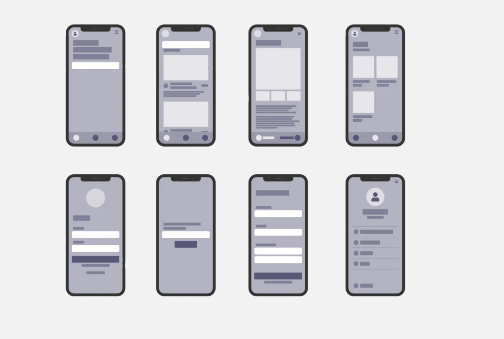
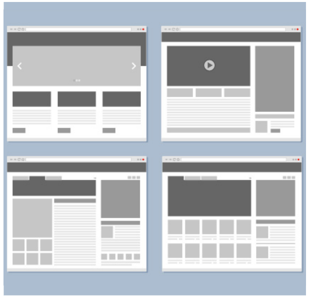

# Part 1: Wireframes

## Introduction

Time to start your final project!!

For **Part 1** of this project (after selecting your team and your app's theme), you will be creating low-fidelity wireframes for your app using Figma.

### What does low-fidelity mean?

Low-fidelity wireframes often refer to paper sketches, the benefit being that they can be created quickly, which makes them a very useful tool for brainstorming sessions.

The goal of low-fidelity wireframes is to make it easier to assess how logically the content and functional elements are arranged on individual pages.

Because of this, low-fidelity wireframes typically don't employ styling; they don't have colors, imagery, type styling, or anything else that might detract from the wireframe's primary goal.

In our case, we are skipping the paper and jumping right into Figma.

**Summary**

You must not include:

- Color
- Images
- Icons
  (You will simply represent them with basic shapes.)

For text, in areas with large blocks of text, you can use basic lorem ipsum placeholder text.

### So how many screens do you have to make?

- Each group must create a homescreen.
- Each member of your group must create additional screens.

So if you are in a group or 3, you will have a total of 7 screens.

## Instructions

1. Ensure that the file your group will be working in has been shared with all members and your prof.
2. Determine which device you will design your app for.
3. Create your frames.
4. Start creating your basic layout.
5. Organize your canvas, so your prof identifies each member's screens.

## Examples

**Example 1:** Ignore the arrows.

**Example 2:** Web version.

## Submission Requirements

For this exercise, you will not be submitting a file. Instead, you will be using Figma's sharing feature. In the comment section of the submission, please include the following;

- Your generated Figma link
- Your chosen website theme
- Your group members' names

(Ensure you invited your prof to the file)

## Grading

| Category          | Weight |
| ----------------- | ------ |
| Frame Layout      | 2      |
| Readability       | 2      |
| Layer Naming      | 2      |
| File Organization | 2      |
| Sharing           | 2      |
| **Total**         | **10** |

## Submission

::: warning Due Date

Section 010: Thursday, November 10, 2021 @ 5pm

Section 020: Wednesday, November 9, 2021 @ 7pm

Submit on Brightspace under Assignments > Part 1 - Wireframes
:::
