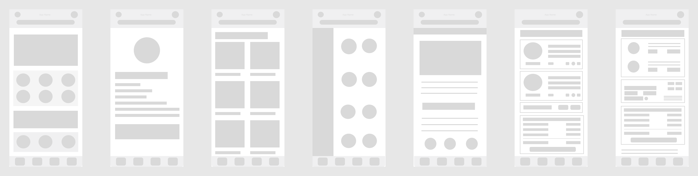

# Part 1: Wireframes

## Introduction

Welcome to the first part of your final project!

Upon forming your teams and deciding on your app's theme, it's time to delve into creating low-fidelity wireframes for your app using Figma.

### Understanding Low-fidelity Wireframes

Low-fidelity wireframes are often synonymous with paper sketches due to their simplicity and speed of creation, making them invaluable for brainstorming sessions.

They aim to facilitate a logical assessment of content and functional element arrangement on each page, devoid of any styling aspects like color, imagery, or type styling, to prevent distraction from the primary focus.

In this project, we'll leapfrog the paper sketching phase and initiate our wireframing journey directly on Figma.

**Key Takeaways:**

- Refrain from including:
  - Color
  - Images
  - Icons (Represent them with basic shapes instead.)
- For areas with substantial text, utilize basic lorem ipsum placeholder text.

### Screen Creation Guidelines

- Every group is required to design a homescreen.
- Additionally, each group member should create two more screens.

For instance, a group of three should craft a total of seven screens.

## Instructions

1. Ensure the Figma file for this project is shared among all group members and your professor.
2. Decide on the device for which you'll be designing your app.
3. Begin crafting your frames.
4. Lay out the basic structure of your design.
5. Organize your canvas in a way that enables your professor to easily identify each member's screens.

## Examples

## Grading Criteria

| Category          | Weight |
| ----------------- | ------ |
| Low-fidelity      | 2      |
| Frame Layout      | 2      |
| Readability       | 2      |
| File Organization | 2      |
| Sharing           | 2      |
| **Total**         | **10** |

## Submission Requirements

Rather than a file submission, you'll be sharing your work via Figma's sharing feature. In the comment section of the submission, please provide:

- Your Figma link
- The selected theme for your website
- Names of all group members

Ensure your professor has been invited to access the Figma file with edit permissions.

**Due Dates:**

<Badge text="Section 300: Tuesday November 7th @3:00pm" /> 
<Badge type="error" text="Section 310: Monday November 6th @4:00pm" />

Submit via Brightspace under Assignments > Part 1 - Low-Fidelity Wireframes
