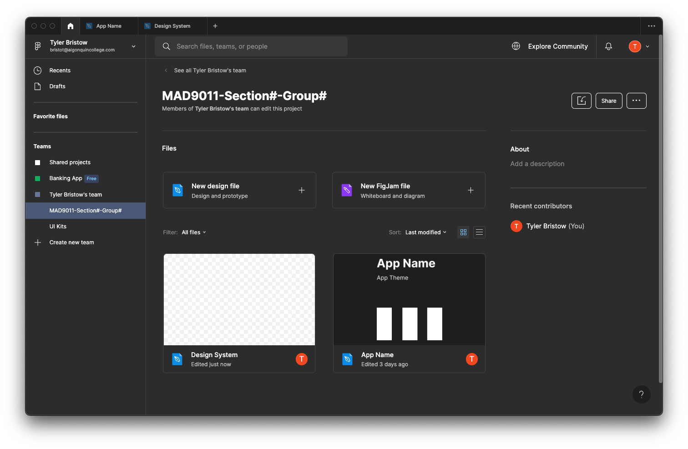
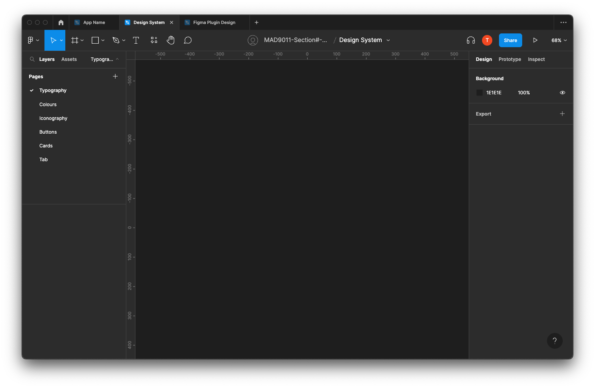
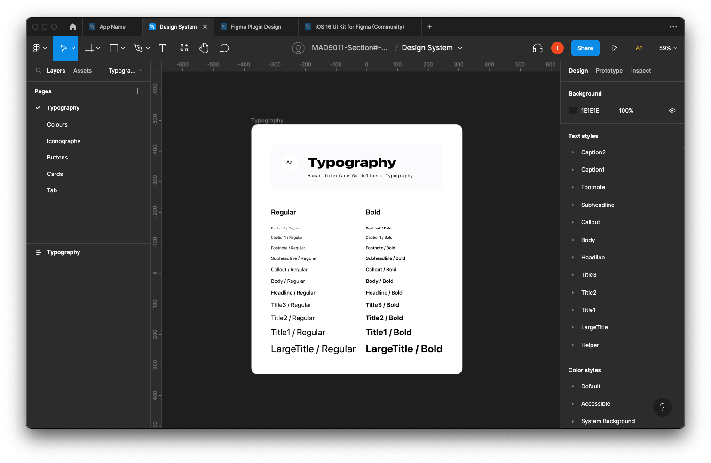
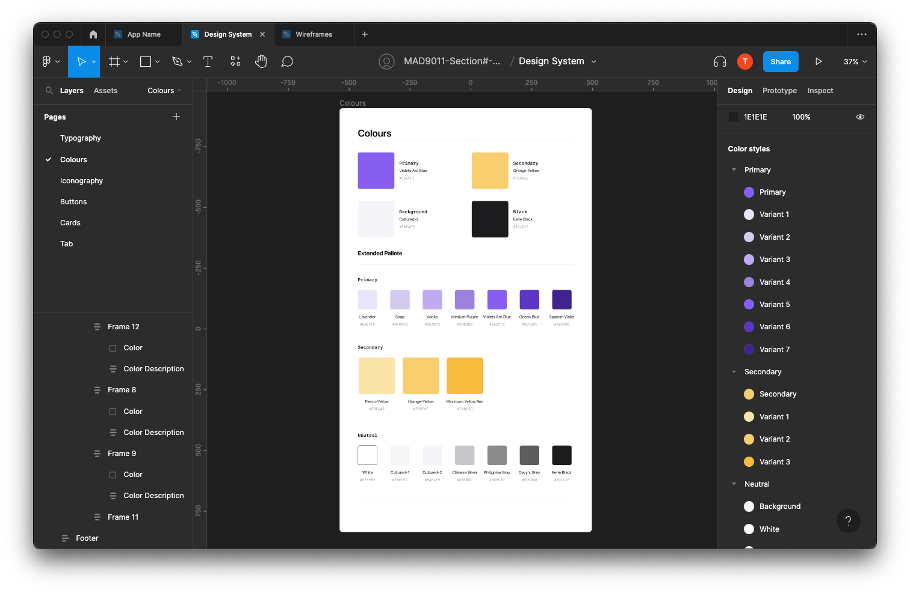
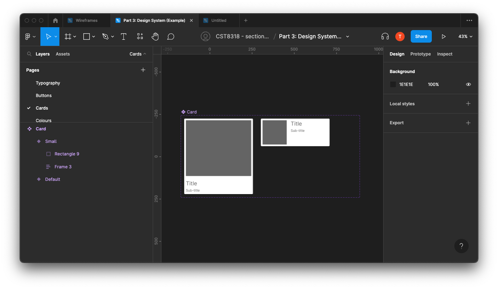
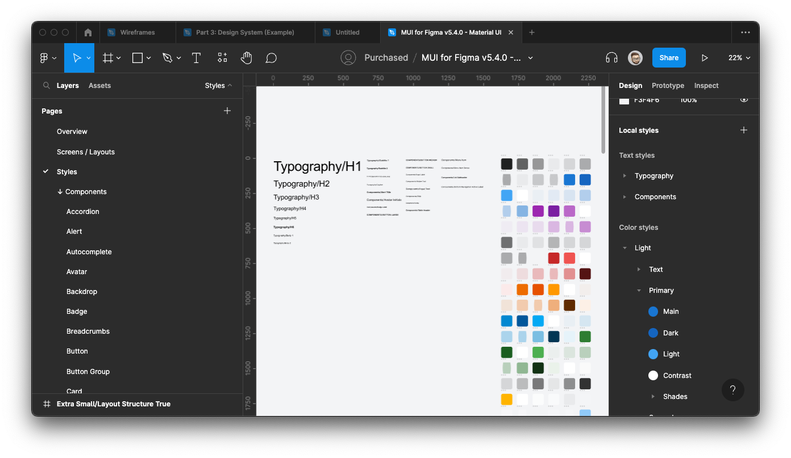
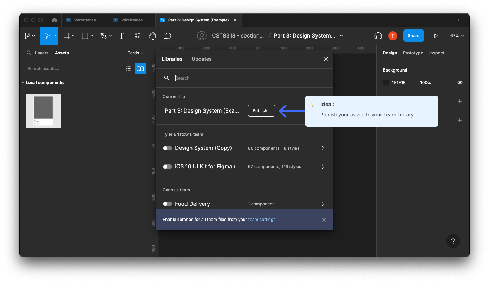
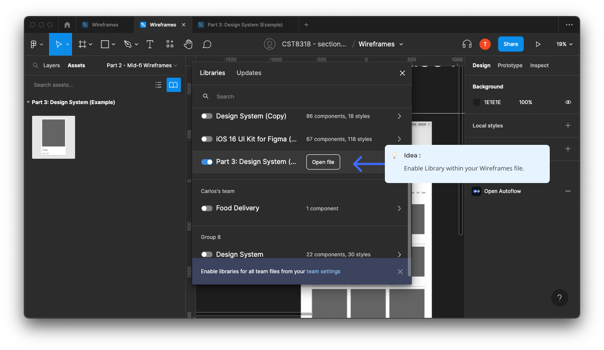

# Part 2: Design System

## Introduction

In **Part 3** of this project, we aim to craft a concise design system for your application. A robust design system ensures consistency throughout your application and simplifies the visual design process as many elements are predefined.

## Requirements

For your design system, you must incorporate:

### Week 11

- **Typography**: Define your application's fonts, sizes, weights, and line heights.
- **Colours**: Establish a color palette, including primary, secondary, and accent colors.
- **Iconography**: Choose or design consistent icon components for common actions and indicators.

### Week 12

- **Buttons**: Design button styles, including hover, active, and disabled states.
- **Cards**: Structure card elements for content presentation.
- **Fields**: Design input fields, dropdowns, checkboxes, and other form components.
- **Navigation**: Create designs for menus, breadcrumbs, tabs, and other navigation elements.

## Steps to Get Started

1. **Setup**: Create a new file within your project and name it "Part 3: Design System."
   

2. **Categorization**: Establish separate pages for different components of your design system, such as:
   

   - Colours
   - Typography
   - Buttons
   - Cards
   - Tabs
   - And more

3. **Typography**: Detail your typography choices, including size, font family, and weights.
   

4. **Color Palette**: Define your color selections, distinguishing between primary, secondary, and accent shades.
   

5. **Component Identification**: Review your mid-fidelity wireframes to identify necessary components.

6. **Component Creation**: Develop your components on their respective pages, ensuring:

   - Components are appropriately named.
   - Variants for different states or versions are created.
     

7. **Global Styles**: After defining your colours and typography, formulate "global" styles for each. Proper naming conventions are essential.
   
   _Note_: The number of styles in the example might exceed what you'll have, as they are from a comprehensive Design System.

8. **Publishing**: After completing your Design System, publish your assets to your Team Library.
   

9. **Integration**: In your Wireframes file, enable access to your design system.
   

## Grading Criteria

| Category          | Points |
| ----------------- | ------ |
| Colours           | 1      |
| Typography        | 1      |
| Iconography       | 1      |
| Components        | 5      |
| File Organization | 1      |
| Styles & Library  | 1      |
| **Total**         | **10** |

## Submission Process

Instead of a traditional file submission, share your work using Figma's sharing feature. In the submission comment section, kindly include:

- Figma project link.
- Your website's chosen theme.
- List of all group members.

Since your professor was invited during Part 1, there's no need for another invitation.

**Due Dates:**

<Badge text="Section 300: Tuesday November 28th @3:00pm" /> 
<Badge type="error" text="Section 310: Monday November 27th @4:00pm" />

Please submit via Brightspace under Assignments > Part 3 - Design System.
