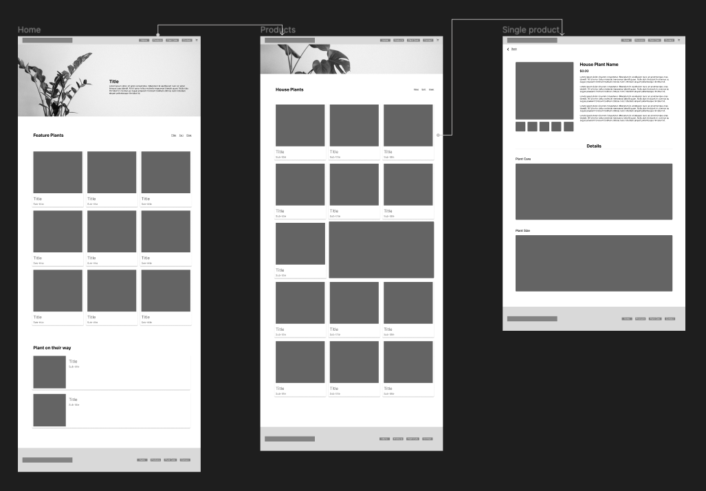

# Part 2: Mid-Fidelity Wireframes

## Introduction

In **Part 2** of this project, we transition from low-fidelity wireframes to a more refined stage. This phase involves integrating styling elements, such as drop shadows and corner radiuses. Think of Part 2 as the nexus between low-fidelity and high-fidelity wireframes, laying the foundation for Part 3.

Moreover, it's essential to incorporate flow arrows between screens, illustrating the user journey.

## Instructions

1. Start by duplicating your "Part 1 - Low-Fidelity Wireframes" and rename the duplicate for Part 2.
2. Name this duplicated page "Part 2 - Mid-Fidelity Wireframes."
3. On this new page, begin implementing styles and effects to your wireframes. However, refrain from using color at this juncture.
4. Images can be added if necessary, but ensure they are desaturated.
5. After styling, introduce arrows to elucidate the flow between screens.

**Note:** This deliverable should not closely mimic a real website yet.

## Example

Below is a sample mid-fidelity wireframe. Use it as a reference point, but don't hesitate to add more intricacies. Observe the arrows indicating the user flow, an essential criterion for this segment of the assignment.

## Grading

| Category        | Weight |
| --------------- | ------ |
| Flow Diagram    | 2      |
| Readability     | 2      |
| Effects         | 2      |
| Styles          | 2      |
| In Class Review | 2      |
| **Total**       | **10** |

## Submission Process

Instead of a traditional file submission, share your work using Figma's sharing feature. In the submission comment section, kindly include:

- Figma project link.
- Your website's chosen theme.
- List of all group members.

Since your professor was invited during Part 1, there's no need for another invitation.

**Due Dates:**

<Badge text="Section 300: Tuesday November 14th @3:00pm" /> 
<Badge type="error" text="Section 310: Monday November 13th @4:00pm" />

Please submit via Brightspace under Assignments > Part 2 - Mid-Fidelity Wireframes.
