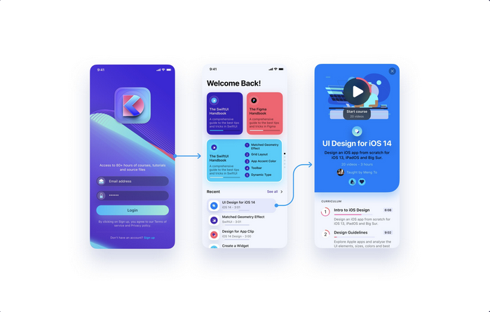

# Part 4: Interactive Visual Prototype

## Introduction

This week's focus is on creating an interactive prototype for your mobile application. This process involves adding triggers and actions to your visual design, transforming it into a dynamic, user-friendly prototype.

## Instructions

1. Initiate the task by establishing a new page titled "Part 5 - Interactive Prototype."
2. Migrate your visual design to this newly created page.
3. Begin the process of linking your screens together.

## Key Considerations

- Ensure all screens are interconnected via the "Tap" function, enabling fluid navigation between them.
- Integrate at least one additional Action/Trigger apart from "Tap."
- If necessary, design supplementary screens to seamlessly link your initial screens.
- Aim for your prototype to emulate the look and functionality of an authentic mobile app.
- Thoroughly assess your prototype using the **Preview mode**.

### Visual Representation

## Grading Criteria

| Category           | Points |
| ------------------ | ------ |
| Connected Screens  | 2      |
| Additional Trigger | 2      |
| Proper Scrolling   | 1      |
| Effort             | 2      |
| Flow               | 2      |
| Week 13 Review     | 1      |
| **Total**          | **10** |

## Submission Procedure

Rather than a traditional file submission, utilize Figma's sharing feature to showcase your work. Within the comment section of your submission, ensure the inclusion of:

- The Figma project link.
- The chosen theme for your application.
- A list of all group members.

Given that your professor received an invitation during Part 1, a re-invitation is unnecessary.

**Submission Deadlines:**

<Badge text="Section 300: Tuesday, December 12th @3:00pm" /> 
<Badge type="error" text="Section 310: Monday, December 11th @4:00pm" />

Please submit via Brightspace under Assignments > Part 5 - Interactive Prototype.
