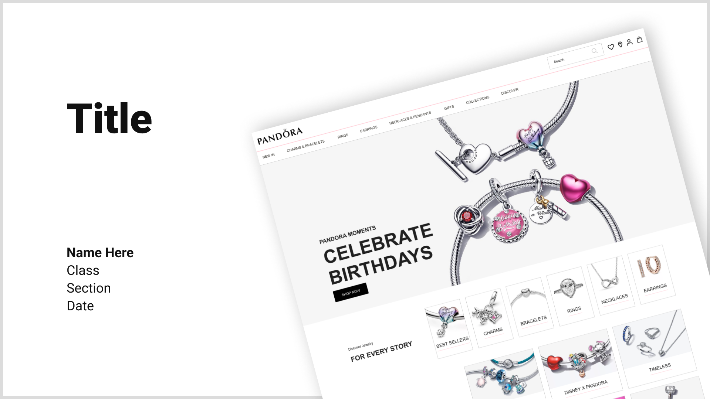
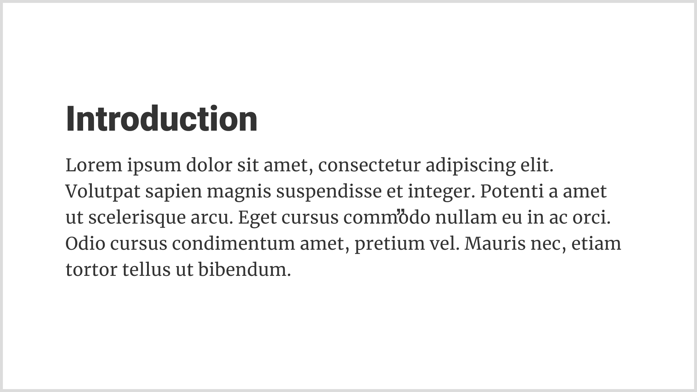
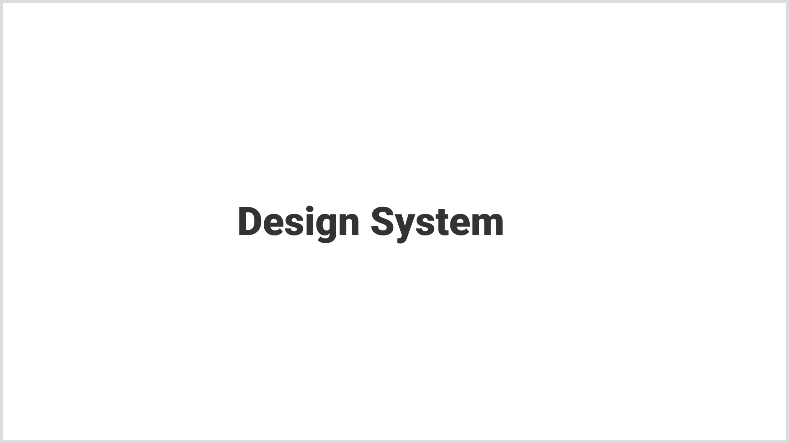
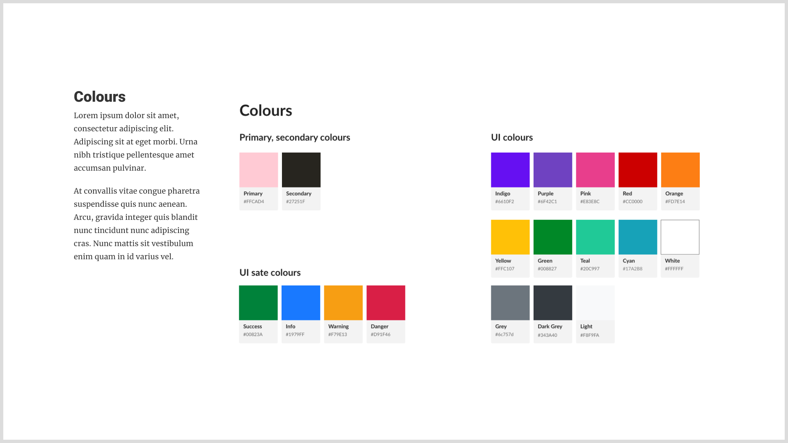
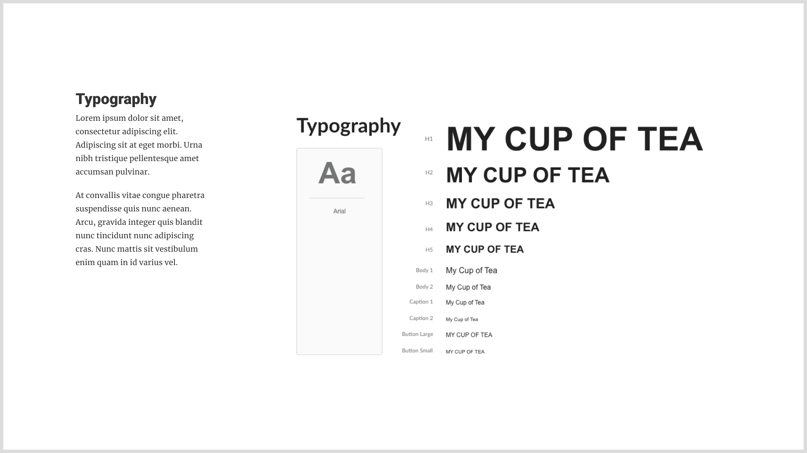
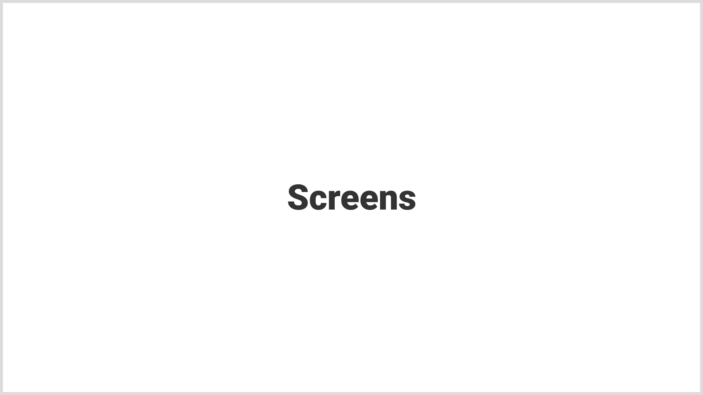
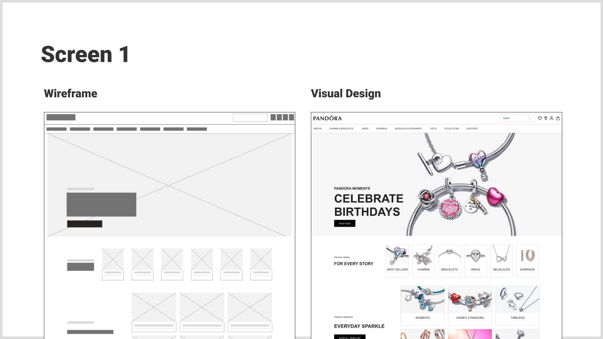

# Part 5: Presentations

## Introduction

This week culminates in the presentation of all the work you've completed from Parts 1 through 4 of the Final Project.

Each group is allotted a maximum of 5 minutes for their presentation. If your computer lacks an HDMI port, please remember to bring an appropriate adapter. I will provide a USBC -> HDMI adapter if needed.

## Presentation Requirements:

- **Display Your Progress:** Showcase the evolution of your project from week to week.
- **Decision Justification:** Explain the rationale behind specific design choices.
- **Visual Prototype Demo:** Walk the audience through your interactive prototype.
- **Reflect:** Share insights on aspects you might have approached differently.
- **Note:** Failing to present results in an automatic zero for Part 6.

## Suggested Presentation Structure:

### Title Slide

Introduce your app or project.

### Introduction

Provide a succinct overview of your application.

### Design System

Detail your styles and components.

### Screens

Dedicate a slide to each screen, juxtaposing wireframes and visual designs.

### Demo

Transition from slides to your Figma file, offering a hands-on demonstration of the interactive prototype.

::: tip Tip for Demonstrating Your Prototype
Craft a narrative when demonstrating your interactive visual prototype, ensuring a seamless transition between screens.
:::

## Grading Criteria:

| Category                | Points |
| ----------------------- | ------ |
| Presentation            | 5      |
| Demo                    | 3      |
| Adherence to Time Limit | 1      |
| Effort                  | 1      |
| **Total**               | **10** |

## Submission Procedure

Rather than a traditional file submission, utilize Figma's sharing feature to showcase your work. Within the comment section of your submission, ensure the inclusion of:

- The Figma project link.
- The chosen theme for your application.
- A list of all group members.
- PDF version of your presentation

Given that your professor received an invitation during Part 1, a re-invitation is unnecessary.

**Submission Deadlines:**

<Badge text="Section 300: Tuesday, December 12th @5:00pm" /> 
<Badge type="error" text="Section 310: Monday, December 11th @6:00pm" />

Please submit via Brightspace under Assignments > Part 6 - Presentation.
