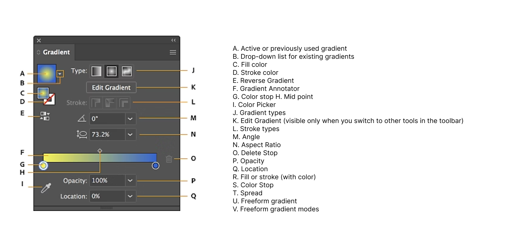

# Week 4 - Color and Effects

## Learning Objectives

By the end of this week, students will be able to:

1. **Understand Color Modes**: Grasp the different color modes (RGB, CMYK, HSB, Grayscale) and how to apply them to various design contexts.
2. **Use Illustrator's Color Tools**: Master the Color Picker, Swatches, and Gradient tool in Adobe Illustrator for precise color application.
3. **Apply Effects**: Learn to use drop shadows, inner/outer glows, and feathering to enhance the depth and visual appeal of your designs.
4. **UI Design Color**: Utilize color effectively in UI design, understanding color schemes and how color affects user interaction.

## 1. Colour Modes

Color modes are crucial for achieving the correct visual output, whether on digital screens or in print. This section introduces the types of color modes, their uses, and how to switch between them in Illustrator.

### 1.1 Colour Modes: Types and Uses

Understanding color modes is essential for ensuring your designs look the way you intend across digital and print formats. Common color modes include:

- **RGB (Red, Green, Blue)**: Ideal for digital screens.
- **CMYK (Cyan, Magenta, Yellow, Key/Black)**: Best for print media.
- **HSB (Hue, Saturation, Brightness)**: User-friendly for color selection based on human perception.
- **Greyscale**: Used for monochromatic designs.

**Pro Tip**: Always choose the appropriate color mode based on your design's final output—digital or print.

### 1.2 Changing Colour Modes

To switch between color modes in Illustrator:

<Slideshow
  :key="'colourModes'"
  :images="[
    { label: 'Document Setup', src: '/f2024/moduleImages/week4/colourMode/1.png' },
    { label: 'After Setup 1', src: '/f2024/moduleImages/week4/colourMode/2.png' },
    { label: 'After Setup 2', src: '/f2024/moduleImages/week4/colourMode/3.png' }
  ]"
/>

### 1.3 Basic Color Theory

Color theory today is primarily based on Isaac Newton's colour wheel, which he established in 1666. The main colour wheel illustrates three colour categories: primary colours, secondary colours, and tertiary colours.

**Primary colors** are those that cannot be produced by mixing two or more other colors. Red, blue, and yellow are the main colors.

The **secondary colors** are orange, purple, and green, which may be created by mixing any two of the three basic colors.

**Tertiary colors** are created when you combine a main and a secondary color. Magenta, vermillion, violet, teal, amber, and chartreuse are the tertiary hues.

<YouTube
  title="Beginning Graphic Design: Color"
  url="https://www.youtube.com/embed/_2LLXnUdUIc?si=49DeBHq2p6bInb7G"
/>

## 2. Using Colours in Illustrator

In Illustrator, color is applied through several tools that allow precision and flexibility. This section covers the Color Picker, Swatches, and Gradient tools.

### 2.1 Colour Picker

The **Color Picker** allows for precise color selection. You can:

- Manually input values for RGB, CMYK, or HSB.
- Select colors from a spectrum or use the eyedropper to pick colors from your design.

### 2.2 Colour Swatches

**Swatches** in Illustrator allow you to save custom colors for easy access later. To create a new swatch:

1. Select a color in the Color Picker.
2. Open the **Swatches panel**.
3. Click on the new swatch icon at the bottom to save the color for future use.

You can also explore Illustrator’s pre-made color libraries for quick access to popular palettes.

### 2.3 Gradient Tool

The **Gradient Tool** in Illustrator allows you to create smooth color transitions. There are two primary types of gradients:

- **Linear Gradient**: Transitions colors along a straight line.
- **Radial Gradient**: Transitions colors in a circular pattern from a central point.

**How to create a gradient:**

1. Select an object and open the Gradient panel.
2. Choose between **Linear** or **Radial**.
3. Adjust the color stops by dragging the sliders in the Gradient panel.
4. Customize the angle, opacity, and position of the gradient for fine control.

### 2.4 Gradient Panel

**Demo**: [Gradient Demo: Bubble](https://drive.google.com/drive/folders/1M5m3ZtZh9FATY83xFqRZximU786w0yCc?usp=sharing)

## 3. Effects

Effects like drop shadows, glows, and feathering help enhance the visual impact of your designs by adding depth and texture.

### 3.1 Dropshadow

Drop shadows add depth to your designs by creating a shadow effect behind an object, making it appear as if it is raised above the background.

<Slideshow
  :key="'dropshadow'"
  :images="[
    { label: 'Step 1', src: '/f2024/moduleImages/week4/dropshadow/1.png' },
    { label: 'Step 2', src: '/f2024/moduleImages/week4/dropshadow/2.png' },
    { label: 'Step 3', src: '/f2024/moduleImages/week4/dropshadow/3.png' },
    { label: 'Result', src: '/f2024/moduleImages/week4/dropshadow/4.png' },
  ]"
/>

### 3.2 Inner or Outer Glow

Inner or Outer Glow creates a soft halo around an object, which can be used to highlight elements or create a specific mood.

<Slideshow
  :key="'Inner Glow'"
  :images="[
    { label: 'Step 1', src: '/f2024/moduleImages/week4/innerGlow/1.png' },
    { label: 'Step 2', src: '/f2024/moduleImages/week4/innerGlow/2.png' },
    { label: 'Step 3', src: '/f2024/moduleImages/week4/innerGlow/3.png' },
    { label: 'Result', src: '/f2024/moduleImages/week4/innerGlow/4.png' },
  ]"
/>

### 3.3 Feather

Feathering softens the edges of an object, creating a gradual transition between the object and the background.

<Slideshow
  :key="'Feather'"
  :images="[
    { label: 'Step 1', src: '/f2024/moduleImages/week4/feather/1.png' },
    { label: 'Step 2', src: '/f2024/moduleImages/week4/feather/2.png' },
    { label: 'Step 3', src: '/f2024/moduleImages/week4/feather/3.png' },
    { label: 'Result', src: '/f2024/moduleImages/week4/feather/4.png' },
  ]"
/>

## 4. Utilizing Colors in UI Design

Color is one of the most powerful elements in UI design. It plays a critical role in influencing user behavior, enhancing user experience, and creating visual hierarchy. By understanding how to use color effectively, you can create interfaces that are not only visually appealing but also functional and accessible.

<Slideshow
  :key="'Colour Schemes'"
  :images="[
    { label: 'Monochromatic', src: '/f2024/moduleImages/week4/colourSchemes/1.png' },
    { label: 'Analogous', src: '/f2024/moduleImages/week4/colourSchemes/2.png' },
    { label: 'Complementary', src: '/f2024/moduleImages/week4/colourSchemes/3.png' },
    { label: 'Split Complementary', src: '/f2024/moduleImages/week4/colourSchemes/4.png' },
    { label: '60-30-10 Rule', src: '/f2024/moduleImages/week4/colourSchemes/5.png' },
    { label: 'Light and Dark Mode', src: '/f2024/moduleImages/week4/colourSchemes/6.png' },
  ]"
/>

### 4.1 The Importance of Color in UI Design

Color in UI design is not just about aesthetics. It also serves multiple functional purposes that directly impact user interaction and perception. Some of the key reasons color is important include:

- **Visual Hierarchy**: Color helps guide the user’s attention to the most important elements on the screen, such as call-to-action buttons or key information. It allows designers to prioritize content without adding unnecessary elements.
- **Brand Identity**: Color is a core part of branding. The color scheme of a UI should reflect the brand’s personality and values. For example, blue is often used by corporate and financial organizations because it communicates trust, while bright colors like yellow and orange evoke energy and creativity.

- **Emotional Impact**: Colors have psychological effects that influence how users feel when interacting with a UI. For instance, blue can evoke a sense of calm, while red can create urgency.

- **Readability and Accessibility**: Choosing the right color combinations is essential for readability, especially for users with visual impairments. It’s important to ensure sufficient contrast between text and background for clarity and ease of reading.

### 4.2 Key Considerations When Using Color in UI Design

When designing user interfaces, it’s crucial to take into account several factors to ensure color is used effectively. Here are some important considerations:

#### 1. **Contrast and Readability**

Ensure there is enough contrast between text and background colors to make the interface readable. A poor contrast ratio can make the content hard to read and negatively impact accessibility. Tools like **[Contrast Checker](https://webaim.org/resources/contrastchecker/)** can help ensure you meet accessibility standards.

- **WCAG Contrast Standards**: Aim for a contrast ratio of 4.5:1 for normal text and 3:1 for large text (18pt and above).

#### 2. **Color Blindness Considerations**

Approximately 8% of men and 0.5% of women have some form of color blindness. Designers need to ensure that color is not the only means of conveying information. Use text labels, patterns, or icons in combination with color to ensure that everyone can understand the interface, regardless of their ability to perceive colors.

- **Tip**: Tools like **[Colorblindly](https://chrome.google.com/webstore/detail/colorblinding/dgbgleaofjainknadoffbjkclicbbgaa)** can simulate how your design will look to users with different types of color blindness.

#### 3. **Cultural Meanings of Color**

Color meanings can vary across cultures. For example, while white is often associated with purity in Western cultures, it can represent mourning in some Eastern cultures. Be mindful of the cultural context of your audience when choosing a color palette.

- **Tip**: Research the cultural significance of colors when designing for a global audience to avoid unintended miscommunication.

#### 4. **Using Color for Interaction Feedback**

Colors can signal interaction states like hover, active, or disabled, providing feedback that helps users understand the functionality of buttons, forms, and other UI elements. For example:

- **Hover States**: Buttons often change color on hover to indicate they are clickable.
- **Disabled States**: Use muted or greyed-out colors to indicate that an element is inactive or unavailable.

#### 5. **Color Consistency**

Maintaining color consistency throughout the UI helps reinforce the brand identity and ensures a coherent visual experience. This consistency also reduces cognitive load for the user, making the interface more intuitive.

- **Tip**: Use a design system or style guide that defines color usage across all elements (e.g., primary buttons, secondary buttons, alerts, and links).

<!-- Add more content to this section -->

::: tip Helpful Tools for Color Schemes

- **[Adobe Color](https://color.adobe.com/)**: Create and explore unique color palettes.
- **[Colormind.io](http://colormind.io/bootstrap/)**: Generate aesthetically pleasing color palettes with web element examples.
  :::
