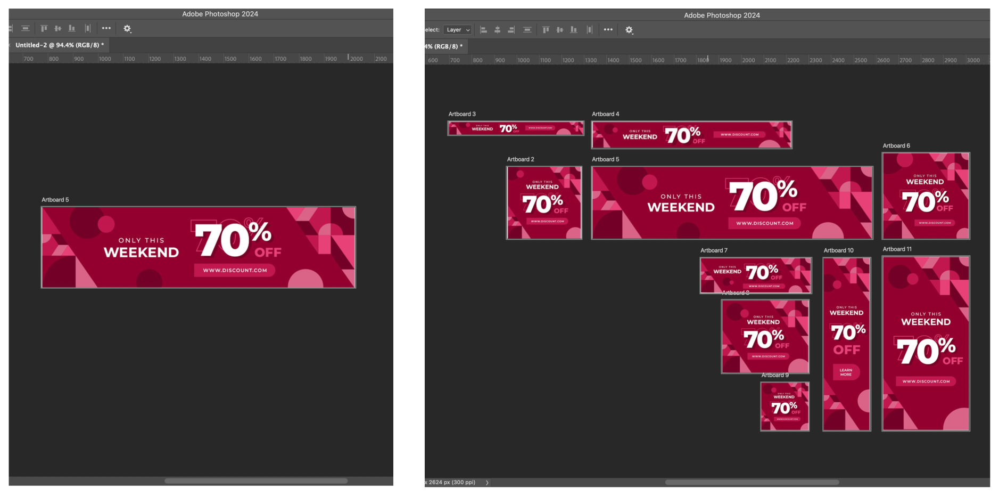

# Week 1 - Introduction to Adobe Photoshop

<Countdown date="2024-09-04" customMessage="Coming Soon! This content will be available before this week's theory class.">

::: tip Learning Objectives

By the end of this week, students will be able to:

1. **Understand Raster Graphics:** Grasp how Photoshop handles pixel-based images, including the significance of resolution and image quality.
2. **Differentiate File Types:** Identify PSD, JPEG, PNG, and GIF, and understand their appropriate applications.
3. **Navigate Photoshop Interface:** Familiarize with the layout, tools, panels, and menus, and learn workspace customization.
4. **Master Layers:** Understand layer creation, management, and styling.
5. **Utilize Core Tools:** Gain proficiency in selection tools, image resizing, and basic masking.
6. **Apply Nondestructive Editing:** Learn the difference between destructive and nondestructive editing, using adjustment layers and smart objects.

:::

## 1. Introduction to Photoshop

Adobe Photoshop is a leading tool in image editing and manipulation, essential in graphic design, photography, and digital art. This module introduces Photoshop's interface and key tools for photo manipulation.

### 1.1 Interface Walkthrough

Adobe Photoshop's interface is a complex environment with various tools and features. Understanding and navigating this interface is crucial for efficient and effective photo editing.

<Slideshow
  :key="'interface'"
  :images="[
    { label: 'Image 1', src: '/f2024/moduleImages/week1/psInterface/1.png' },
    { label: 'Image 2', src: '/f2024/moduleImages/week1/psInterface/2.png' },
    { label: 'Image 3', src: '/f2024/moduleImages/week1/psInterface/3.png' },
    { label: 'Image 4', src: '/f2024/moduleImages/week1/psInterface/4.png' },
    { label: 'Image 5', src: '/f2024/moduleImages/week1/psInterface/5.png' },
    { label: 'Image 6', src: '/f2024/moduleImages/week1/psInterface/6.png' },
    { label: 'Image 7', src: '/f2024/moduleImages/week1/psInterface/7.png' },
    { label: 'Image 8', src: '/f2024/moduleImages/week1/psInterface/8.png' }
  ]"
/>

### 1.2 Canvases and Artboards

In Photoshop, **canvases** and **artboards** are essential for organizing your workspace. Though they share some similarities, they cater to different design needs.

#### Photoshop Canvas

- **Single Design Focus:** The canvas is the base area where your design or image resides. It’s like a single piece of digital paper where you create and manipulate your artwork.
- **Best for Single Images:** Ideal for projects that focus on one design or image, such as photo editing, illustration, or digital painting.

#### Photoshop Artboards

- **Multiple Design Areas:** Artboards enable you to create multiple design areas within a single document. They’re like having several canvases in one file, perfect for working on multiple variations of a project at once.
- **Organize & Export with Ease:** You can easily name, rearrange, and export individual artboards. This makes them ideal for projects with multiple layouts, like website designs, social media posts, or UI mockups.

#### Common Features: Canvas & Artboards

- **Adjustable Size:** Both canvases and artboards allow you to change their size at any point, making it easy to expand or crop your working area to suit the project’s requirements.
- **Background Options:** Whether you’re working with a canvas or an artboard, you can set the background to be solid (any color) or transparent. This is useful when creating designs for web graphics, layering, or composite images.

#### When to Use Canvas vs. Artboards

| **Use Case**                       | **Canvas**                                                               | **Artboards**                                                |
| ---------------------------------- | ------------------------------------------------------------------------ | ------------------------------------------------------------ |
| **Single Image or Design**         | Perfect for focused, single designs like photo editing or illustrations. | Best when managing multiple versions or layouts.             |
| **Multiple Layouts/Variations**    | Possible but not efficient.                                              | Ideal for managing multiple designs or layouts side by side. |
| **Resizing for Specific Projects** | Easily resize to fit your design needs.                                  | Resize and rearrange multiple artboards in one document.     |
| **Exporting Designs**              | Export individual images.                                                | Export individual artboards or all artboards together.       |

**Pro Tip:**  
Use **canvases** for single projects or images, and **artboards** when working on multiple designs or variations, such as social media posts or responsive web designs.

For more details, check out the [Artboards in Photoshop User Guide](https://helpx.adobe.com/photoshop/using/artboards.html).

By understanding when to use canvases and artboards, you'll streamline your workflow and handle complex design projects more efficiently in Photoshop.

## 2. Image Fundamentals

### 2.1 Raster Graphics

Raster graphics are fundamental to how Photoshop manages images. They are:

- **Composed of Pixels:** Each pixel is a tiny square that makes up part of the image. Every pixel contains data about color and brightness, contributing to the overall appearance of the image.
- **Photoshop's Pixel Manipulation:** Photoshop edits images by altering these pixels. Whether you're adjusting colors, applying filters, or transforming shapes, Photoshop recalculates the pixel data to create the desired effect.

### 2.2 Image Resolution

Resolution is a key concept in digital imaging that directly impacts the quality and usability of your images.

- **Pixels Per Inch (PPI):** This measures the density of pixels in an image. A higher PPI means more pixels are packed into each inch, resulting in finer detail and sharper images.
- **Effect on Image Quality:** High-resolution images are clearer and more detailed, making them ideal for high-quality prints and detailed editing. However, they also have larger file sizes, which can be a consideration for web use or storage.
- **Choosing the Right Resolution:**
  - **For Printing:** Higher resolutions, typically around 300 PPI, are preferred to ensure that prints are sharp and detailed.
  - **For Web and Screen Use:** Lower resolutions, such as 72 PPI, are often sufficient since screens generally display fewer pixels per inch than what can be achieved in print. This also helps in reducing file size, which is crucial for website loading times and performance.
  - **Editing Considerations:** When editing, consider the final output of your image. If you're working on graphics for a website, a lower resolution might suffice. However, if you're editing images for a printed brochure, you'll need a higher resolution to ensure quality in the final print.

### 2.3 File Types and Their Uses

- **PSD:** Photoshop's native format for layered files.
- **JPEG:** Common for photos, balancing quality and file size.
- **PNG:** Ideal for web graphics with transparency.
- **GIF:** For simple animations and low-color images.

## 3. Core Photoshop Techniques

### 3.1 Working with Layers

Layers are a cornerstone of Photoshop, providing flexibility and control over different elements of your image.

<YouTube
  title="How to Use Layers: Photoshop | Adobe Creative Cloud"
  url="https://www.youtube.com/embed/xRFBOcxjkQU?si=tFU3O8-DA0kYOqXI"
/>

### 3.2 Making Selections

A selection isolates part of an image so you can work on that area without affecting the rest of the image. Take a look at this series of short tutorials and practice [**making selections.** (3 videos)](https://helpx.adobe.com/photoshop/how-to/selection-tools-basics.html)

- Learn selection basics
- Learn how to use the Quick Selection and Lasso tools
- Fine-tune a selection

#### Object Selection Tool

Learn how to select regions of a photo quickly using the Photoshop Select Object tool.

<YouTube
  title="How to Select Objects in Photoshop"
  url="https://www.youtube.com/embed/PAeEnLPgal4?si=bZ6WWbcTryOPkg2i"
/>

### 3.3 Changing Image Size

Photoshop allows you to resize, crop, and straighten an image and change the canvas size. **Note:** Canvas and image resize won't work when artboards are used. Resize artboards instead. Let's Begin the video tutorials to [**Change the image size.** (4 videos)](https://helpx.adobe.com/photoshop/how-to/image-resizing-basics.html)

- Resize an image
- Set the resolution
- Crop and straighten an image
- Expand the canvas

### 3.4 Masking

Layer masking is a nondestructive way to hide parts of an image or layer without erasing them.

<YouTube
  title="Make Your First Layer Mask with Photoshop"
  url="https://www.youtube.com/embed/ddbMxDT7J9Y?si=oMr2c71PTzff39-i"
/>

### 3.5 Layer Adjustments

Layer adjustments are a powerful feature in Photoshop that allow for flexible, non-destructive editing. They enable you to modify the appearance of your images—such as color, brightness, and contrast—without permanently altering the original content, preserving your ability to make changes later.

### Understanding Layer Adjustments

- **Non-Destructive Editing:** Adjustment layers sit on top of your image layers, letting you make modifications like color corrections or exposure changes without touching the original pixels.
- **Flexible Control:** You can stack multiple adjustment layers to build complex effects, and toggle them on or off to compare different looks instantly.

### Key Types of Adjustment Layers

- **Levels & Curves:** Ideal for adjusting brightness, contrast, and the tonal range of your image with precision.
- **Hue/Saturation:** Modify the intensity and hue of colors, perfect for making colors pop or creating dramatic shifts in tone.
- **Color Balance:** A go-to tool for color correction, letting you fine-tune the overall color mix in your image.
- **Black & White:** Convert your images to grayscale with control over how individual colors are represented in shades of gray.
- **Photo Filter:** Apply warming or cooling effects to your images, simulating the look of traditional camera filters.

### How to Use Adjustment Layers

1. **Adding an Adjustment Layer:** Click the ‘New Adjustment Layer’ icon at the bottom of the Layers panel, or access it via the 'Layer' menu to apply a new adjustment.
2. **Fine-Tuning Adjustments:** Once added, you can modify the properties of the adjustment layer in the Properties panel. Remember, adjustments only affect the layers beneath them in the stacking order.
3. **Using Layer Masks:** Every adjustment layer comes with a built-in mask, allowing you to selectively apply changes to specific areas by painting on the mask—ideal for precise edits.

### Learn More

For a visual walkthrough of how to use adjustment layers, check out this video:

<YouTube
  title="Get to Know Adjustment Layers in Adobe Photoshop"
  url="https://www.youtube.com/embed/AW-1gogYcFM?si=4AVorrsg3XrZKW2t"
/>

## 4. Key Concept: Destructive vs. Nondestructive Editing

In Adobe Photoshop, one of the most important concepts is **non-destructive editing**. But what does that mean? Non-destructive editing refers to editing techniques that keep your original work intact, allowing all changes, adjustments, and filters to be easily reversed. This flexibility ensures that if you make a mistake or decide to take a new direction, you can revert to earlier stages of your work without losing quality. Here’s why non-destructive editing is so crucial:

1. **Preserve Your Original Assets**: It ensures you don't accidentally alter or damage your original assets. This is essential when working with client files where keeping originals untouched is critical.
2. **Easily Revert Changes**: If you decide to change direction later, non-destructive techniques make it easy to revert to earlier versions of your work.
3. **Maintain Image Quality**: It ensures no loss of image data, preserving the high quality of your images even after multiple edits.

---

### How to Edit Non-Destructively

To ensure you're working non-destructively, follow these best practices:

1. **Stay Organized**: Maintain strong file and layer organization to avoid unintentionally altering or deleting layers.
2. **Use Layer Masks**: Instead of deleting parts of a layer, use layer masks to hide or reveal portions. This preserves the original pixels, giving you the flexibility to make adjustments later.
3. **Leverage Smart Objects**: Convert layers into Smart Objects to protect them while allowing for reversible filter and effect edits. Smart Objects let you edit without committing changes permanently.

By following these practices, you’ll safeguard your work, maintain image quality, and have the freedom to adjust your designs with ease.

::: tip
**Pro Tip:** Always save a backup of your original assets in case you need to refer to them later. Non-destructive editing ensures you won’t need it, but it’s always a good safety net.
:::

## 5. Exporting Assets from Photoshop

It is important to properly **name your artboards** as the `Export As` dialogue uses the artboard names to name the exported file.

<Slideshow
  :key="'export'"
  :images="[
    { label: 'Image 1', src: '/f2024/moduleImages/week1/psExport/1.png' },
    { label: 'Image 2', src: '/f2024/moduleImages/week1/psExport/2.png' },
    { label: 'Image 3', src: '/f2024/moduleImages/week1/psExport/3.png' },
    { label: 'Image 4', src: '/f2024/moduleImages/week1/psExport/4.png' },
    { label: 'Image 5', src: '/f2024/moduleImages/week1/psExport/5.png' }
  ]"
/>

## 6. Resources

- [Photoshop User Guide](https://helpx.adobe.com/photoshop/user-guide.html)
- [Photoshop Tool Galleries](https://helpx.adobe.com/photoshop/using/tools.html)
- [Photoshop Artboards](https://helpx.adobe.com/photoshop/using/artboards.html)
- [Keyboard Shortcuts](https://helpx.adobe.com/ca/photoshop/using/default-keyboard-shortcuts.html)
- [Adobe PS Tutorials](https://helpx.adobe.com/ca/photoshop/tutorials.html)
- [A comprehensive tutorial for Photoshop Tools](http://www.photoshop-bootcamp.com/beginners-guide-photoshop-tools-toolbar/)

**Free stock photos**

- [Unsplash](https://unsplash.com/)
- [Pixabay](https://pixabay.com/)
- [Pexels](https://www.pexels.com/)

</Countdown>
