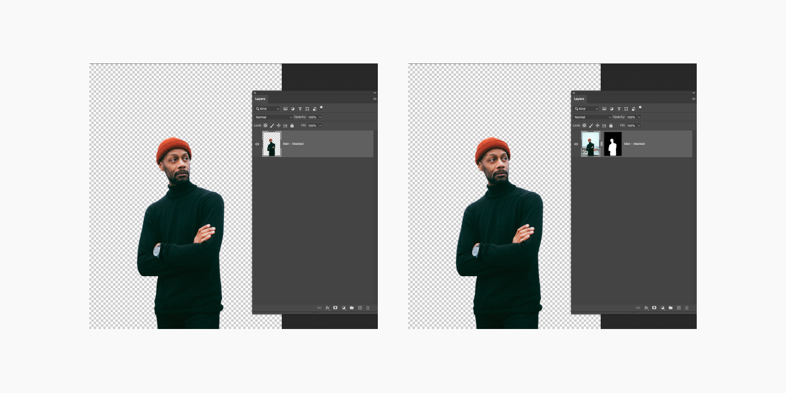

# Week 1 - Photoshop Fundamentals

## Learning Objectives

By the end of this week, students will be able to:

1. **Understand Raster Graphics:** Grasp how Photoshop handles pixel-based images, including the significance of resolution and image quality.
2. **Differentiate File Types:** Identify PSD, JPEG, PNG, and GIF, and understand their appropriate applications.
3. **Navigate Photoshop Interface:** Familiarize with the layout, tools, panels, and menus, and learn workspace customization.
4. **Master Layers:** Understand layer creation, management, and styling.
5. **Utilize Core Tools:** Gain proficiency in selection tools, image resizing, and basic masking.
6. **Apply Nondestructive Editing:** Learn the difference between destructive and nondestructive editing, using adjustment layers and smart objects.

## Introduction to Photoshop

Adobe Photoshop is a leading tool in image editing and manipulation, essential in graphic design, photography, and digital art. This module introduces Photoshop's interface and key tools for photo manipulation.

## Raster Graphics and Pixels

<!-- Introduction ramble about pixels and vectors but focused more on Pixels -->

### Understanding Raster Graphics

Raster graphics are fundamental to how Photoshop manages images. They are:

- **Composed of Pixels:** Each pixel is a tiny square that makes up part of the image. Every pixel contains data about color and brightness, contributing to the overall appearance of the image.
- **Photoshop's Pixel Manipulation:** Photoshop edits images by altering these pixels. Whether you're adjusting colors, applying filters, or transforming shapes, Photoshop recalculates the pixel data to create the desired effect.

### Image Resolution

Resolution is a key concept in digital imaging that directly impacts the quality and usability of your images.

- **Pixels Per Inch (PPI):** This measures the density of pixels in an image. A higher PPI means more pixels are packed into each inch, resulting in finer detail and sharper images.
- **Effect on Image Quality:** High-resolution images are clearer and more detailed, making them ideal for high-quality prints and detailed editing. However, they also have larger file sizes, which can be a consideration for web use or storage.
- **Choosing the Right Resolution:**
  - **For Printing:** Higher resolutions, typically around 300 PPI, are preferred to ensure that prints are sharp and detailed.
  - **For Web and Screen Use:** Lower resolutions, such as 72 PPI, are often sufficient since screens generally display fewer pixels per inch than what can be achieved in print. This also helps in reducing file size, which is crucial for website loading times and performance.
  - **Editing Considerations:** When editing, consider the final output of your image. If you're working on graphics for a website, a lower resolution might suffice. However, if you're editing images for a printed brochure, you'll need a higher resolution to ensure quality in the final print.

## File Types and Their Uses

- **PSD:** Photoshop's native format for layered files.
- **JPEG:** Common for photos, balancing quality and file size.
- **PNG:** Ideal for web graphics with transparency.
- **GIF:** For simple animations and low-color images.

## Understanding Photoshop's Interface

Adobe Photoshop's interface is a complex environment with various tools and features. Understanding and navigating this interface is crucial for efficient and effective photo editing.

<!-- SLIDE SHOW HERE!!! -->

<ImageSwitcher
  :images="[
    { label: 'Image 1', src: '/f2024/moduleImages/week1/psInterface/1.png', title: 'Title for Image 1', description: 'This is the body text corresponding to Image 1.' },
    { label: 'Image 2', src: '/f2024/moduleImages/week1/psInterface/2.png', title: 'Title for Image 2', description: 'This is the body text corresponding to Image 2.' },
    { label: 'Image 3', src: '/f2024/moduleImages/week1/psInterface/3.png', title: 'Title for Image 3', description: 'This is the body text corresponding to Image 3.' },
    { label: 'Image 4', src: '/f2024/moduleImages/week1/psInterface/4.png', title: 'Title for Image 4', description: 'This is the body text corresponding to Image 4.' },
    { label: 'Image 5', src: '/f2024/moduleImages/week1/psInterface/5.png', title: 'Title for Image 5', description: 'This is the body text corresponding to Image 5.' },
    { label: 'Image 6', src: '/f2024/moduleImages/week1/psInterface/6.png', title: 'Title for Image 6', description: 'This is the body text corresponding to Image 6.' },
    { label: 'Image 7', src: '/f2024/moduleImages/week1/psInterface/7.png', title: 'Title for Image 7', description: 'This is the body text corresponding to Image 7.' },
    { label: 'Image 8', src: '/f2024/moduleImages/week1/psInterface/8.png', title: 'Title for Image 8', description: 'This is the body text corresponding to Image 8.' }
  ]"
/>

## Understanding Photoshop Canvases and Artboards

In Photoshop, the concepts of canvases and artboards are fundamental for managing your design workspace efficiently. While they share similarities, they serve different purposes and are used in various design scenarios.

### Photoshop Canvas

- **The Foundation of Your Design:** The canvas in Photoshop is the base area where your design or image resides. It's like a digital piece of paper where you create and manipulate your artwork.
- **Canvas Size and Resizing:** The size of the canvas determines the working area for your design. You can adjust the canvas size according to the requirements of your project, which is particularly useful when you need to add extra space around your design or crop it to specific dimensions.
- **Background and Transparency:** The canvas can have a background color or be transparent. A transparent canvas is essential when creating graphics for the web or layers for composite images.

### Photoshop Artboards

- **Multiple Workspaces in One Document:** Artboards allow you to have multiple 'canvases' within a single Photoshop document. Each artboard acts as an independent workspace, enabling you to work on different design elements or variations side by side.
- **Organizing and Exporting Artboards:** You can easily organize, name, and rearrange artboards within a document. Photoshop also provides efficient tools for exporting artboards, making it simple to share and present different parts of your project.

[Artboards](https://helpx.adobe.com/photoshop/using/artboards.html) article provides a quick reference in Photoshop User Guide.

### When to Use Canvas vs. Artboards

- **Single Design or Image Editing:** Use the canvas when working on a single image or if your project doesn't require multiple variations or layouts.
- **Multiple Designs or Layouts:** Use artboards when your project involves different designs or variations that need to be viewed and edited in parallel, such as designing for multiple devices or creating a series of web banners.

Understanding when and how to use canvases and artboards will enhance your workflow in Photoshop, allowing you to choose the right approach for your specific design needs.

## Working with Layers

Layers are a cornerstone of Photoshop, providing flexibility and control over different elements of your image.

<YouTube
  title="How to Use Layers: Photoshop | Adobe Creative Cloud"
  url="https://www.youtube.com/embed/xRFBOcxjkQU?si=tFU3O8-DA0kYOqXI"
/>

## Changing Image Size

Photoshop allows you to resize, crop, and straighten an image and change the canvas size. **Note:** Canvas and image resize won't work when artboards are used. Resize artboards instead. Let's Begin the video tutorials to [**Change the image size.** (4 videos)](https://helpx.adobe.com/photoshop/how-to/image-resizing-basics.html)

- Resize an image
- Set the resolution
- Crop and straighten an image
- Expand the canvas

## Making Selections

A selection isolates part of an image so you can work on that area without affecting the rest of the image. Take a look at this series of short tutorials and practice [**making selections.** (3 videos)](https://helpx.adobe.com/photoshop/how-to/selection-tools-basics.html)

- Learn selection basics
- Learn how to use the Quick Selection and Lasso tools
- Fine-tune a selection

### Object Selection Tool

Learn how to select regions of a photo quickly using the Photoshop Select Object tool.

<YouTube
  title="How to Select Objects in Photoshop"
  url="https://www.youtube.com/embed/PAeEnLPgal4?si=bZ6WWbcTryOPkg2i"
/>

## Masking

Layer masking is a nondestructive way to hide parts of an image or layer without erasing them.

<YouTube
  title="Make Your First Layer Mask with Photoshop"
  url="https://www.youtube.com/embed/ddbMxDT7J9Y?si=oMr2c71PTzff39-i"
/>

## Layer Adjustments

Layer adjustments are a crucial aspect of Photoshop that allow for versatile and non-destructive editing of images. They enable you to tweak the appearance of your artwork without permanently altering the original pixels.

### Understanding Layer Adjustments

- **Non-Destructive Editing:** Layer adjustments are applied over your image layers, allowing you to make changes like color correction, brightness adjustments, or contrast enhancements without modifying the original layer.
- **Flexibility:** You can stack multiple adjustment layers to create complex effects and easily toggle them on and off to compare different looks.

### Types of Adjustment Layers

- **Levels and Curves:** For fine-tuning the brightness and contrast of your image.
- **Hue/Saturation:** To adjust the colors’ intensity and hue.
- **Color Balance:** Ideal for color correction, helping to adjust the overall mixture of colors.
- **Black & White:** Convert your images to grayscale, with control over how individual colors are translated into shades of gray.
- **Photo Filter:** Apply color tints, mimicking the effect of using a camera filter.

### Using Adjustment Layers

1. **Adding an Adjustment Layer:** You can add an adjustment layer by clicking the 'New Adjustment Layer' icon at the bottom of the Layers panel or through the 'Layer' menu.
2. **Editing Adjustments:** Once added, you can edit the properties of the adjustment layer to achieve your desired effect. The changes will only affect layers below the adjustment layer in the layer stack.
3. **Layer Masks:** Each adjustment layer comes with its own mask, allowing you to selectively apply the adjustment to parts of your image by painting on the mask.

<YouTube
  title="Get to Know Adjustment Layers in Adobe Photoshop"
  url="https://www.youtube.com/embed/AW-1gogYcFM?si=4AVorrsg3XrZKW2t"
/>

## Destructive vs Nondestructive Editing

In Adobe Photoshop there is a incredibly important concept called **non-destructive editing**. What does that mean exactly? Non-destructive editing means that the edits, changes, filters, etc. that you do in your PSD file are all done in a way that is reversible and non-permanent. Meaning, if you make a mistake or make a large revision, you could easily undo certain changes and revert your work to an earlier state if necessary. This is important for a number of reasons:

1. It protects your assets so you don't accidentally change the original and no longer have access to the original asset (It's really embarrassing if you accidentally permanently change an asset and have to go back to your client to ask for another copy of the originals)
2. It makes it easy to revert to an earlier version if you decide to go another direction with your work
3. It protects your assets and does not remove image data, preserving the quality of your images.

### How do you edit non-destructively?

Some best practices to insure you are working non-destructively include:

1. **Maintain strong file organization** - helps to insure layers aren't deleted or modified unintentionally
2. **Use effective `Layer Masks`** - this allows you to hide portions of a layer without deleting pixels, preserving the ability to edit and change later on
3. **Use `Smart Objects` as much as possible** - making a layer a `Smart Object` protects the layer while allowing you to add/remove/edit filters, effects, and more without making them permanent

## Exporting Assets from Photoshop

<!-- This can be a slide show -->

<ImageSwitcher
  :images="[
    { label: 'Image 1', src: '/f2024/moduleImages/week1/psExport/1.png', title: 'Export As Menu', description: 'Photoshop offers various export processes in the File > Export menu, but we will focus on the Export As dialog because it allows processing multiple artboards simultaneously with customizable output options for each.' },
    { label: 'Image 2', src: '/f2024/moduleImages/week1/psExport/2.png', title: 'Output Scales', description: 'You can output the artboard at multiple different scales at once. Keep in mind, Photoshop is <strong>raster</strong> so you can only scale down, you cannot scale up.' },
    { label: 'Image 3', src: '/f2024/moduleImages/week1/psExport/3.png', title: 'Artboard Select', description: 'Select which artboards you wish to export by clicking on the check box. Click on the card to select the artboard that you want to update the settings.' },
    { label: 'Image 4', src: '/f2024/moduleImages/week1/psExport/4.png', title: 'Preview Window', description: 'Previews the artboard currently selected.' },
    { label: 'Image 5', src: '/f2024/moduleImages/week1/psExport/5.png', title: 'Output Settings', description: 'Control the settings of the outputted image including format, size, etc.' }
  ]"
/>

It is important to properly **name your artboards** as the `Export As` dialogue uses the artboard names to name the exported file.

## Resources

- [Photoshop User Guide](https://helpx.adobe.com/photoshop/user-guide.html)
- [Photoshop Tool Galleries](https://helpx.adobe.com/photoshop/using/tools.html)
- [Photoshop Artboards](https://helpx.adobe.com/photoshop/using/artboards.html)
- [Keyboard Shortcuts](https://helpx.adobe.com/ca/photoshop/using/default-keyboard-shortcuts.html)
- [Adobe PS Tutorials](https://helpx.adobe.com/ca/photoshop/tutorials.html)
- [A comprehensive tutorial for Photoshop Tools](http://www.photoshop-bootcamp.com/beginners-guide-photoshop-tools-toolbar/)

### Free stock photos

- [Unsplash](https://unsplash.com/)
- [Pixabay](https://pixabay.com/)
- [Pexels](https://www.pexels.com/)
