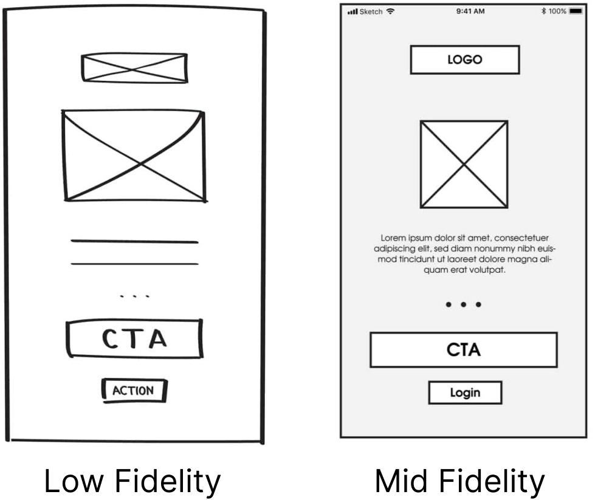
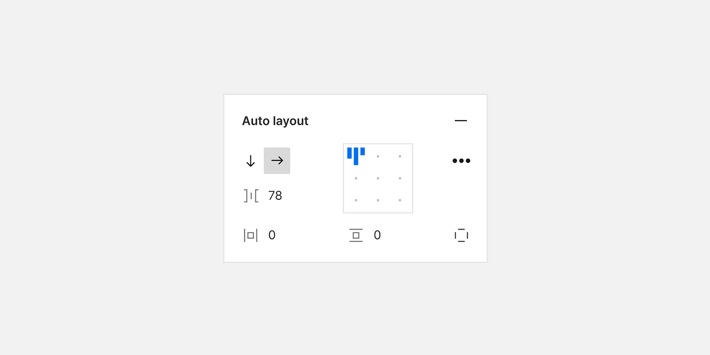
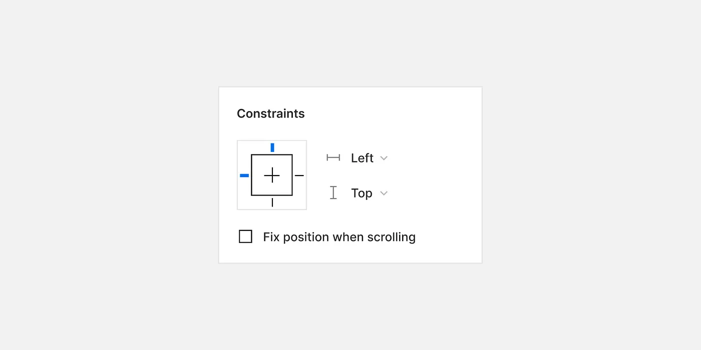
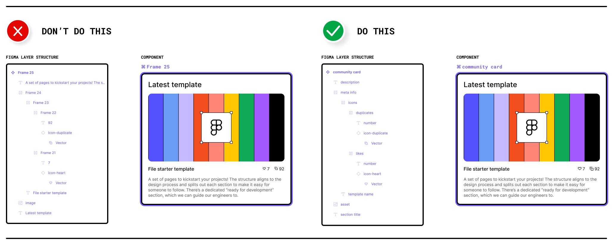
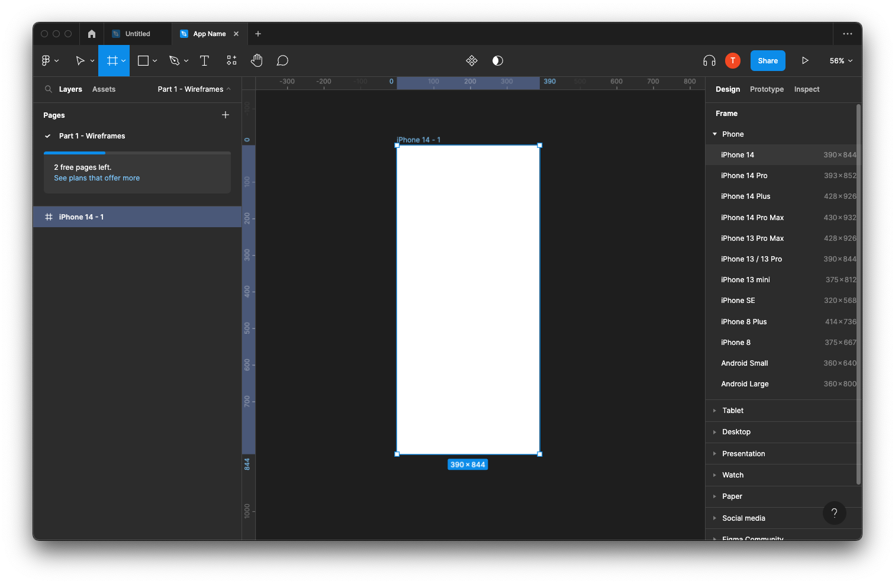
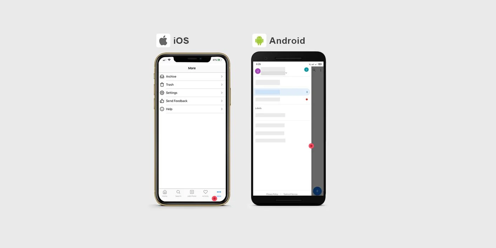
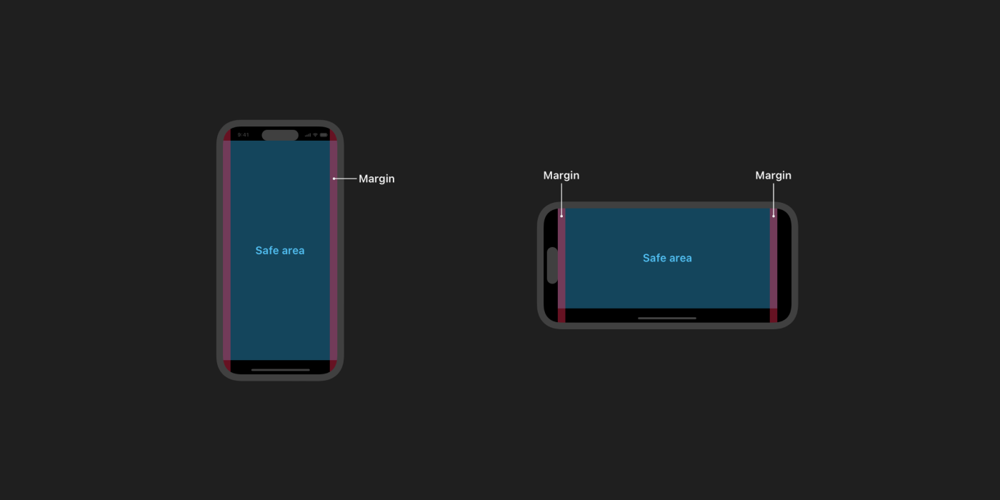
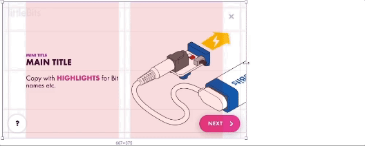
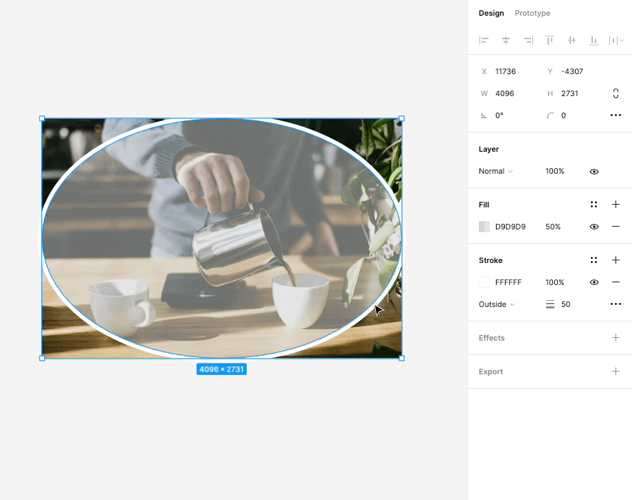
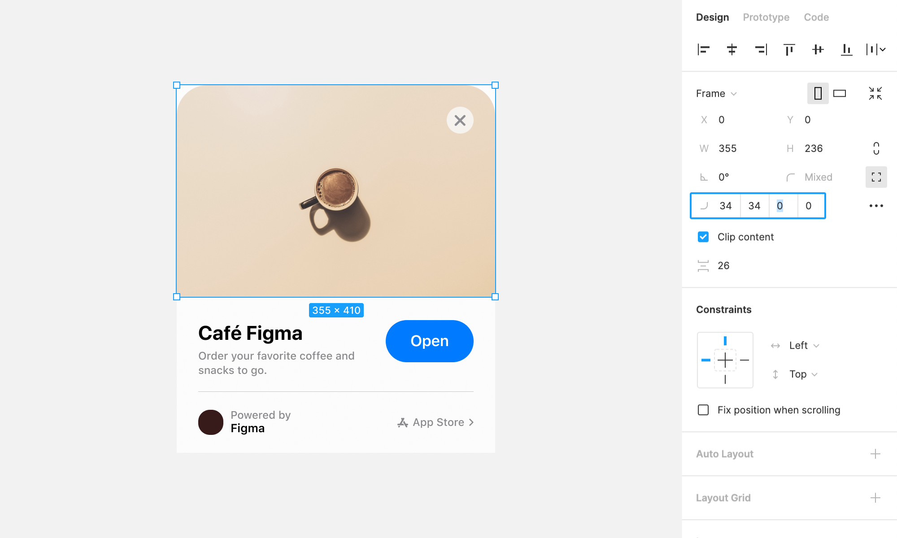

# Week 10 - Mid-Fidelity Wireframes and Design Features

## Mid-Fidelity Wireframes

Mid-fidelity wireframes strike a balance between low-fidelity sketches and high-fidelity designs. They offer a clearer depiction of content structure and layout, making them ideal for collaboration, feedback collection, and usability testing.

### The Advantages of Mid-Fidelity Wireframes

1. **Enhanced Detail**: Mid-fidelity wireframes provide a clearer representation of the design's structural layout compared to low-fidelity counterparts.

2. **Usability Testing**: They are suitable for usability testing, helping identify potential issues and improvements in the user experience.

3. **Collaboration**: Mid-fidelity wireframes enable effective collaboration between designers, stakeholders, and team members.

4. **Feedback Collection**: They serve as a visual aid for gathering feedback, refining design concepts, and making informed decisions.

## Frames, Layers & Groups Continued

### Auto-Layout

Figma's Auto-Layout is a powerful feature that makes designing responsive layouts a breeze. With Auto-Layout, elements can automatically adjust their positions and sizes within a frame, depending on the content or viewport size. This feature simplifies the process of creating designs that adapt seamlessly to different screen sizes, such as those found on various devices, from desktops to mobile phones.

#### How to Use Auto-Layout

1. **Select an Element**: To start using Auto-Layout, select a frame or group that you want to make responsive.

2. **Enable Auto-Layout**: In the right-hand panel, find the "Layout" section. Click on the "Auto" button to enable Auto-Layout for the selected frame or group.

3. **Adjust Constraints**: With Auto-Layout enabled, you can specify how elements within the frame should behave when content changes. You can set constraints for horizontal and vertical alignment, as well as spacing between elements.

4. **Design Responsively**: As you add, remove, or modify elements within the frame, Figma will automatically adjust their positions and sizes based on the constraints you've defined. This ensures that your design looks great on any screen.

For a visual demonstration, watch this video: [Figma in 5: Auto Layout](https://www.youtube.com/embed/TyaGpGDFczw).

#### Nested Auto Layout

Auto-layout frames can be nested, combining horizontal and vertical layout properties to create compelling interface designs. To achieve this:

1. Select the objects, then click Shift+A again, making the auto-layout frame a child frame inside a parent frame.

2. You can choose vertical or horizontal distribution and white space in the right-hand properties menu. To prevent text frames from growing in one direction, ensure you choose fixed width or height.

### Group Constraints

Group constraints in Figma are essential for maintaining consistent layouts in responsive designs. When you're working with a group of elements that need to stay aligned and organized, group constraints come to the rescue. They allow you to define how elements within a group should behave when the group is resized.

For a step-by-step tutorial, watch this video: [Figma tutorial: Constraints](https://www.youtube.com/embed/LHY9cm_2zwU).

## Layer Management: Keeping Your Designs Organized

Effective layer management is crucial for maintaining organized and easily navigable design files in Figma. When you have multiple elements, groups, and frames in your project, a well-structured layer hierarchy can save you time and make collaboration smoother.

### Tips for Structuring Your Layers

1. **Naming Conventions**: Give each layer a clear and descriptive name. This practice helps you and your collaborators quickly identify the purpose of each layer. For example, use names like "Header," "Button," or "Background."

2. **Grouping**: Group related elements together. For instance, if you have a navigation menu, group its items and layers within a dedicated folder. To group elements, select them and press `Ctrl + G` (Windows) or `Cmd + G` (Mac), or use the right-click context menu.

3. **Hierarchical Ordering**: Arrange layers hierarchically. Place the most important or overarching elements at the top-level layers and their related sub-elements within groups or frames. This hierarchy makes it easier to navigate complex designs.

4. **Use Frames**: Utilize frames as containers for groups of elements. Frames help you define the boundaries of specific design sections, making it simple to manipulate and move related content as a single unit.

5. **Lock and Hide Layers**: When working on a specific part of your design, consider locking or hiding unrelated layers temporarily. This minimizes accidental changes to elements you're not currently focusing on.

6. **Reordering Layers**: Easily reorder layers by dragging and dropping them within the layers panel. Reordering is handy when you need to adjust the stacking order of elements within a frame.

## Basic Mobile App Layouts: Creating User-Centric Design

To create effective mobile app layouts in Figma, it's essential to understand the foundational principles. This knowledge includes screen dimensions, design grids, platform-specific layout structures tailored to different devices, and mobile safe zones/areas. Let's delve into these core elements:

### Screen Dimensions

When designing a mobile app, one of the first considerations is selecting the right canvas size to match the target devices. Familiarizing yourself with typical screen dimensions for various devices is crucial. This knowledge not only helps you choose the correct canvas size but also ensures that your designs fit seamlessly on different screens.

In Figma, you'll find presets for common devices. These presets simplify the canvas size selection process. You can access these presets to ensure that your design canvas matches popular devices, such as iPhone models or Android smartphones.

### Design Grids

Design grids are the backbone of a well-structured layout. They provide a framework for consistently placing elements on the screen, ensuring a balanced and visually pleasing design. Utilizing grids in your mobile app design not only enhances alignment but also aids in responsive design.

#### How to Use Design Grids in Figma

Here's how you can create and use grids in Figma:

1. **Grid Setup**: In the "Layout Grids" section, you can choose to create grids based on columns or rows. Define the number of columns or rows and set the gutter width to determine the spacing between elements.

2. **Grid Placement**: Snap elements to the grid by enabling the "Grid" option in the right-hand panel. This makes it easy to align your app's interface elements, ensuring a consistent look and feel.

For a step-by-step tutorial, watch this video: [Figma Tutorial: Layout Grids](https://www.youtube.com/embed/zd8wrAdURN0?si=PLsBfMyviTA7NxL_).

### Platform Considerations

Different mobile platforms, such as iOS and Android, have specific design guidelines and layout expectations. Understanding these platform-specific principles is essential for creating user-friendly and cohesive mobile apps.

**We will explore the differences in the next module.**

### Mobile Safe Zones/Areas

When designing mobile apps, it's crucial to consider mobile safe zones or areas. These zones ensure that critical content remains visible and accessible, even on devices with notches, camera cutouts, or irregular screen shapes.

For more information on iOS Safe Areas, read this article: [Human Interface Guidelines: Layout](https://developer.apple.com/design/human-interface-guidelines/layout)

For more information on Android Safe Areas, read this article: [Layout Basics](https://developer.android.com/design/ui/mobile/guides/layout-and-content/layout-basics)

### Adaptive Design

Mobile devices come in various screen sizes and orientations. To address this diversity and provide a seamless user experience, adaptive design is essential. Figma's auto-layout feature and group constraints empower you to design components that intelligently resize and adapt to different screen sizes.

By mastering these core elements of mobile app design, you'll be well-equipped to create user-centric, visually appealing, and responsive mobile apps in Figma. Understanding screen dimensions, leveraging design grids, considering platform-specific guidelines, and implementing adaptive design principles are all critical skills for today's mobile app designers.

## Styles and Effects in Figma: Elevating Visual Appeal

Discover how Figma's styling options, including stroke, corner radius, and effects, can transform your mid-fidelity wireframes into visually appealing designs. Let's explore these style elements in detail:

### Styles: Adding Emphasis with Strokes

In Figma, the use of strokes is a powerful styling option to outline and emphasize elements within your designs. Here's how you can utilize this feature effectively:

- **Emphasizing Elements**: Strokes are a versatile tool for drawing attention to specific elements, such as buttons, icons, or text. By adding a stroke to an element, you can create a clear visual separation between that element and the surrounding content. This is particularly useful for creating standout buttons or highlighting important information.

- **Adjustable Thickness**: Figma allows you to adjust the thickness or width of strokes. This flexibility gives you control over how bold or subtle the emphasis should be. Whether you want a subtle outline or a bold border, you can fine-tune the stroke's thickness to match your design's aesthetic.

- **Custom Colors**: You can choose from a wide range of colors for your strokes, allowing you to match them with your overall design palette or create contrasting visual effects. This feature helps in maintaining design consistency while also enabling you to get creative with your color choices.

### Corner Radius: Smooth and Sleek Design Elements

Corner radii control the curvature or roundness of corners in shapes and elements. Mastering corner radii is key to creating sleek and visually pleasing designs:

- **Creating Visual Harmony**: The control of corner radii can significantly impact the overall aesthetics of your design. By rounding the corners of elements like buttons or cards, you can create a softer and more inviting appearance. On the other hand, sharp corners can convey a more modern and edgy feel.

- **Uniformity and Consistency**: To maintain a cohesive design, it's essential to ensure that corner radii are consistent throughout your project. Figma's precision tools allow you to apply the same radius to multiple elements, ensuring that your design maintains a polished and professional look.

- **Adaptive Design**: Corner radii are especially useful in responsive design. You can adjust radii to suit different screen sizes and orientations, ensuring that your design adapts gracefully to various devices.

### Effects: Adding Depth and Dimension

Figma's effects feature opens up a world of possibilities for adding depth, dimension, and realism to your designs. Here's what you can do with effects:

- **Shadows**: One of the most commonly used effects, shadows create a sense of depth and help elements appear as if they're floating above the background. You can control the shadow's color, opacity, and distance, allowing you to fine-tune the desired effect.

- **Blurs**: Blurs are used to create a range of effects, from frosted glass to subtle blurriness for background elements. These effects can be applied to elements like pop-up windows, dropdown menus, and background layers.

- **Overlay and Background Blending**: Effects in Figma include blending modes, such as overlay and background effects, which enable you to combine and blend elements creatively. These can be used to simulate overlay effects, color adjustments, and much more.

- **Customizability**: Effects in Figma are highly customizable. You can adjust their intensity, position, and size to achieve the desired visual effect. This level of control empowers you to create designs that look and feel authentic.
