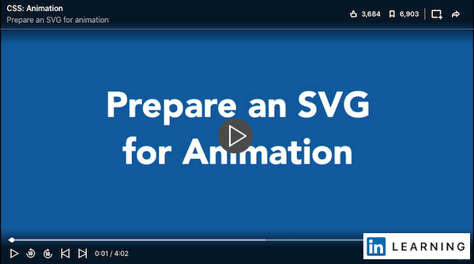

# Week 10 - Introduction to SVG

## Scalable Vector Graphics (SVG)

Scalable Vector Graphics (SVG) is an XML-based vector image format for two-dimensional graphics with support for interactivity and animation. SVG images are defined in XML text files. In this section, we are going to learn how to generate good SVG code using Illustrator and preparing it to be animated and used on the web as well as how to write our own SVG code from scratch. 

[SVG Reference](./svg.md)

## From AI to SVG

Using Illustrator to design graphics and then export them in SVG format allows us to use that code directly on the web and animate it using CSS. The cleaner and more organized our `Ai` file is, the easier it will be to manipulate the `SVG` code later on. Follow the first 2 videos on LinkedIn Learning to:

- Prepare an SVG for animation
- Export SVG from Illustrator

### Cleaning generated SVG

Now we know that if we use SVGs generated by a tool like Adobe Illustrator, Sketch, or Inkscape there’s lots of extra cruft that we don’t need in the files. We can use some optimization tools to clean up the SVG. Here are the two popular online tools to use.  

- [SVG Editor](http://petercollingridge.appspot.com/svg-editor)
- [SVGOMG](https://jakearchibald.github.io/svgomg/)

## SVGs are code
SVGs are purely vector graphics written in XML markup language. You can use a pure code editor to create an SVG. Let's follow along this series of video tutorial and write SVG markup with VSCode. 

### WRITING SVG CODE  

In this video you will learn to write SVG code from scratch and integrate it into an HTML document.
Read SVG reference of [Writing SVG code](./svg.md#writing-svg) for the syntax and code for basic shapes.  

<YouTube
  title="Writing SVG code"
  url="https://www.youtube.com/embed/q_3Q9HHcXuA"
/>

### SVG: ATTRIBUTES AND CSS  

It's common practice to use both `*SVG style attributes*` and `*CSS*` to style SVGs. Watch this video to learn the why and how. 

<YouTube
  title="SVG: attributes & CSS"
  url="https://www.youtube.com/embed/EEtnu8OMD3o"
/>

### SVG TEXT
Using text directly inside our SVG has lots of benefits: We can apply web fonts, masking, gradients, and textures to them and they are fully **accessible**.  

[SVG text reference](./svg.html#svgs-are-code)

#### Text & web fonts
We will follow along this video tutorial to practice using live, accessible text inside an embedded SVG and applying web fonts.

<YouTube
  title="SVG: text & web fonts"
  url="https://www.youtube.com/embed/UKXRwuXd7rA"
/>

#### Masking text
Continue with this video to learn masking text to create semi-transparent textures within the letters. 

<YouTube
  title="SVG: masking text"
  url="https://www.youtube.com/embed/B5ol4ss-mi4"
/>

#### Gradients on text
In this video, we will apply gradients into the text letters using SVG. These two online tools let us generate code for SVG gradients and CSS gradients. 

- [Gradient Generator](https://briangrinstead.com/gradient/) 
- [CSS Gradient Generator](https://cssgradient.io/)
- [SVG Editor](http://petercollingridge.appspot.com/svg-editor)

<YouTube
  title="SVG: gradients on text"
  url="https://www.youtube.com/embed/xgZkRVCS07Q"
/>

#### Textures on text

<YouTube
  title="SVG: masking text"
  url="https://www.youtube.com/embed/B5ol4ss-mi4"
/>

## TODO

::: tip TODO Before next week

- If you have not read all these notes and watched the videos from this week, do that first.
- Finish reading the notes for week 9 and watch all the videos in the notes for week 10.
  :::
