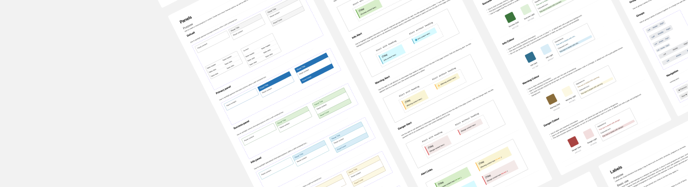
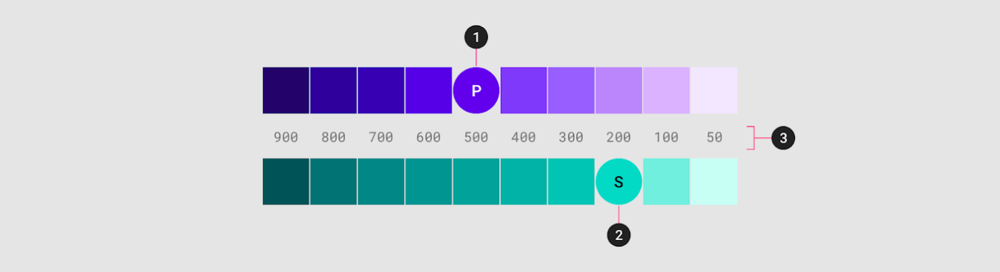
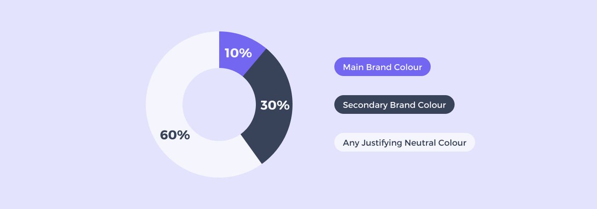
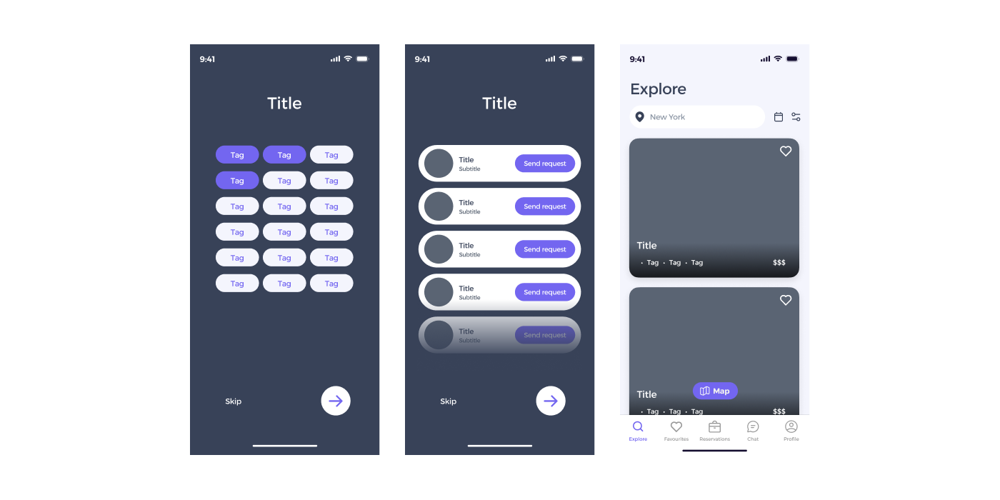
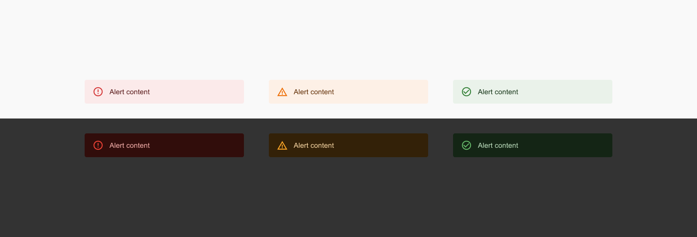
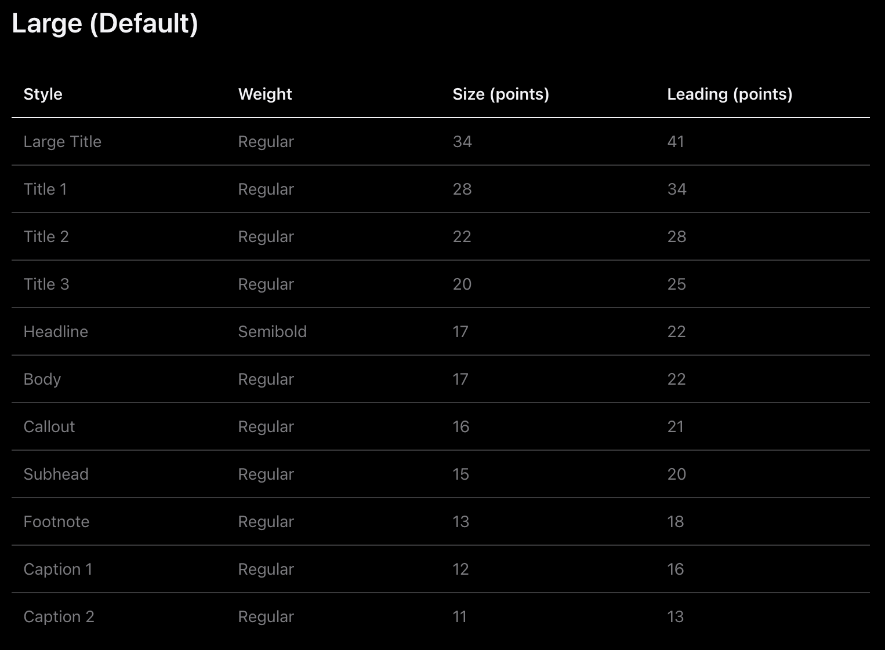
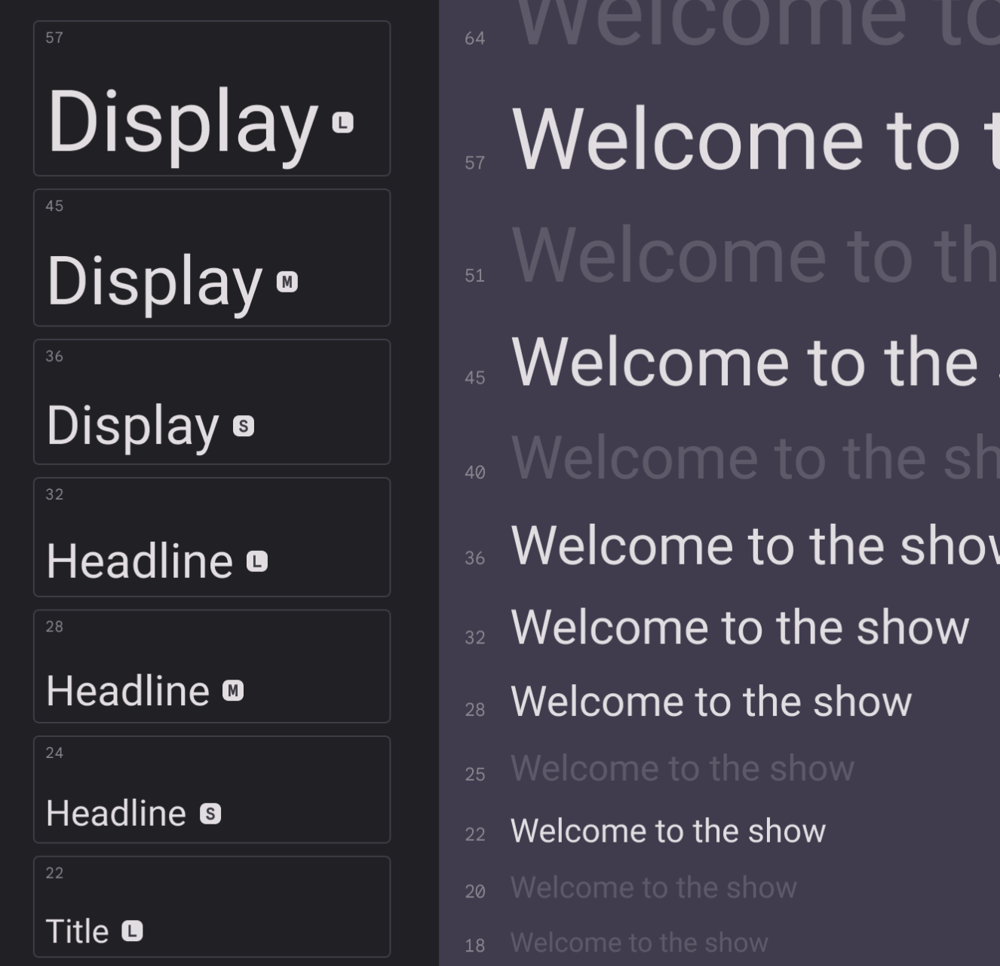
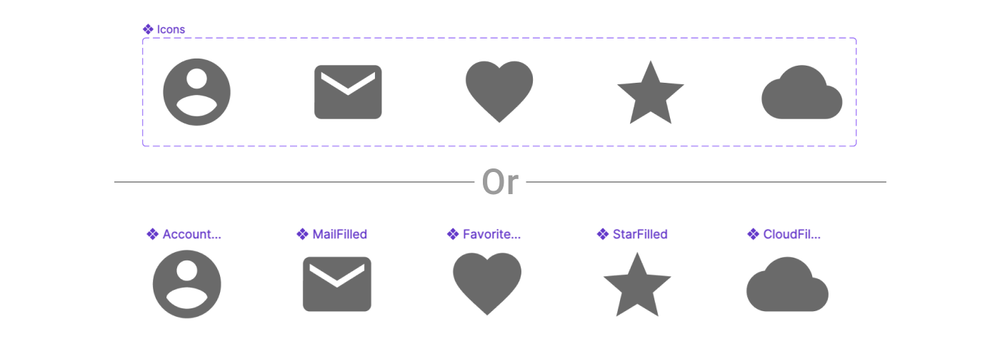

# Week 10 - Design Systems Part 1

<Countdown date="2024-12-25" customMessage="No need to rush ahead. This content will be available before this week's theory class, so just focus on what we're learning this week.">

## Learning Objectives

By the end of this week, students will be able to:

- Grasp the critical components and qualities of a design system, including both its tangible (components, patterns, style guides) and intangible elements (guidelines, brand values, design mindset).
- Learn to maintain a well-organized design system through clear hierarchy, consistent naming conventions, and version control.
- Understand color theory, the 60-30-10 rule for balanced color schemes, and guidelines for developing effective color palettes. This includes the strategic use of interactive and denotative colors.
- Gain insights into the importance of typography, its impact on readability, mood setting, and brand identity, along with best practices for selecting typefaces, styling, and ensuring text scalability and readability.
- Learn to select, create, and manage icon components and styles in Figma, focusing on clarity, consistency, and usability to enhance the overall user interface design.

## Design Systems

A design system is a collection of reusable components and standards used to maintain consistency across a range of products. It acts as a single source of truth for a team, guiding the design of products with a singular design language.

### What Are the Elements of a Design System?

A design system consists of both tangible and intangible elements. Components, patterns, and style guides are tangible elements.

- **Components** are functional elements of a user interface – buttons, input fields, text labels, etc.
- **Patterns** are individual functional elements that all serve the same purpose organized into groups–sign-in forms, menus, etc.
- A **style guide** is a set of visual design decisions such as which colors, typography, iconography to use, as well as guidelines for using decorative elements such as whitespace and shadows.

Guidelines, brand values, and design mindset, on the other hand, are intangible elements:

- **Guidelines** are sets of rules that allow a team to design consistent and coherent experiences made up of components, patterns, and visual styles.
- **Brand values**, which naturally include a brand legend and brand mission, are a set of guiding principles that shape every aspect of your design.
- A **design mindset** is your philosophy of design that aligns a team around a clear set of goals.

<YouTube title="Build it in Figma: Create a Design System — Foundations" url="https://www.youtube.com/embed/EK-pHkc5EL4?si=_iOUBnaFqggjYii4" />

### What Are the Qualities of a Well-Functioning Design System?

Design systems differ based on an organization’s need, but all well-functioning design systems share similar characteristics:

- **Easily adopted:** Well-functioning design systems fit easily into the existing culture of your team, becoming a natural part of the design process.
- **Consistent:** All components of the design system should consistently and naturally work together.
- **Flexible:** Consistency is important, but well-functioning design systems leave room for team members to contribute in new ways.
- **Documented:** Documentation is one of the most important components of a well-functioning design system. Documentation should be detailed and regularly updated.
- **Reusable:** Design systems should be able to be reused and repurposed in a variety of situations.

### Organizing a Design System

Maintaining a well-organized design system is crucial for clarity, efficiency, and collaboration. Here are some tips:

1. **Clear Hierarchy**: Categorize components, patterns, and styles logically.
2. **Naming Conventions**: Use consistent names for components and styles.
3. **Version Control**: Track changes and updates in your design system.

## Utilizing Colors in UI Design

Color is a pivotal element in design, shaping user perception and bolstering brand identity. Effective color palettes are instrumental in crafting visually captivating and meaningful designs.

### Color Theory

Color theory today is primarily based on Isaac Newton's colour wheel, which he established in 1666. The main colour wheel illustrates three colour categories: primary colours, secondary colours, and tertiary colours. Let’s understand it...

**Primary colors** are those that cannot be produced by mixing two or more other colors. Red, blue, and yellow are the main colors.

The **secondary colors** are orange, purple, and green, which may be created by mixing any two of the three basic colors.

**Tertiary colors** are created when you combine a main and a secondary color. Magenta, vermillion, violet, teal, amber, and chartreuse are the tertiary hues.

<YouTube
  title="Beginning Graphic Design: Color"
  url="https://www.youtube.com/embed/_2LLXnUdUIc?si=49DeBHq2p6bInb7G"
/>

### The 60-30-10 Color Rule

A popular approach to achieving color balance is the 60-30-10 rule, often associated with the notion of a Golden Ratio in design. This rule suggests that:

- A neutral color for **60%** of your design
- A secondary brand color for **30%**
- **10%** in your UI design should be your main brand color

Effective UI design leverages this rule to achieve an impeccable color coordination, enhancing the user's interaction with the design.

### Example of 60-30-10 Color Rule in a Mobile App

**Dominant Color (60%) - Light Lavender:**

- **Usage:** Ideal for backgrounds and large UI elements. This light lavender (`#F4F5FD`) offers a clean, calming, and modern backdrop that's easy on the eyes.
- **Hex Code:** `#F4F5FD`

**Secondary Color (30%) - Deep Slate:**

- **Usage:** For text, headers, footers, and less prominent buttons. Deep slate (`#384258`) provides a strong contrast against the light lavender, adding depth and sophistication to the design.
- **Hex Code:** `#384258`

**Accent Color (10%) - Vibrant Purple:**

- **Usage:** For call-to-action buttons, highlights, and key interactive elements. Vibrant purple (`#7366F0`) stands out against both the light lavender and deep slate, drawing attention to important actions and features.
- **Hex Code:** `#7366F0`

**Application in UI Elements:**

- **Backgrounds and Large Areas:** Light Lavender (`#F4F5FD`)
- **Text and Secondary Elements:** Deep Slate (`#384258`)
- **Interactive Elements and Highlights:** Vibrant Purple (`#7366F0`)

### Employing Interactive Colors

Interactive colors are indispensable for highlighting interactive UI elements such as links, buttons, and other controls. Here are some guidelines:

- Assign a specific hue to primary interactions, allowing users to associate that color with certain actions.
- Create dark and light variants of the interactive color to indicate different states (e.g., hovered, clicked).

### Understanding Denotative Colors

Denotative colors carry inherent meanings and are crucial for signaling different states in your app or website, like error, success, or warning. Commonly, red, black, and green are utilized for these purposes.

For instance, if red is a brand color, avoid using it for error messages. Ensure that colors chosen for disabled states have adequate contrast for legibility.

### Guidelines for Crafting a Color Palette:

Constructing a set of rules for your color palette can bolster consistency and coherence across your design projects. Here are some fundamental guidelines:

1. **Restricted Color Palette**: Maintain a restricted color palette to preserve a sleek and professional demeanor.

2. **Color Harmony**: Ensure your colors resonate well with each other, fostering a visually satisfying experience.

3. **Consistent Application**: Apply colors consistently for specific elements or actions to enhance user recognition and comprehension.

4. **Accessibility**: Make judicious color choices to cater to all users, including those with visual impairments.

## Mastering Typography in UI Design

Typography in UI design isn't just about choosing appealing fonts; it's a pivotal visual communication tool that can significantly enhance user engagement and conversions. Unlike a meticulous reading, users often scan a page to quickly ascertain if the information they need is present. Here, well-organized and scannable typography can capture and hold the users' attention.

Once engaged, clear and informative typographic design is crucial for providing precise information about the products or services offered, nudging the users toward making a purchase.

The importance of typography in UI design is indispensable and should never be overlooked.

### The Benefits of Good Typography

Beyond being a medium of visual communication, good typography in website or mobile app design offers numerous advantages:

1. **Enhanced Readability and Accessibility**:

   - Good typography facilitates easier reading, scanning, and navigation across the page, thereby reducing the time users take to find the information they need.

2. **Consistent Tone and Mood**:

   - The choice of typeface sets the general tone or atmosphere across interfaces. For instance, a cartoon font with warm colors and bold strokes adds a fun, personalized touch, whereas a simple and serious typography sets a more formal tone.

3. **Distinctive App Identity**:

   - Like other elements in UI design, high-quality typography has a professional allure and aligns with the brand's vision, color, and concept, helping your app stand out from the crowd.

4. **Boosted Product Sales**:

   - Effective typographic design keeps users on your app longer and facilitates easy access to necessary information, indirectly boosting sales by reducing user distractions.

### Styling Typography to Suit Your Purpose

**Bold and Italic**:

- Common typographic styles like italic and bold help emphasize text. Bold is great for headlines and crucial text areas, while italics are often used for foreign words or reference links.

**Typeface Families**:

- Some typefaces offer a range of styles. For example, Futura has 22 different styles including light, condensed, semi-bold, and extra bold, providing versatile options for different design needs.

**Novelty Styles**:

- Novelty styles add a unique flair but should be used sparingly to avoid overwhelming the design.

### Crafting an Effective Typography Design

With a grasp of typography types and manipulations, here are 10 best practices to achieve compelling typography design:

1. **Choosing Typefaces**: Selecting the right typefaces is fundamental. Choose a typeface that aligns with your brand's personality and the overall design aesthetics of your UI. It's often advisable to pair a serif and a sans-serif typeface to create a balanced look.

2. **Selecting Font-Weight and Styles**: The weight and style of the font can significantly impact the look and feel of your design. Bold weights are excellent for headlines, while regular or light weights are suitable for body text. Experiment with different styles to find what works best for your design.

3. **Mind the Spacing**: Adequate spacing between letters, words, and lines improves readability and aesthetics. Use kerning, tracking, and leading effectively to achieve a well-spaced typography design.

4. **Establish a Clear Visual Hierarchy**: Visual hierarchy guides the reader's eye and helps them navigate the content easily. Create a clear hierarchy using different font sizes, weights, and colors for headings, subheadings, and body text.

5. **Ensure Scalability**: Your typography should remain effective and legible across various screen sizes and resolutions. Use scalable units like ems or rems for font sizes to ensure a responsive design.

6. **Utilize Visual Contrast Judiciously**: Contrast helps in distinguishing text and improves readability. Ensure there's enough contrast between your text and background, but avoid overly harsh contrasts as they can be straining to the eyes.

7. **Keep Text Simple and Concise**: Clear and straightforward text is key to effective communication. Avoid jargon and keep your sentences short and to the point.

8. **Maintain Consistency**: Consistency in typography creates a cohesive look and improves the user experience. Stick to a defined set of typefaces and styles throughout your design.

9. **Animate Your Copy Wisely**: Animation can add a dynamic flair to your typography, but it should be used sparingly. Ensure animations enhance rather than distract from your message.

10. **Prototyping and Testing**: Before finalizing your typography design, prototype and test it with real users to gather feedback. Testing helps in understanding how your typography performs across different devices and under various use cases, allowing you to make necessary adjustments for an optimal user experience.

Each of these practices requires careful consideration and fine-tuning to ensure your typography not only looks good but also serves its fundamental purpose of conveying information clearly and effectively.

### Platform Specific Guidelines for Typography

#### iOS

[Read more here](https://developer.apple.com/design/human-interface-guidelines/typography)

#### Android

[Read more here](https://m3.material.io/styles/typography/type-scale-tokens)

## Iconography

Icons play a pivotal role in mobile app design, serving as visual cues that convey information quickly and efficiently to users. In Figma, designers have access to a powerful set of tools and resources, making it possible to create, manage, and implement iconography effectively. With Figma's versatile platform, you can ensure that your app's icons are not only visually appealing but also provide clear and intuitive guidance to users, enhancing their overall experience.

Selecting the right icons for your mobile app design is crucial for effective communication and user experience. When choosing icons, consider the following factors:

- **Clarity and Relevance**: Icons should be chosen based on their clarity and relevance to the app's functions or actions. They need to provide an immediate and clear understanding to users.

- **Consistency**: Maintain consistency in your iconography to create a cohesive visual language across your mobile app. Consistent icons contribute to a more user-friendly experience.

- **Universal Understanding**: Opt for icons that are universally understood to minimize the need for additional explanations. Icons should transcend language barriers and be recognizable to a broad audience.

- **Cultural Considerations**: Be aware of cultural preferences and interpretations. Icons may have different meanings in various regions or demographics. Ensure your choices are culturally appropriate.

- **Customization in Figma**: Figma offers a broad library of icons that you can browse and search through. It also provides tools for customizing and adapting icons to match your design's specific needs.

### Creating Icon Components in Figma

Creating icon components in Figma is a crucial skill for UI/UX designers. It allows for the efficient use and reuse of icons across different designs, ensuring consistency and saving time. Here's a step-by-step guide to creating icon components in Figma:

#### Step 1: Prepare Your Icons

1. **Design or Import Icons**: Start by designing your icons in Figma or importing them from other sources. Ensure they are vector graphics for scalability and editing flexibility.
2. **Standardize Sizes**: Make sure all icons are of a consistent size. Common sizes are 24x24 or 32x32 pixels, but this can vary based on your design system.
3. **Optimize for Pixel-Perfect Rendering**: Align your icons to the pixel grid to avoid blurry edges. This is particularly important for small-sized icons.

[Read more about icon grid here](https://m2.material.io/design/iconography/system-icons.html#grid-and-keyline-shapes)

#### Step 2: Create Components

1. **Select an Icon**: Click on the icon you want to turn into a component.
2. **Create the Component**: Use the keyboard shortcut `Cmd + Alt + K` (Mac) or `Ctrl + Alt + K` (Windows) to create a component. Alternatively, you can right-click on the icon and select 'Create Component'.
3. **Name Your Component**: Give your component a clear and descriptive name. This is crucial for finding and organizing your components later.

#### Step 3: Organize Components

1. **Apply Consistent Naming**: Use a consistent naming convention for your components, like `Icons/Navigation/Back` or `Icons/Social/Facebook`.
2. **Individual Components or Variants**: Decide whether to use individual components for each icon or a single component with multiple variants. Variants can be useful for icons that share a similar structure but differ in minor ways, such as arrows pointing in different directions or buttons with different states.

#### Step 4: Use and Edit Components

1. **Drag and Drop to Use**: To use an icon component in your design, simply drag it from the 'Assets' panel into your canvas.
2. **Override Properties**: You can override certain properties of an icon component (like color) in its instance without affecting the main component.
3. **Detach Instance**: If you need to make significant changes to an icon for a specific use case, you can detach it from the component (`Right-click > Detach Instance`). Remember, this means any updates to the main component won’t reflect in this detached instance.

Creating icon components in Figma not only streamlines your design process but also ensures consistency across your projects, making it an essential skill for efficient and effective UI/UX design.

## Styles in Figma

Styles are reusable collections of properties that help maintain consistency in design.

<YouTube
  title="Figma Tutorial: Creating Styles"
  url="https://www.youtube.com/embed/gtQ_A3imzsg?si=WFHEbMokOLgtvakq"
/>

### Style Types:

1. **Text Styles**: Define text styles for headings, body text, and other text elements. Apply these styles consistently to maintain a uniform look.

2. **Color Styles**: Create color styles for primary and secondary colors. These styles ensure that your design adheres to your chosen color palette.

3. **Grid Styles**: Set up grid styles for layouts, columns, and spacing. This helps maintain alignment and consistency in your design.

4. **Effect Styles**: Customize shadows, blurs, and other effects as styles. Apply these effects easily to elements for a cohesive design.

</Countdown>
