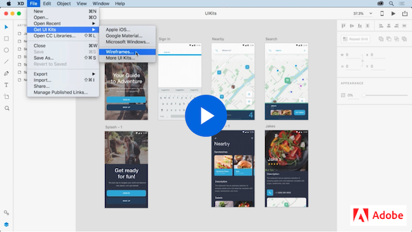
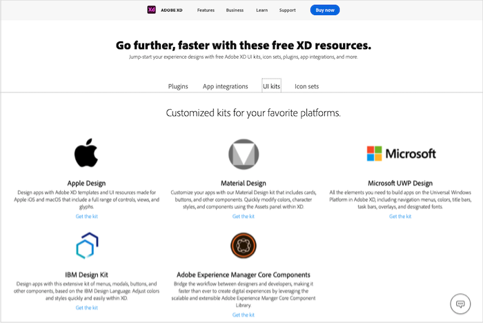

# Week 10 - Components, UI Kits, Plugins & More!

::: tip Files
[Week 13 Tutorial Files Download](https://drive.google.com/uc?export=download&id=131s3TLxqdlr79sz892PJK5qFlk-2UJGd)
:::

## Introduction

In this lesson, we will harness our Adobe XD knowledge by using Xd productivity tools, UI Kits, and plugins. We will learn the common mobile user interface elements with ease and get an introduction to the industry design standards and guidelines: Human Interface Guidelines (AppleOS) and Material Design (Android).

## Xd Productivity Tools

Let's follow this video to practice using some popular Xd features: Object Flip, Search Layers, and Linked Symbols (now components).

<YouTube
  url="https://www.youtube.com/embed/wHlcOCJycxw"
  title=""
/>

## Components

Xd Componenets are previousely called Symbols. This tutorial gives us an introduction of Master Components, and Component Overrides features.

<YouTube
  url="https://www.youtube.com/embed/qrsuk6zl8B8"
  title=""
/>

### Using Components

This set of short video tutorals teaches us to create/nest/swap componenets, update master componenets and use different componenet states. We will follow along to practice. [Download tutorial file](https://www.dropbox.com/s/vfz93h52t0nsgvz/Components_Demo.xd?dl=0)

[Watch playlist on YouTube](https://youtube.com/playlist?list=PLHjwuoik-ep1PW3Dh29lgnN8X2VSBYEwt)

#### Component hover states & Micro-Interactions

Check out this video to learn how component states allows you to save elements for future use and create additional versions of your buttons, toggles, fields, and more.

<YouTube
  url="https://www.youtube.com/embed/c8ov6IzFE0c"
  title=""
/>

## Xd Interactions

Let's watch this set of short videos to practice popular prototype interaction design in Adobe XD. We will build prototype with screen animation, transitions, drag gesture, componenet overlay, and voice control. [Download tutorial file](https://www.dropbox.com/s/j12i70snyblerui/Prototyping_Demo.xd?dl=0)

[Watch playlist on YouTube](https://youtube.com/playlist?list=PLHjwuoik-ep2SMq4Ns1tQAHyk-Bj2kR3V)

### Multiple Interactions

Xd 2020 release allows desingers to apply multiple interactions to the same UI object. Follow this video to make our prototype interaction more natural.

<YouTube
  url="https://www.youtube.com/embed/zWQv9Qszm7c"
  title=""
/>

## Content-Aware Layout

We will learn content-aware layout to quickly create and edit common design elements without a lot of tedious steps. We can also add group padding coupled with responsive resize.

<YouTube
  url="https://www.youtube.com/embed/h2yyNV4fnN0"
  title=""
/>

For more great tutorials like this, check out [Prototype](https://www.adobe.com/products/xd/learn/prototype.html) on the Let's Xd website.

## Xd Ui Kits

UI Kits content contains common buttons, form elements, headers, icons, and other UI elements. Follow this XD tutorial to learn how to get UI kits and use the Kit content in your own designs.

Note: We will explorer UI Kits for [Apple iOS](https://developer.apple.com/design/resources/) and [Material Design]("https://material.io/resources) in class to understand the platform standards together. Download [Apple iOS fonts & symbols](https://developer.apple.com/fonts/) and [Roboto fonts for Android devices](https://material.io/design/typography/understanding-typography.html#system-fonts)

Let's start our design with UI kits. We will follow this video to get the Wireframes UI Kits and use the content in our own XD file.

Leveraging UI Kits tutorial shows multiple ways to access UI Kits in Xd and how to download UI Kits from [Adobe Resources website](https://helpx.adobe.com/xd/how-to/ui-kits.html)

<YouTube
  url="https://www.youtube.com/embed/Jgk83qXOYSk"
  title=""
/>

### UI Kit Resources

- [Material Design Resources](https://material.io/resources)
- [Apple Design Resources](https://developer.apple.com/design/resources/)
- [Design toolkits and samples for Windows apps](https://docs.microsoft.com/en-us/windows/uwp/design/downloads/)
- [Auto Animated UI Kit by Howard Pinsky & Jonathan Pimento](https://www.behance.net/gallery/72065227/Auto-Animate-UI-Kit-for-Adobe-XD)
- [Component States UI Kit](https://letsxd.com/states)

## Xd Plugin Manager

This tutorial provides a quick overview of XD Plugin Manager and multiple ways to access it.

<YouTube
  url="https://www.youtube.com/embed/YAgKDA6c9_I"
  title=""
/>

### Some Great Plugins

Let's follow this tutorial to install some useful plugins. We will only use a few these plugins for our class exercises, however feel free to try as many as you like.

::: tip Heads up!
Skip to 0:55 for the start of the tutorial. Sorry the classic awkward YouTube tropes, but the content is ultimately good.
:::

<YouTube
  url="https://www.youtube.com/embed/d-Hxze_r9rU"
  title=""
/>

Another super cool plugin is Google Spreadsheet which is very useful when designing UI with data.

<YouTube
  url="https://www.youtube.com/embed/g8z0l5moNIw"
  title=""
/>

### More Plugin Resources

Here are two plugins you may try for usability testing in Xd. They both provide free/education access.

- [Useberry](https://www.useberry.com/integrations/adobe-xd/) - You can watch [Useberry video demo](https://www.youtube.com/watch?v=ecFwUeYtq78)
- [Usertesting](https://help.usertesting.com/hc/en-us/articles/360014666372)

## Xd Resources

[Adobe XD resources, now under Features tab](https://www.adobe.com/products/xd/features/ui-kits.html) provides resources we can use to optimize our workflow and speed up the design process. They include UI kits, icon sets, plugins, app integrations, and more.

::: tip To Do for Next Week

- Review and implement App Branding Feedback
- Complete App Branding assignment
  :::
