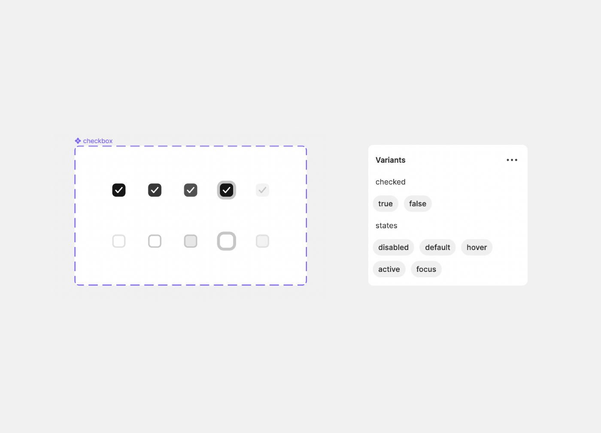
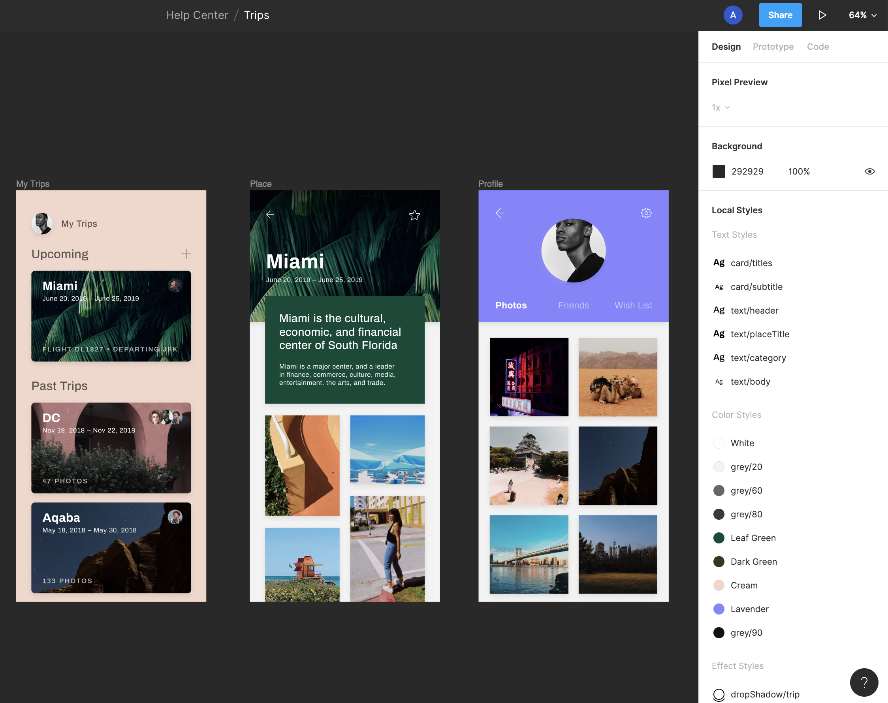
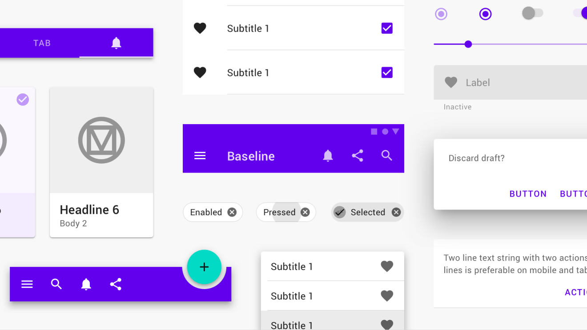
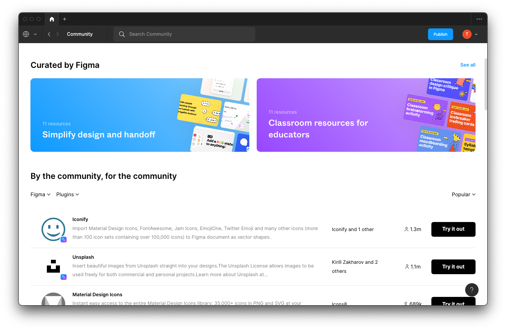

# Week 10 - Design Systems, Components, Styles & More

## Design Systems

**What is a design system?** A design system is a collection of reusable functional elements–components and patterns–guided by clear standards that product teams use to create a consistent experience across a range of products. Design systems act as a single source of truth for an entire organization by using a singular design language to guide the development of products.

Design systems should be flexible and responsive to any changes in the field of design, such as new visual design trends or the rising importance of different types of emerging technology.
What Are the Elements of a Design System?

**A design system consists of both tangible and intangible elements. Components, patterns, and style guides are tangible elements.**

- Components are functional elements of a user interface – buttons, input fields, text labels, etc.
- Patterns are individual functional elements that all serve the same purpose organized into groups–sign-in forms, menus, etc.
- A style guide is a set of visual design decisions such as which colors, typography, iconography to use, as well as guidelines for using decorative elements such as whitespace and shadows

**Guidelines, brand values, and design mindset, on the other hand, are intangible elements:**

- Guidelines are sets of rules that allow a team to design consistent and coherent experiences made up of components, patterns, and visual styles
- Brand values, which naturally include a brand legend and brand mission, are a set of guiding principles that shape every aspect of your design
- A design mindset is your philosophy of design that aligns a team around a clear set of goals

Both tangible and intangible elements work together to direct product teams and help them make meaningful design decisions.

### What Are the Qualities of a Well-Functioning Design System?

Design systems differ based on an organization’s need, but all well-functioning design systems share similar characteristics:

- **Easily adopted** Well-functioning design systems fit easily into the existing culture of your team, becoming a natural part of the design process.
- **Consistent** All components of the design system should consistently and naturally work together.
- **Flexible** Consistency is important, but well-functioning design systems leave room for team members to contribute in new ways.
- **Documented** Documentation is one of the most important components of a well-functioning design system. Documentation should be detailed and regularly updated.
- **Reusable** Design systems should be able to be reused and repurposed in a variety of situations.

## Figma Components, Styles and Libraries

### Components

These are reusable objects in your design. They can be as simple as an individual button, or as complex as an entire navigation header (comprised of instances of other components like logos, avatars, buttons and menu items).

**Component Instances** Once you make something a component, you can create instances of it, which are essentially connected copies of that component—so if you update the design of the original component, the instances will reflect that change. For example, if you change the color of a button component to red, and then publish those changes, any file that used instances of that button will get a notification. They can then choose whether to update their instances to red.

**Component Properties**

<YouTube
  title="Figma tutorial: Component properties"
  url="https://www.youtube.com/embed/iIq8FLt1hUY"
/>

**Component Variants**

<YouTube
  title="Figma Tutorial: Variants"
  url="https://www.youtube.com/embed/y29Xwt9dET0"
/>

### Styles

These are reusable collections of properties which you can easily apply to elements in your design. In Figma, you can create styles for text, colors, grids and effects like shadows and blurs. If components are reusable objects, think of styles as the attributes you might apply to those objects.

<YouTube
  title="Figma Tutorial: Creating Styles"
  url="https://www.youtube.com/embed/gtQ_A3imzsg"
/>

### Libraries

In Figma, you can share components and styles by publishing them. This turns your file into a library, so you can use instances of those components in other files. Updates to the design of your components can be published and pushed out to other documents where instances of your components live. Users have the choice to accept those updates or continue working with an old version (if required).

<YouTube
  title="Figma tutorial: Create a shareable team library [5 of 8]"
  url="https://www.youtube.com/embed/79T8Q6OBmRk"
/>

## UI Kits

UI kits are comprehensive resource sets that allow you to plan your design’s structure properly without having to sacrifice your creative and original ideas. A UI kit generally contains an assortment of graphic files including UI components (buttons, check boxes, progress bars, etc.) for the purpose of user interface design. They allow designers to create outstanding visuals in reasonable timeframes. So instead of wasting time figuring out how to implement components, UI kits let you focus on what you do best: creating great designs.

UI kits can help improve your design workflow in a number of different ways, but the two most common uses for UI kits are for prototyping and mobile and website design.

Using UI kits is not just about creating functionality — it's about retaining it and using it multiple times, just like you do with functions and separate elements. The process is not complicated, and it doesn’t require reinventing the wheel: everything you need should already be there!

### Popular UI Kits

**Apple's Human Interface Guidelines (HIG)**

[Human Interface Guidelines](https://developer.apple.com/design/human-interface-guidelines/guidelines/overview)

**Google's Material Design**

[Material Design](https://m3.material.io/)

## Plugins

Plugins are programs or applications created by the community that extend the functionality of Figma and FigJam. Plugins run in Figma or FigJam files and perform one or more user actions. They allow users to customize their experience or create more efficient workflows.

There are a ton of Figma plugins to explore!

<YouTube
  title="5 MUST HAVE Plugins For Figma Designers! (Best Figma Plugins 2022)"
  url="https://www.youtube.com/embed/QaA_XmXNGaI"
/>
