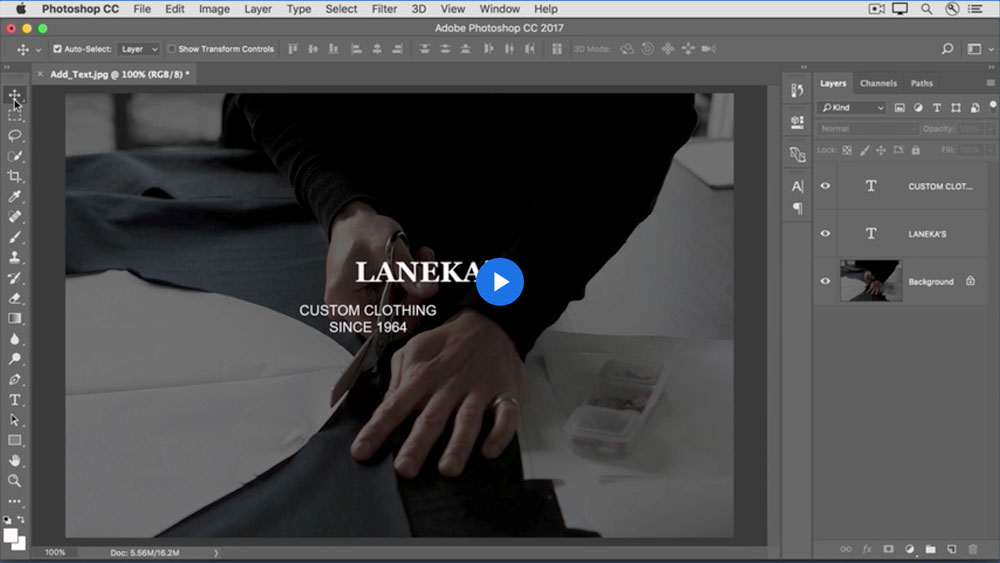
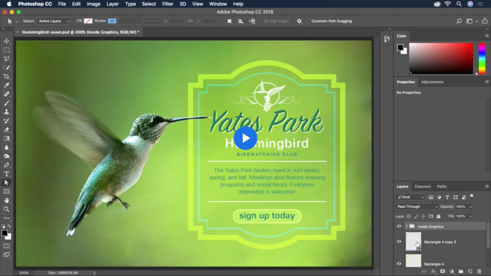
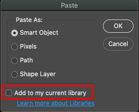

# Week 10 - Vectors in Photoshop

::: tip Files
[Week 10 Tutorial Files Download](https://drive.google.com/uc?export=download&id=1VY_Iej_wvmGJ1TiQc5-iXhMBCAooSpRX)
:::

## Introduction

A number of the tools for creating vector shapes that exist in Illustrator, such as the Pen, Rectangle, Ellipse, and more, also exist in Photoshop. In general, Photoshop works and displays content in a raster format. However, certain layers can be made as vectors and can be resized infinitely as needed. Some basic layer types that are vector in Photoshop include Text layers, Shape layers, and imported Vector Smart Objects.

## Adding Text and Shapes

Let's start with the basics of creating text and shapes in Photoshop. This is going to feel very familiar to what we covered previously in Illustrator. Most of the tools work identically, however there is the occasional difference.

## Working with shape tools

Shape layers in Photoshop provide us with some pretty cool functionality. When creating our shapes, we have the option to create each shape on an independent layer (similarly to how we made shapes in Illustrator), or we can combine multiple shapes on the same shape layer to create complex shapes.

## Copying Assets from Illustrator

You can create and edit vector assets right in Photoshop. However, depending on what kind of graphics you are making it may be easier to make your assets first in Illustrator and then copy them into Photoshop. Doing so is as simple as copying the desired artwork from Illustrator and pasting into Photoshop. Check out this video for more details:



### Some key things to note:

- Make sure when you paste you shapes in Photoshop to paste as a Smart Object and **do not check** the `Add to my current library` option. Having this checked will put the shape as a linked file into your CC Libraries, which will create issues when you share your files.
  
  &nbsp;
- By pasting as a Smart Object, you can double-click on the layer preview to open the shape up in Illustrator to make edits to the vector. The changes will auto-update in Photoshop when you save the file (unfortunately this can be a bit glitchy sometimes).
- If you duplicate a Vector Smart Object, the duplicates will be linked. If you update one version, they all update. However, if you paste the same graphic separately multiple times, they will be independent Vector Smart Objects that will not be linked and therefore won't both update.
- Make sure to rename the layer! Each time you paste from Illustrator the layer will automatically be called **Vector Smart Object**, which will get confusing if you past a whole bunch!

::: tip To Do for Next Week

- Complete Web Banner exercise
- Complete the Profile Card assignment
- Complete the Photoshop Quiz
- Review week 11 content
  :::
