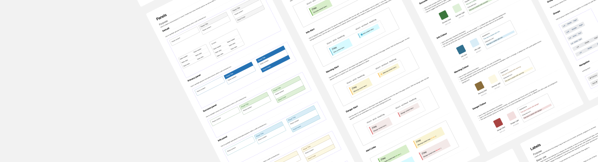

# Week 11 - Design Systems Part 1

## Design Systems

**What is a design system?** A design system is a collection of reusable functional elements–components and patterns–guided by clear standards that product teams use to create a consistent experience across a range of products. Design systems act as a single source of truth for an entire organization by using a singular design language to guide the development of products.

Design systems should be flexible and responsive to any changes in the field of design, such as new visual design trends or the rising importance of different types of emerging technology.

### What Are the Elements of a Design System?

A design system consists of both tangible and intangible elements. Components, patterns, and style guides are tangible elements.

- **Components** are functional elements of a user interface – buttons, input fields, text labels, etc.
- **Patterns** are individual functional elements that all serve the same purpose organized into groups–sign-in forms, menus, etc.
- A **style guide** is a set of visual design decisions such as which colors, typography, iconography to use, as well as guidelines for using decorative elements such as whitespace and shadows.

Guidelines, brand values, and design mindset, on the other hand, are intangible elements:

- **Guidelines** are sets of rules that allow a team to design consistent and coherent experiences made up of components, patterns, and visual styles.
- **Brand values**, which naturally include a brand legend and brand mission, are a set of guiding principles that shape every aspect of your design.
- A **design mindset** is your philosophy of design that aligns a team around a clear set of goals.

Both tangible and intangible elements work together to direct product teams and help them make meaningful design decisions.

### What Are the Qualities of a Well-Functioning Design System?

Design systems differ based on an organization’s need, but all well-functioning design systems share similar characteristics:

- **Easily adopted:** Well-functioning design systems fit easily into the existing culture of your team, becoming a natural part of the design process.
- **Consistent:** All components of the design system should consistently and naturally work together.
- **Flexible:** Consistency is important, but well-functioning design systems leave room for team members to contribute in new ways.
- **Documented:** Documentation is one of the most important components of a well-functioning design system. Documentation should be detailed and regularly updated.
- **Reusable:** Design systems should be able to be reused and repurposed in a variety of situations.

## Effective Typography in Figma

Typography is a fundamental aspect of design. It involves the selection and arrangement of fonts, sizes, spacing, and other text-related elements. Effective typography can greatly impact the readability, aesthetics, and overall user experience of your design. In Figma, achieving effective typography aligns with principles outlined in Apple's Human Interface Guidelines and Google's Material Design, ensuring that your design not only looks good but also functions well across various platforms.

### Key Aspects of Effective Typography:

1. **Font Selection**: When selecting fonts in Figma, consider their alignment with your design's purpose and the tone you want to convey. Apple's Human Interface Guidelines suggest using system fonts such as San Francisco for Apple devices and Roboto for Android. These system fonts are designed for optimal legibility and consistency within their respective ecosystems. However, you can also explore other web fonts available in Figma to suit your design's unique needs while maintaining brand consistency.

2. **Font Sizing**: Determining appropriate font sizes is crucial for creating a consistent and user-friendly design. Apple's guidelines emphasize text legibility and readability, recommending specific text sizes for various purposes, including body text, headings, and subheadings. In Material Design, text sizing follows a similar hierarchy, with guidelines for text at different levels of importance. Figma provides text style management to ensure you maintain consistency in text hierarchy. This feature allows you to create and apply predefined text styles throughout your design, ensuring a uniform look and feel.

3. **Spacing and Line Height**: Paying attention to spacing between lines (line height) and characters (kerning) is essential to ensure text is easy to read and aesthetically pleasing. Apple's Human Interface Guidelines recommend a default line height for text, but you can adjust it according to your design needs. Material Design also offers guidelines for text line height, and Figma provides tools to adjust line height and letter spacing, allowing you to fine-tune text elements for readability and aesthetics.

4. **Hierarchy and Emphasis**: Both Apple and Google stress the importance of using typography to create visual hierarchy within your design. This involves using variations in font size, weight, and style to highlight important information and guide users through your interface. Figma's text style features allow you to define and apply different text styles for various purposes, such as emphasizing headings or distinguishing between primary and secondary text. This ensures a clear and consistent hierarchy in your design, aligning with the principles of both design systems.

5. **Accessibility**: Ensuring that text is easily readable and accessible to all users, including those with visual impairments, is a fundamental consideration in both Apple's and Google's design guidelines. Apple's guidelines provide extensive recommendations for text legibility and contrast, while Material Design includes accessibility guidelines for text and color choices. In Figma, you can use design tools to check color contrast and provide alternatives for users with visual impairments, ensuring that your design meets accessibility standards and is inclusive.

## Colour Pallets

Color plays a pivotal role in design. It influences user perception, communicates emotions, and reinforces brand identity. Effective use of color palettes is essential for creating visually appealing and meaningful designs.

## Working with Color Palettes in Figma

Color palettes are a crucial element of design, and in Figma, you can efficiently manage and apply them to create visually appealing and cohesive designs. Here are tips for effectively working with color palettes in your Figma projects:

### Key Tips for Working with Color Palettes:

1. **Primary and Secondary Colors**: In Figma, it's essential to define a set of primary and secondary colors that represent your brand or design theme. These colors should be consistent across your design. Create a color library or swatch styles in Figma to store and apply these colors easily. Figma provides features for adding and organizing color styles, allowing you to maintain color consistency throughout your design. Refer to Apple's Human Interface Guidelines and Google's Material Design for insights into selecting primary and secondary colors that align with platform-specific recommendations.

2. **Color Psychology**: Understanding the psychological and cultural associations of colors is essential in design. In Figma, you can use this knowledge to evoke specific emotions or convey particular messages in your design. Refer to Apple and Google's design guidelines for insights into the preferred color schemes for different contexts and interfaces. Figma provides a vast library of system colors and resources to help you choose the right colors for your project.

3. **Contrast and Legibility**: In Figma, ensuring that text and design elements have sufficient contrast against the background is critical to guarantee readability. Figma offers tools to check color contrast, and you can use these features to adhere to accessibility standards. Apple and Google also emphasize the importance of color contrast in their design guidelines. By following their recommendations and leveraging Figma's tools, you can create designs that are both visually pleasing and accessible to all users.

4. **Color Consistency**: Consistency in color usage is essential for a cohesive design. In Figma, you can create guidelines for using colors consistently throughout your design. This includes specifying color codes (hex, RGB, etc.) to maintain uniformity. Apple's Human Interface Guidelines and Google's Material Design provide color guidelines and resources that you can apply directly to your Figma projects for consistency.

5. **Accessibility**: In Figma, you can consider color accessibility standards to make your design inclusive and usable by individuals with color vision deficiencies. Figma provides resources and tools to help you ensure that your design meets accessibility standards. By aligning with the accessibility guidelines from Apple and Google, you can create designs that are not only visually appealing but also inclusive.

## Iconography

Icons play a pivotal role in mobile app design, serving as visual cues that convey information quickly and efficiently to users. In Figma, designers have access to a powerful set of tools and resources, making it possible to create, manage, and implement iconography effectively. With Figma's versatile platform, you can ensure that your app's icons are not only visually appealing but also provide clear and intuitive guidance to users, enhancing their overall experience.

Selecting the right icons for your mobile app design is crucial for effective communication and user experience. When choosing icons, consider the following factors:

- **Clarity and Relevance**: Icons should be chosen based on their clarity and relevance to the app's functions or actions. They need to provide an immediate and clear understanding to users.

- **Consistency**: Maintain consistency in your iconography to create a cohesive visual language across your mobile app. Consistent icons contribute to a more user-friendly experience.

- **Universal Understanding**: Opt for icons that are universally understood to minimize the need for additional explanations. Icons should transcend language barriers and be recognizable to a broad audience.

- **Cultural Considerations**: Be aware of cultural preferences and interpretations. Icons may have different meanings in various regions or demographics. Ensure your choices are culturally appropriate.

- **Customization in Figma**: Figma offers a broad library of icons that you can browse and search through. It also provides tools for customizing and adapting icons to match your design's specific needs.

## Organizing a Design System

<YouTube
  title="Build it in Figma: Create a Design System — Foundations"
  url="https://www.youtube.com/embed/EK-pHkc5EL4?si=_iOUBnaFqggjYii4"
/>

Organizing your design system is crucial for maintaining clarity, efficiency, and collaboration within your design team. Here are some organizational tips:

1. **Clear Hierarchy**: Structure your design system with a clear hierarchy. Categorize components, patterns, and styles logically for easy navigation.

2. **Naming Conventions**: Use consistent and descriptive names for components and styles. This makes it easier for team members to find and use the right assets.

3. **Version Control**: Implement version control to track changes and updates in your design system. This ensures that everyone is working with the latest assets.

4. **Collaboration**: Foster collaboration by allowing team members to contribute to the design system. Encourage feedback and improvements.

## Styles

Styles in Figma are reusable collections of properties that you can apply to elements in your design. Whether it's text, colors, grids, or effects like shadows and blurs, styles allow you to maintain consistency and efficiency in your design process.

<YouTube
  title="Figma Tutorial: Creating Styles"
  url="https://www.youtube.com/embed/gtQ_A3imzsg?si=WFHEbMokOLgtvakq"
/>

### Creating and Applying Styles in Figma:

1. **Text Styles**: Define text styles for headings, body text, and other text elements. Apply these styles consistently to maintain a uniform look.

2. **Color Styles**: Create color styles for primary and secondary colors. These styles ensure that your design adheres to your chosen color palette.

3. **Grid Styles**: Set up grid styles for layouts, columns, and spacing. This helps maintain alignment and consistency in your design.

4. **Effect Styles**: Customize shadows, blurs, and other effects as styles. Apply these effects easily to elements for a cohesive design.

## Libraries

<YouTube
  title="Figma tutorial: Create a shareable team library"
  url="https://www.youtube.com/embed/79T8Q6OBmRk?si=_IkxRjfrfLfE4AnQ"
/>

In Figma, you can share components and styles by publishing them as libraries. This feature allows you to create a central source of truth for your design system and collaborate seamlessly.

### Benefits of Using Figma Libraries

1. **Shared Components**: Publish components as libraries so that they can be used across multiple projects. This ensures consistency and saves time by avoiding the need to recreate the same elements from scratch.

2. **Consistency and Branding**: Libraries enable you to maintain design consistency, making it easier to adhere to brand guidelines. Any updates made to library components are automatically reflected in all instances throughout your projects.

3. **Streamlined Collaboration**: With libraries, design teams can work seamlessly together. Changes and improvements made to library components are instantly accessible to all collaborators, fostering a cohesive design process.

4. **Version Control**: Figma libraries support version control, allowing you to keep track of changes, roll back to previous versions, and ensure that your designs are always in sync with the latest updates.

5. **Cross-File Styles**: Libraries allow for the creation of shared design styles, such as text styles and color palettes, which can be used consistently across multiple files.

6. **Enhanced Efficiency**: Using libraries reduces redundancy and enhances productivity. You can access a centralized repository of approved assets, preventing the need to search or recreate elements for each new project.

7. **Rapid Prototyping**: Libraries expedite the prototyping process by providing quick access to pre-approved components and styles. This accelerates the creation of wireframes and prototypes.

8. **Accessibility**: Figma's libraries enhance accessibility for all team members. Teammates can easily locate and apply approved components and styles, ensuring a barrier-free design process.

By leveraging Figma libraries, you unlock a wealth of advantages that simplify the design workflow, improve consistency, and boost overall efficiency.
