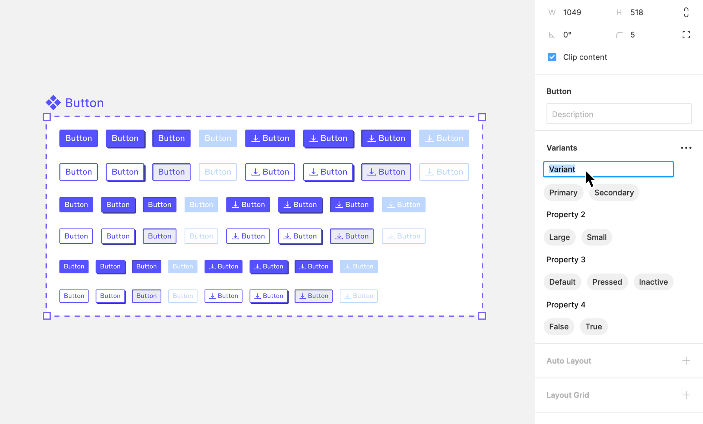

# Week 11 - Design Systems Part 2

<Countdown date="2024-12-25" customMessage="No need to rush ahead. This content will be available before this week's theory class, so just focus on what we're learning this week.">

## Learning Objectives

By the end of this week, students will be able to:

- Define and explain the purpose of components in Figma and their benefits in UI/UX design.
- Create, edit, and organize components in Figma for efficient design workflows.
- Understand and apply the concept of nesting components to create complex UI elements.
- Utilize components effectively in designs, including instantiation and property overriding.
- Integrate and manage local styles within components to ensure consistency and scalability in design projects.

## Introduction to Components in Figma

Components in Figma are powerful, reusable design elements that serve as the foundational building blocks of design systems, enabling designers to create consistent and efficient designs across multiple projects. With a modular approach to designing interfaces, components can be utilized within the same project multiple times or across different projects. Once a master component is created, its instances can be placed anywhere within a design. Crucially, any updates made to the master component are automatically reflected across all its instances, ensuring uniformity and consistency throughout your design work. This is especially beneficial for frequently used elements such as buttons, icons, headers, and footers, allowing for their seamless integration across different screens or projects.

### Benefits of Components

- **Consistency**: Components ensure that your design elements remain uniform across your project, which is crucial for maintaining a cohesive look and feel.
- **Efficiency**: They significantly reduce the time and effort required to make global updates. Changing a single component updates all instances where that component is used.
- **Reusability**: Once a component is created, it can be reused in any number of designs, saving time and fostering a modular design approach.
- **Scalability**: Components make it easier to scale your designs. As projects grow, components can be easily managed and updated, ensuring that large projects remain manageable.

### Difference Between Components and Frames

While both components and frames are essential elements within Figma, they serve different purposes and have distinct characteristics:

- **Frames**: Frames are containers that can hold other objects, including shapes, text, and even other frames. They are used to structure the layout of your design, such as creating the canvas for a webpage or defining the boundaries of a mobile app screen. Frames can also be nested within each other to create complex layouts.

- **Components**: Unlike frames, components are defined by their reusability and the ability to ensure consistency across designs. Components can contain frames, but they come with the added benefit of being instances that are linked back to a master component. This linkage allows for the central management of design elements, where changes to the master component are reflected across all instances.

## Creating and Editing Components

<YouTube
  title="Figma Tutorial: Components - The Basics"
  url="https://www.youtube.com/embed/k74IrUNaJVk?si=h0GvncQBVj2Bft21"
/>

## Creating Component Variants

<YouTube
  title="Figma Tutorial: Variants"
  url="https://www.youtube.com/embed/y29Xwt9dET0?si=RTlkMvLZ1HU-A2T0"
/>

## Creating Components Like a Developer

In our previous discussions on Auto-layout, we drew parallels between Figma's Auto-layout feature and the flexbox property in CSS, illustrating how Figma's design capabilities can mirror web development practices. This analogy extends beyond Auto-layout into other facets of component creation in Figma.

Take the example of implementing a hover effect on a card that triggers the display of a new element. In web development, this effect is usually achieved by incorporating the element in the initial markup but keeping it hidden with CSS until the user hovers over the card. We apply a similar strategy when creating components in Figma. The base component is designed to include the hover state's elements from the start. These elements are then visually hidden or made inactive in the default variant and are only revealed or activated in the hover state variant. This approach not only streamlines the design process but also aligns closely with the logic and practices used in front-end development, facilitating a more cohesive workflow between design and development teams.

## Nesting Components

Nesting components in Figma is a technique that involves placing one component inside another. This approach is instrumental in building more complex and dynamic design systems, allowing designers to create detailed and highly customizable interfaces. By mastering nested components, designers can significantly enhance their workflow efficiency and design consistency.

### Benefits of Nesting Components

- **Modularity:** Nesting components promotes a modular design approach, making it easier to assemble, disassemble, and reconfigure parts of your design.
- **Scalability:** It allows your design system to grow more seamlessly. As new components are needed, they can be created by combining existing ones, saving time and effort.
- **Efficiency:** Updates to base components automatically propagate to all instances where they are nested, streamlining the process of making global changes.
- **Consistency:** Ensures design consistency across projects by reusing components, reducing the risk of discrepancies.

### How to Create and Manage Nested Components

1. **Start Simple:** Begin by creating your base components. These are the smallest, most atomic parts of your design (e.g., icons, buttons).
2. **Combine Components:** To create a nested component, drag an existing component into another component. Figma automatically recognizes this as nesting.
3. **Use Variants:** Leverage variants to manage different states or types of nested components, keeping them organized and accessible.
4. **Organize and Document:** Use Figma’s naming conventions and team libraries to organize your nested components. Documentation helps your team understand how and when to use each component.
5. **Review and Refine:** Regularly review your nested components to ensure they remain efficient and effective. Simplify or decompose them as needed.

## Libraries for UI in Figma

Figma libraries are especially useful for UI design as they allow for the consistent application of design patterns across different screens and projects.

<YouTube
  title="Figma tutorial: Create a shareable team library"
  url="https://www.youtube.com/embed/79T8Q6OBmRk?si=_IkxRjfrfLfE4AnQ"
/>

## Engaging with the Figma Community for UI Inspiration

The Figma Community is a rich resource for UI designers, offering access to a wide range of UI design templates and UI kits.

### Benefits of the Figma Community for UI Designers:

1. **UI Templates**: Find and use templates specifically created for UI designs.
2. **Learning from Experts**: Follow leading UI designers to learn from their designs and workflows.
3. **Sharing and Feedback**: Share your UI designs to get feedback and suggestions from the community.

By focusing on these aspects, you can effectively use Figma to create, manage, and share UI design components and assets, ensuring a consistent and user-friendly experience.

</Countdown>
