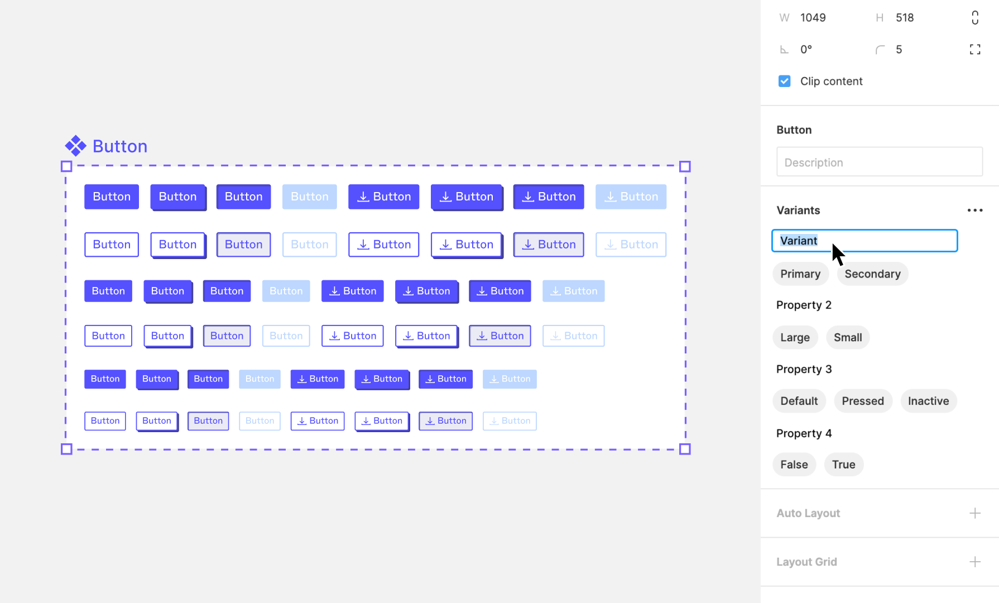
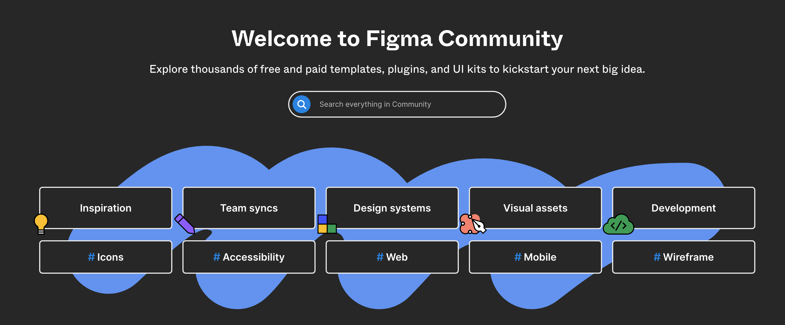

# Week 12 - Design Systems Part 2

## Managing Design Assets and Components for Mobile UI

When managing design assets and components for mobile UI, special considerations are needed to ensure that the designs are responsive, accessible, and user-friendly.

### Key Considerations for Mobile UI Asset Management

1. **Responsive Assets**: Ensure your assets are optimized for different screen sizes and resolutions. This includes scalable vector graphics and responsive icons.
2. **Touch Targets**: Design assets should accommodate touch interactions, with adequately sized touch targets for comfortable use.
3. **Accessibility**: Assets should be designed with accessibility in mind, including color contrast and legibility.
4. **Device-Specific Assets**: Consider creating assets for different mobile operating systems, as iOS and Android might have different design guidelines.

## Creating Components for Mobile UI in Figma

In Figma, creating components for mobile UI involves understanding the nuances of mobile interfaces, such as smaller screens and touch interactions.

<YouTube
  title="Figma Tutorial: Components - The Basics"
  url="https://www.youtube.com/embed/k74IrUNaJVk?si=h0GvncQBVj2Bft21"
/>

### Creating Component Variants for Mobile UI

Component variants for mobile UI should include different states (e.g., default, pressed, disabled) and adapt to various screen sizes.

#### Steps to Create Mobile-Friendly Component Variants:

1. **Design for Touch**: Ensure buttons and interactive elements are of a size that's easy to tap.
2. **Consider Screen Real Estate**: Design variants that make efficient use of the limited screen space.
3. **State Variants**: Include variants for different user interaction states like hover, clicked, or disabled.

### Types of Components

In mobile UI design, various types of components are used to create an intuitive and effective user interface. Understanding these types is crucial for creating a versatile and comprehensive design system.

1. **UI Controls**: These are interactive elements like buttons, sliders, and switches that enable users to perform actions.
2. **Navigation Components**: Elements such as tab bars, menus, and drawers that help users navigate through the app.
3. **Input Components**: Fields like text boxes, checkboxes, and toggles that allow users to enter or select information.
4. **Feedback Components**: These include alerts, toasts, and progress bars that provide feedback to users based on their interactions.
5. **Containers**: Elements like cards, modals, and panels that hold content and organize the layout.
6. **Informational Components**: Items such as badges, tooltips, and labels that display information in a concise format.
7. **List and Grids**: Used for displaying collections of items in an organized manner, such as lists of contacts or photo grids.
8. **Media Components**: Components that handle media content like images, videos, and audio players.
9. **Charts and Data Visualization**: Elements used to represent data graphically, like graphs, pie charts, and timelines.

Each type of component plays a specific role in the mobile UI, and understanding their use and best practices is key to creating a functional and aesthetically pleasing app.

### Creating a Responsive Button Component with Auto Layout in Figma

Designing a responsive button in Figma using Auto Layout allows the button to adjust its size automatically based on its content, ensuring consistency and efficiency in your designs. Here’s how to do it:

#### Step 1: Set Up the Basic Button

1. **Draw the Base Shape**: Use the Rectangle tool to create the button's shape. Choose a default size that's versatile for most use cases.
2. **Apply Styling**: Add your desired color, border radius, and any necessary shadows. Ensure the design is accessible, with adequate color contrast.

#### Step 2: Add Text and Icons

1. **Insert Text**: Use the Text tool to add your button's label. Ensure the font size is readable on mobile devices.
2. **Add Icons (Optional)**: If needed, include an icon. Make sure its size is balanced with the text.

#### Step 3: Implement Auto Layout

1. **Select Elements**: Select both the text (and icon if applicable) and the button shape.
2. **Enable Auto Layout**: Click on the 'Auto Layout' button in the toolbar. This groups the items into a frame with Auto Layout applied. In most cases, by enabling auto layout, the base shap
3. **Adjust Padding**: Set the padding around the text (and icon) to ensure the button looks balanced. This padding will be maintained regardless of the button's width.

#### Step 4: Convert to a Component

1. **Create a Component**: With the Auto Layout frame selected, create a component using Figma’s 'Create Component' feature.
2. **Name Your Component**: Give it a logical name, like `Button/Primary`.

#### Step 5: Create Variants

1. **Duplicate for Variants**: Make copies of the base component for different states like hover, pressed, and disabled.
2. **Modify Styles**: Adjust the styling for each state. For example, change the background color for the hover state.
3. **Use Variants Feature**: Group these states using Figma's Variants feature, keeping them under one component set.

#### Step 6: Responsiveness and Constraints

1. **Set Constraints**: If your button includes an icon, set constraints to ensure elements stay correctly aligned when the button size changes.
2. **Test Responsiveness**: Place the button in different layouts to see how it adapts to various widths.

#### Step 7: Testing and Iteration

1. **Contextual Testing**: Test your button in multiple contexts to ensure its design and functionality are consistent.
2. **Iterate Based on Feedback**: Make adjustments based on any issues or feedback you encounter during testing.

#### Step 8: Documentation and Sharing

1. **Document Usage**: Write guidelines on how to use the button component, including descriptions of each variant.
2. **Distribute in Team Library**: Share your component in a shared library for your team, ensuring everyone has access to the latest version.

By utilizing Auto Layout in Figma, you can create a button component that is not only visually consistent but also dynamically adjusts to its content, making your mobile UI design more efficient and adaptable.

### Creating Component Varients

<YouTube
  title="Figma Tutorial: Variants"
  url="https://www.youtube.com/embed/y29Xwt9dET0?si=RTlkMvLZ1HU-A2T0"
/>

### Nested Components for Mobile UI

Nested components in mobile UI design can help in creating complex yet consistent interfaces, like navigation menus or form elements.

#### Tips for Nested Components in Mobile UI:

1. **Modular Design**: Create components that can be easily combined to form more complex UI elements.
2. **Scalability**: Ensure that nested components are scalable and adaptable to different screen sizes.

### Nested Button Component

Creating a nested button component in Figma is similar to making a standard button using Auto Layout, with a key difference in how you handle the icon. Here's how to approach it:

#### Steps to Create a Nested Button Component:

1. **Start with the Basic Button Setup**: Follow the initial steps for creating a standard button using Auto Layout. This includes drawing the base shape and applying your desired styling for color, border radius, and shadows.

2. **Add an Icon Component**: Instead of using a static icon, incorporate an icon component. This approach allows for greater flexibility. You can easily switch between different icon variants within the button, enhancing the button's adaptability and functionality.

3. **Implement Auto Layout**: Group the text and the icon component along with the button shape. Enable Auto Layout to ensure that the button adjusts its size dynamically based on the content, maintaining a balanced and cohesive design.

4. **Convert to a Component**: With the Auto Layout frame selected, create a component. This step transforms your button into a reusable design element that can be consistently applied across various parts of your project.

5. **Create and Manage Variants**: Develop different variants of the button for states like hover, pressed, and disabled. Adjust the styling for each state as needed. Utilizing Figma's Variants feature, you can group these states under one component set, simplifying the management and application of these variants.

6. **Test and Iterate**: Place the nested button component in different layouts to test its responsiveness and functionality. Iterate based on feedback or any issues you encounter to refine the design.

7. **Document and Share**: Clearly document the usage guidelines for the nested button component, detailing how to switch between icons and button variants. Share your component in a shared library to ensure team-wide accessibility and consistency.

By incorporating an icon component into your button design, you create a nested button component that offers enhanced versatility. This method allows for easy changes between different icons and button variants, making your design system more dynamic and efficient.

## Libraries for Mobile UI in Figma

Figma libraries are especially useful for mobile UI design as they allow for the consistent application of design patterns across different screens and projects.

<YouTube
  title="Figma tutorial: Create a shareable team library"
  url="https://www.youtube.com/embed/79T8Q6OBmRk?si=_IkxRjfrfLfE4AnQ"
/>

### Tips for Using Figma Libraries in Mobile UI Design:

1. **Device-Specific Libraries**: Create separate libraries for iOS and Android to adhere to their specific design guidelines.
2. **Responsive Components**: Include responsive components in your libraries that adapt to different screen sizes.
3. **Accessibility Guidelines**: Incorporate accessibility guidelines in your library components to ensure inclusive designs.

## Figma Plugins for Mobile UI Design

Figma plugins can significantly streamline the process of designing mobile UIs.

### Recommended Figma Plugins for Mobile UI:

1. **Responsive Resize**: This plugin helps in quickly resizing components for different screen sizes.
2. **Mobile Patterns**: Provides a collection of design patterns specifically for mobile interfaces.
3. **Flowkit**: Useful for creating user flow diagrams in mobile app designs.

## Engaging with the Figma Community for Mobile UI Inspiration

The Figma Community is a rich resource for mobile UI designers, offering access to a wide range of mobile-specific design templates and UI kits.

### Benefits of the Figma Community for Mobile UI Designers:

1. **Mobile UI Templates**: Find and use templates specifically created for mobile UI designs.
2. **Learning from Experts**: Follow leading mobile UI designers to learn from their designs and workflows.
3. **Sharing and Feedback**: Share your mobile UI designs to get feedback and suggestions from the community.

By focusing on these aspects, you can effectively use Figma to create, manage, and share mobile UI design components and assets, ensuring a consistent and user-friendly mobile experience.
