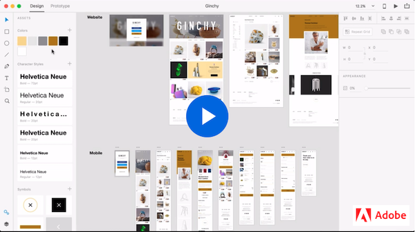
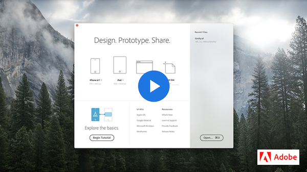

# Week 12 - Introduction to Adobe XD

## Hooray! 

Finally, welcome to the Adobe XD, a vector-based user experience design tool for mobile and web apps. XD supports rapid wireframing and interactive click-through visual prototypes. UI/UX designers use Adobe XD to seamlessly iterate and share interactive visual prototypes with team members and reviewers across devices and platforms.  

### WHAT IS ADOBE XD?

Let's watch this videos to learn how Xd let designers create UI visual mockups with speed, precision, and quality.

### XD WORKSPACE

We will get familiar with the workspace and the interface by exploring the in-app resources to learn how to use Adobe XD, or to get a head start on your designs. Learn their respective tools by navigating the Design and Prototype modes.

## Xd Workflow: Design > Prototype > Share

[Design, prototype, and share with Adobe XD](https://helpx.adobe.com/ca/xd/help/adobe-xd-overview.html) article provides a quick reference in XD User Guide.

XD general workflow includes the following high-level steps: Design, Prototype, Share. Follow this series of XD tutorials to obtain a hands-on mobile app prototype building experience. XD supports SVG and bitmap files without any loss of fidelity. It integrates with Illustrator, Photoshop, and After Effects. You can also use plugins to automate repeat operations or parts of designer workflows that are tedious, complex, or repetitive.

### DESIGN

Let's start with **DESIGN** to learn the basics like designing splash screens, importing images, and working with Repeat Grid.

Android uses the Java Virtual Machine (JVM) to run the apps. The JVM is included in the Java Runtime Environment (JRE). Most OS come with this already installed for use.

However, if you want to be able to build and compile applications for Android, you need to have the Java Developer Kit (JDK) Standard Edition (SE) installed. [JDK Download](https://www.oracle.com/java/technologies/jdk8-downloads.html).

We will need the JDK version 8.X 64 bit version for Windows 10. The version number will be listed as 8u221 or something like that. As long as it starts with an 8 and is the 64 bit version we are good.

## Setting up Android Studio

To be able to build our Hybrid Apps for Android we need to have the Android SDK installed. The best way to do this is to install Android Studio.

[Android Studio Download](https://developer.android.com/studio)

## Android SDK and APIs

Once we have Android Studio installed, that means we will have the Android SDK installed and ready to use. In addition to the SDK we need to install API versions. There is a separate API for each Android OS version. Eg: Android Oreo is version 8.0 and 8.1 and uses APIs version 26 and 27.

We will use Android Studio to update and download new API versions. [Read More about updating APIs](apis.md)

If you want to see the current market distribution of the different APIs then you can visit the [Android Dashboard](https://developer.android.com/about/dashboards)

## Gradle

Gradle is a tool that is used by Android to manage the process of compiling apps. There is a version of Gradle installed with Android Studio but we can install and manage one ourselves and then set the Enviornment variable to point to our install location.

On the [Gradle website](https://gradle.org/install), scroll to the `Manual Install` section and download the `binary-only` version. This will give you a `.zip` file that contains all the gradle files.

Download the `.zip` and move the folder to the `extras` folder that is inside the `ANDROID_SDK_ROOT` folder. If the `extras` folder is missing then you can create it.

## Android Devices

Android Devices with the development options turned on.

- Go to the `Settings` for the device and location the `Build Number`, usually in the `About this phone` section.
- Tap 7 times on the `build number` to unlock development features.

## Environment Variables

Environment variables are something that is used by operating systems to save important pieces of information, like the location of program or settings files.

[Learn more and Environment Variables](./env.md)

## Android Virtual Devices and Emulators

An emulator is a virtual machine used to replicate another operating system. In our case, it is a mobile device running Android that we want to emulate.

An AVD is an Android virtual device which is a file that contains settings about the Android device that we want to emulate as well as the specific version of an OS.

[Learn more about AVDs](./avd.md)

## Intro to Cordova

Here is the Cordova Reference [for working with the Android Platform](https://cordova.apache.org/docs/en/latest/guide/platforms/android/)

[Learn about getting starting with Cordova](./cordova.md)

## config.xml

Cordova apps have a settings file, at the root of the project folder, called `config.xml`. This file gets created when you create the Cordova project. It contains the values for the name and version of the project, all the supported platforms and plugins.

[Learn more about config.xml](./config.md)

## deviceready and device plugin

When a webpage loads, we use the `DOMContentLoaded` event to known when the interface is ready to start allowing the user interactions. In a Cordova app, the event we wait for is called `deviceready`. This event tells us that all of the plugins have been loaded AND the `DOMContentLoaded` event has fired.

The `device` plugin is one of the core Cordova plugins which allows us to determine which OS version is on the device, which platform the device is, and the device unique id.

[Learn about the deviceready event and the Cordova device plugin](./device.md)

## TODO

::: tip TODO Before next week

- If you have not read all these notes and watched the videos from this week, do that first.
- Finish reading the notes for week 12 and watch all the videos in the notes for week 13.
  :::
