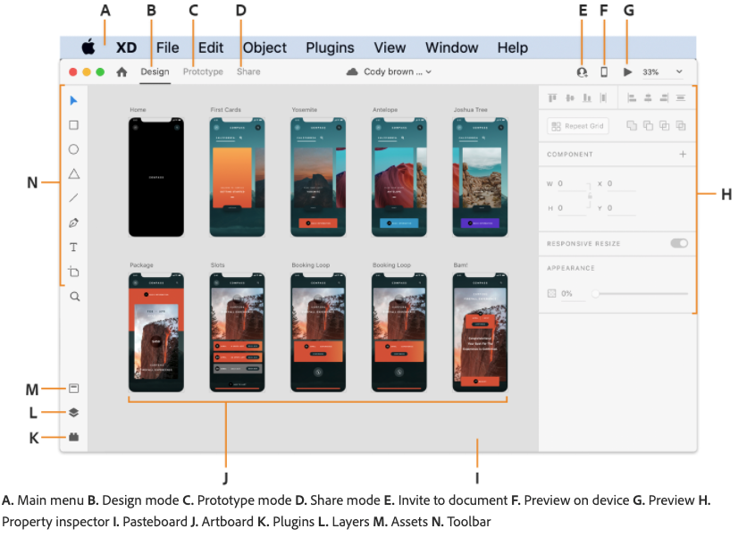
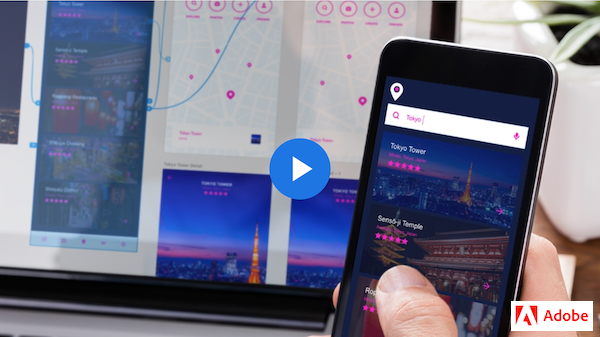
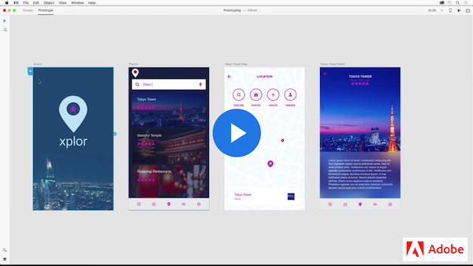
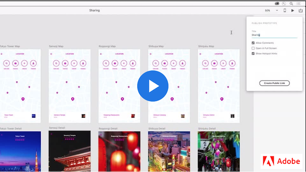
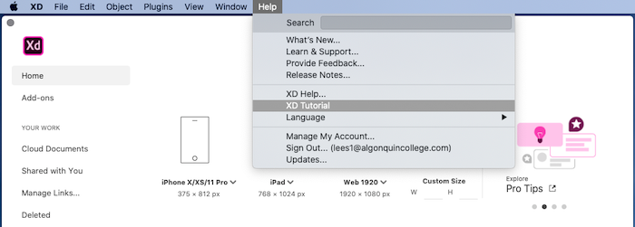

# Week 12 - Introduction to Adobe XD

## Hooray! 

Finally, welcome to the Adobe XD, a vector-based user experience design tool for mobile and web apps. XD supports rapid wireframing and interactive click-through visual prototypes. UI/UX designers use Adobe XD to seamlessly iterate and share interactive visual prototypes with team members and reviewers across devices and platforms.  

[What's new in Adobe XD](https://helpx.adobe.com/ca/xd/help/whats-new.html) will help us keep up with the UI changes because Adobe releases XD updates monthly. 

### WHAT IS ADOBE XD?

Let's watch this videos to get an overview of how Xd let designers create UI visual mockups with speed, precision, and quality. 

<YouTube
  title="Adobe XD Explore the User Interface 2020"
  url="https://www.youtube.com/embed/-hV9kKY5a94"
/>

### XD WORKSPACE

We will get familiar with the workspace and the interface by exploring the in-app resources to learn how to use Adobe XD, or to get a head start on your designs. Learn their respective tools by navigating the Design and Prototype modes.

[*Workspace basics*](https://helpx.adobe.com/ca/xd/help/workspace-basics.html) is a quick reference for Adobe XD user interface. 

## Xd Workflow: Design > Prototype > Share

[*Design, prototype, and share with Adobe XD*](https://helpx.adobe.com/ca/xd/help/adobe-xd-overview.html) article provides a quick reference in XD User Guide.

Follow the Xd tutorials below to obtain a hands-on mobile app prototype building experience. Xd supports SVG and bitmap files without any loss of fidelity. It integrates with Illustrator, Photoshop, and After Effects. You can also use plugins to automate repeat operations or parts of designer workflows that are tedious, complex, or repetitive. 

Before starting the workflow of: Design, Prototype, Share, we will [Download the XD kits.](https://download.adobe.com/pub/adobe/xd/Wires.zip?promoid=VG52KLJG&mv=other) 

### DESIGN

In **DESIGN** step, we will learn the basics for designing splash screens, importing images, and working with Repeat Grid. 

Note: Do you notice that you can click on the artboard name to select/move the artboard and double-click to edit the name? 

### PROTOTYPE

In **PROTOTYPE** step, we will turn our designs into interactive visual mockups. We will wire artboards together, switch back and forth between design and prototype mode and preview our UI experience.

[*Share designs and prototypes*](https://helpx.adobe.com/ca/xd/help/share-designs-prototypes.html) is a user guide that contains the current *Xd* UI features and screenshots. 

### SHARE 

In **PREVIEW & SHARE** step, we will learn to preview our interactive prototpye on a mobile device and share prototype and design specs for feedback with developers and other stakeholders. 

**NOTE:** Xd UI has been updated. Watch this video to locate the "Share" feature in the UI and practice further.

<YouTube
  title="Share Mode – Adobe XD November Release 2019"
  url="https://www.youtube.com/embed/3vj03O641GA"
/>

## Cloud documents in XD

Your Creative Cloud plan includes different types of cloud storage—cloud documents, libraries, and Creative Cloud files (synced files). These have different uses and benefits.

[*Cloud documents in Adobe XD*](https://helpx.adobe.com/xd/help/cloud-documents.html) article is a comprehensive guide for Adobe XD Cloud sharing and collaboration. 

### USING XD CLOUD DOCUMENTS
XD Cloud Documents let us **auto-save** files; **safely keep** everything in one place; make **fast and easy sharing**; work and **live collaborate** with others anywhere with document **versioning** control. 

**Using Cloud Document Files**

If you notice minor UI differences in the video, you can find your way around in the reference of [*Workspace basics*](https://helpx.adobe.com/ca/xd/help/workspace-basics.html) page. 

<YouTube
  title="Adobe XD December 2018 Update: Cloud Document Files"
  url="https://www.youtube.com/embed/H_TmuOJmdkI"
/>

**Cloud Document Sharing** 
We can quickly share documents with collaborators and team members when we save them as cloud documents in Adobe XD.

<YouTube
  title="Adobe XD December 2018 Release: Cloud Document Sharing"
  url="https://www.youtube.com/embed/qICToKxlxAc"
/>

### COEDITING & DOCUMENT HISTORY  

### Xd PRODUCTIVITY

Follow this video to learn `Object Flip`, `Search Layers`, `Linked Symbols (now components)` features.

<YouTube
  title="Adobe XD December 2018 Release: Cloud Document Sharing"
  url="https://www.youtube.com/embed/wHlcOCJycxw"
/>

**Master Components**

`Compenents` are previousely called *Symbols*. Let's watch this Adobe XD tutorial to learn how to effectively utilise the new `Master Components`, and `Component Overrides` features.

<YouTube
  title="Master Components & Overrides in Adobe XD"
  url="https://www.youtube.com/embed/wVJrxdVW15M"
/>

**?? Component States** in Adobe XD – Hover & Micro-Interactions

<YouTube
  title="Adobe XD – Hover & Micro-Interactions"
  url="https://www.youtube.com/embed/c8ov6IzFE0c"
/>

## Built-in XD Tutorial

Now, let's review what we have learned so far by completing this built-in tutorial. 

1. Start Adobe XD
2. From `Help` menu, click to open `XD Tutorial` 
3. Follow the 10 short steps to complete the tutorial  
4. Share for co-editing 
5. Share for development & Comments 

## TODO

::: tip TODO Before next week

- If you have not read all these notes and watched the videos from this week, do that first.
- Finish reading the notes for week 12 and watch all the videos in the notes for week 13.
- [In-class Xd Exercise:](https://www.youtube.com/playlist?list=PLHjwuoik-ep1zZ_xheCvRL8KluMJMjYsV) Adding Interaction to UI layout 
- Final Project: Mobile UI Visual Prototype  
- Hybrid 8 - Coding an SVG Due
  :::