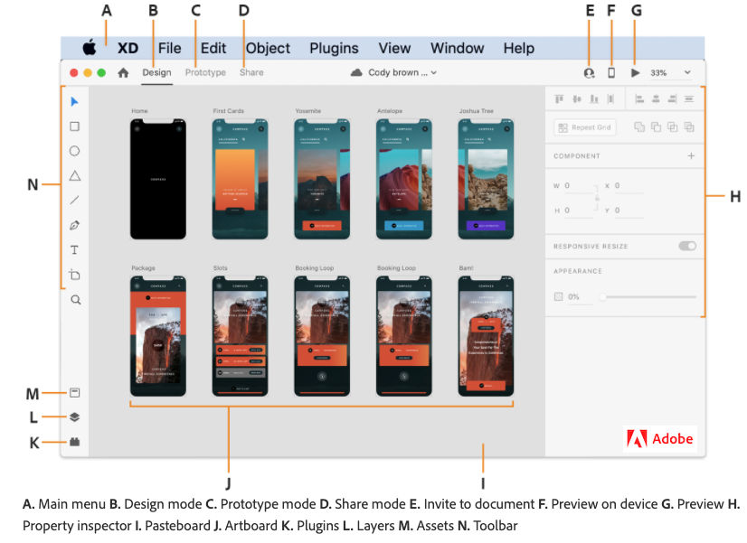

# Week 12 - Introduction to Adobe XD

## Hooray! 

Finally, welcome to Adobe XD (Xd), a vector-based user experience design tool for mobile and web apps. Xd supports rapid wireframing and click-through prototyping. UI/UX designers use Adobe XD to seamlessly iterate and share interactive visual prototypes with team members and reviewers across devices and platforms.  

- [*Adobe XD User Guide*](https://helpx.adobe.com/ca/xd/user-guide.html) contains all reference material 
- [*What's new in Adobe XD*](https://helpx.adobe.com/ca/xd/help/whats-new.html) section will help us keep up with the UI changes from Adobe XD monthly updates. 

### WHAT IS ADOBE XD?

Let's watch this video to get an overview of how Xd let designers create UI visual mockups with speed, precision, and quality. 

<YouTube
  title="Adobe XD Explore the User Interface 2020"
  url="https://www.youtube.com/embed/-hV9kKY5a94"
/>

### XD WORKSPACE

We will get familiar with the workspace and the interface by exploring the in-app resources to learn how to use Adobe XD, or to get a head start on your designs. Learn their respective tools by navigating the Design and Prototype modes.

[*Workspace basics*](https://helpx.adobe.com/ca/xd/help/workspace-basics.html) is a quick reference for Adobe XD user interface. 

#### Work with drawing and text tools

We can quickly create graphics and texts using the `shape` tools, `Pen` tool, and `text` tools in Adobe XD. Read [*Work with drawing and text tools*](https://helpx.adobe.com/ca/xd/help/drawing-text-tools.html) article for a quick reference.

Let's check out the improved shape feature in this video to create customizable star shapes. 

<YouTube
  title="Star Ratio (Jan-2020)"
  url="https://www.youtube.com/embed/RYWiPfNSWkg"
/>

## Xd Workflow: Design > Prototype > Share

[*Design, prototype, and share with Adobe XD*](https://helpx.adobe.com/ca/xd/help/adobe-xd-overview.html) article provides a quick reference in *Adobe XD User Guide*.

Follow the Xd tutorials below to obtain a hands-on mobile app prototyping experience. Xd supports SVG and bitmap files without any loss of fidelity. It integrates with Illustrator, Photoshop, and After Effects. You can also use plugins to automate repeat operations or parts of designer workflows that are tedious, complex, or repetitive. 

Before starting the workflow of: Design, Prototype, Share, we will [Download the XD kits.](https://download.adobe.com/pub/adobe/xd/Wires.zip?promoid=VG52KLJG&mv=other) 

### DESIGN

In **DESIGN** step, we will learn the basics for designing splash screens, importing images, and working with Repeat Grid. 

Note: Do you notice that you can click on the artboard name to select/move the artboard and double-click to edit the name? 

### PROTOTYPE

In **PROTOTYPE** step, we will turn our designs into interactive visual mockups. We will wire artboards together, switch back and forth between design and prototype mode and preview our UI experience.

[*Share designs and prototypes*](https://helpx.adobe.com/ca/xd/help/share-designs-prototypes.html) is a user guide that contains the current *Xd* UI features and screenshots. 

### SHARE 

In **PREVIEW & SHARE** step, we will learn to preview our interactive prototpye on a mobile device and share prototype and design specs for feedback with other designers, developers and even for usability testing. 

**NOTE:** Xd UI has been updated. Watch the video below to locate the "Share" tab in the top right corner and practice further.

<YouTube
  title="Share Mode – Adobe XD November Release 2019"
  url="https://www.youtube.com/embed/3vj03O641GA"
/>

#### Use Xd for Usability Studies

<YouTube
  title="Adobe XD for Usability Studies"
  url="https://www.youtube.com/embed/swKI-M-RViQ"
/>

## Collaboration features in Adobe XD

Creative Cloud plan includes different types of cloud storage features for different uses and benefits: cloud documents, libraries, and Creative Cloud files (synced files).

[*Cloud documents in Adobe XD*](https://helpx.adobe.com/xd/help/cloud-documents.html) article is a comprehensive guide for Adobe XD Cloud sharing and collaboration. 

### USING XD CLOUD DOCUMENTS
XD Cloud Documents let us **auto-save** files; **safely keep** everything in one place; make **fast and easy sharing**; work and **live collaborate** with others anywhere by using the **document versioning control**. 

#### Using Cloud Document Files

Let's practice using cloud document files. If you notice minor UI differences in the video, you can find your way around in the reference of [*Workspace basics*](https://helpx.adobe.com/ca/xd/help/workspace-basics.html) page. 

<YouTube
  title="Adobe XD December 2018 Update: Cloud Document Files"
  url="https://www.youtube.com/embed/H_TmuOJmdkI"
/>

#### Cloud Document Sharing

We will learn how to quickly share documents with collaborators and team members when we save them as cloud documents in Adobe XD.

<YouTube
  title="Adobe XD December 2018 Release: Cloud Document Sharing"
  url="https://www.youtube.com/embed/qICToKxlxAc"
/>

### COEDITING & DOCUMENT HISTORY  

We can collaborate and coedit with others in the same document in **real-time** with Xd. We can also check document history to quickly see who's made edits and revert to old versions when needed. Let's follow this tutorial to use these features.  

<YouTube
  title="Coediting & Document History – Adobe XD November Release 2019"
  url="https://www.youtube.com/embed/XDFE5DH2Z5E"
/>

#### Managing fonts

The design may be altered unexpectedly during collaboration if someone doesn't have the right fonts installed. This tutorial will teach us to identify potential font issues and how to resolve them. 

<YouTube
  title="March 2019: Missing fonts will now load automatically"
  url="https://www.youtube.com/embed/QD1TVEuNNcQ"
/>

**Links**

- [CC Libraries Integration](https://youtu.be/GWuA1y79AT8)
- [Convert Sketch Libraries](https://youtu.be/DHyMngVm8CA)

## Built-in XD Tutorial

Now, let's review what we have learned so far by completing this Xd built-in tutorial. 

1. Start Adobe XD
2. From `Help` menu, click to open `XD Tutorial` 
3. Follow the 10 short steps to complete the tutorial  
4. Share with a classmate for co-editing 
5. Share for development review to obtain comments from two classmates

## TODO

::: tip TODO Before next week

- If you have not read all these notes and watched the videos from this week, do that first.
- Read the notes and watch all the videos for Week 13.
- [In-class Xd Exercise:](https://www.youtube.com/playlist?list=PLHjwuoik-ep1zZ_xheCvRL8KluMJMjYsV) Adding Interaction to UI layout 
- Final Project: Mobile UI Visual Prototype  
- Hybrid 8 - Coding an SVG Due
  :::