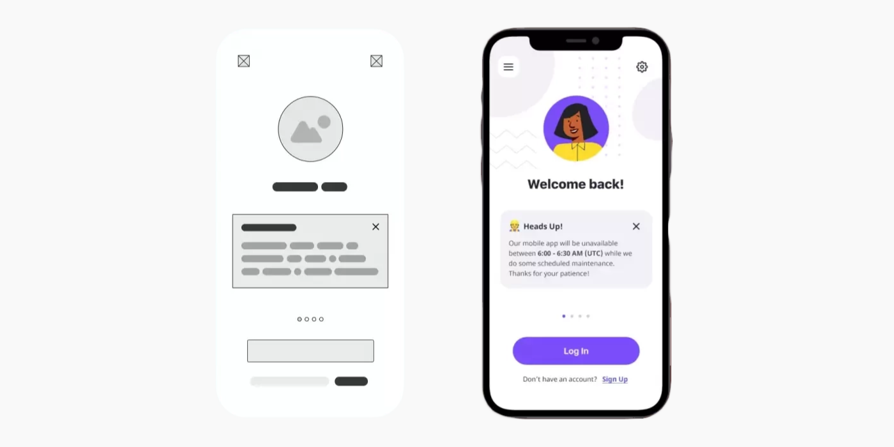
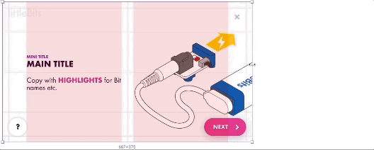

# Week 12 - Visual Design and High-Fidelity Wireframes

## Learning Objectives

- **Maintain Consistency**: Achieve a coherent visual and functional flow throughout the user interface.
- **Incorporate Real Content and Data**: Elevate designs with actual content to assess and improve readability and user engagement.
- **Utilize Design Systems**: Streamline your design process by:
  - Integrating a centralized design system within your wireframe project for enhanced consistency and efficiency.
- **Accessibility Considerations**: Implement inclusive design principles using tools like the Able plugin for Figma to ensure your designs are universally accessible.

## Visual Design

> [Source](https://moqups.com/blog/low-fidelity-vs-high-fidelity-wireframes/)

Visual design is crucial in defining and enhancing user experience. It involves the strategic use of elements such as illustrations, photography, typography, space, layout, and color. These elements work collectively to make digital products not only usable but also visually appealing.

Consider visual design as the defining layer of the design process, providing your product with a unique, recognizable identity that goes beyond mere aesthetics.

## Understanding High-Fidelity Wireframes

High-fidelity wireframes are detailed designs that mirror the final product, focusing on visual and interactive elements. They are essential for:

- **Providing Realism**: Allowing stakeholders to see a close representation of the end product.
- **Enhancing User Experience**: Prioritizing aesthetics and interaction to offer a seamless user experience.
- **Easing Development**: Serving as a comprehensive visual guide for developers, reducing design ambiguities.
- **Gathering Precise Feedback**: Facilitating detailed feedback on a prototype that closely resembles the final application.

### Visual Design vs. Graphic Design

 
<ListItem
imageSrc="/w2024/moduleImages/week12/Visual-Design.png"
title="Visual Design"
content="Focuses on enhancing user experience in digital spaces. It employs elements like typography and color to improve interaction and usability, integrating functionality and user journey into the design.">
</ListItem>

<ListItem
imageSrc="/w2024/moduleImages/week12/Graphic-Design.png"
title="Graphic Design"
content="Centers on creating visual content to communicate messages across digital and print media. It emphasizes artistic expression and visual storytelling, often without the constraints of user interfaces.
">
</ListItem>
 

## Layout Best Practices

A well-organized and visually appealing layout is fundamental in high-fidelity wireframing. Here are essential best practices:

- **Grid Columns Usage**: Implement grids to ensure alignment and consistency across your design. Utilize Figma's grid and column settings to structure your layout efficiently.
- **Consistent Spacing**: Apply consistent spacing between elements to create a balanced and harmonious interface. Use Figma's auto layout feature to manage spacing and alignment effortlessly.
- **Responsive Design**: Design your wireframes to be responsive, ensuring they adapt gracefully across different devices and screen sizes. Leverage Figma's constraints and responsive components to achieve fluid designs.

### Basic Column Setup

To create a basic column setup in Figma, start by defining a grid with columns that reflect your content's structure. Use Figma's layout grids to set the number of columns, gutters, and margins, aligning to the desired width for optimal readability and alignment.

- **Count:** 4
- **Type:** Stretch
- **Width:** auto
- **Margin:** 16
- **Gutter:** 16

## Utilizing Your Design System

::: danger Consistency

All colours and typography used in your high-fidelity wireframes must be defined in your design system. If you find a case where a new style is needed, you will need to update your design system and republish.

:::

In Figma, a library is a collection of design assets, like components, styles, and variables. These design assets live in a single file, but can be reused across different files or projects.

People often use libraries for sharing common design elements, like buttons, icons, pieces of UI, colors, or values for certain properties. This helps everyone stay consistent and makes it easy to build from existing designs.

When someone changes assets in a library, people can quickly review the changes and automatically update their designs. [Click here to read the full article](https://help.figma.com/hc/en-us/articles/360041051154-Guide-to-libraries-in-Figma)

If you have not watched this video from week 11, I recommend you do.

<YouTube
  title="Figma tutorial: Create a shareable team library"
  url="https://www.youtube.com/embed/79T8Q6OBmRk?si=_IkxRjfrfLfE4AnQ"
/>

## Using OS Kits

For certain components like status bars and home indicators, grab the official version from the OS's Figma kit found in the Figma Community.

## Accessibility Considerations

Ensuring your designs are accessible is crucial for reaching a wider audience and complying with legal standards. Use Figma's accessibility tools and plugins, like Able, to check your designs for color contrast, text size, and other accessibility guidelines. Incorporate these practices early in your design process to make your digital products usable by as many people as possible.

### Figma Plugin: Able - Friction-Free Accessibility

Utilize the Able plugin in Figma to enhance your design's accessibility. This powerful tool assists in evaluating color contrast ratios, ensuring text legibility, and adhering to WCAG guidelines, thereby making your designs accessible to a broader audience.
