# Week 13 - Interactive Visual Prototype

## What is Prototyping?

Figma is a great tool for prototyping UX/UI designs. It allows you to create interactive flows directly in the design file with advanced, yet easy-to-use features. In just a few minutes, you can turn your static designs into a realistic version of your app or product.

Creating prototypes is important for many reasons. You can explore how new user flows will work. Communicate interactions to your team. Test and get feedback from your users. And pitch designs to stakeholders for buy-in.

This video maybe out of date, but can still be useful in helping you understand basics.
<YouTube
  title="Figma Tutorial: Prototyping"
  url="https://www.youtube.com/embed/-sAAa-CCOcg"
/>

**Turn your static design files into an interactive experience—no coding required**

- Intuitive build: Simply connect UI elements and choose your interactions and animations.
- Interactions: Define subtle interactions, like on click, while hovering, while pressing a button, and more.
- Mobile-viewing: Experience your designs in real life using our Figma mobile app, available for iOS and Android.

---

### Interface

Assess (almost) all prototype features in the right-hand panel under "Prototype".

<ol type="A">
<li>Prototype panel</li>
<li>Add a new prototype flow</li>
<li>Add and configure interactions</li>
<li>Add and configure overflow scrolling</li>
<li>Configure prototype settings</li>
<li>Present prototype</li>
</ol>

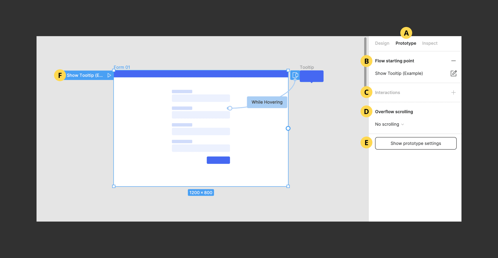

## Getting Started

### Add Prototype Flows

Each page in your Figma file can have one or many prototype flows. Each one needs to have its own starting point and unique name. Select the first frame you wish to appear in your flow and click the "Add" icon next to "Flow Starting Point". Once added, rename the flow by clicking on the name input. Add a description by clicking the "Edit" icon next to the flow name. To remove the starting point click the "Delete" icon next to "Flow Starting Point"

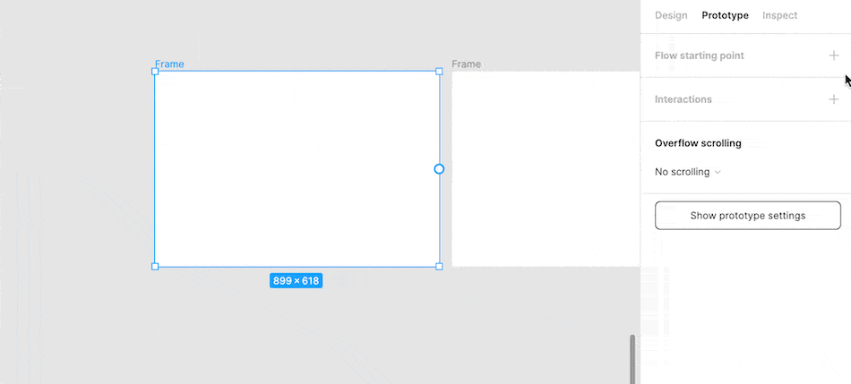

---

### Connect Layers

Add a connection between any two layers (e.g. frames, groups, shapes, text layers, etc..). To add a connection, hover over or select the first layer and drag the blue node that appears to the second layer. The "Interaction Details" menu will then appear. The first layer will become a new flow starting point if has no other connections.

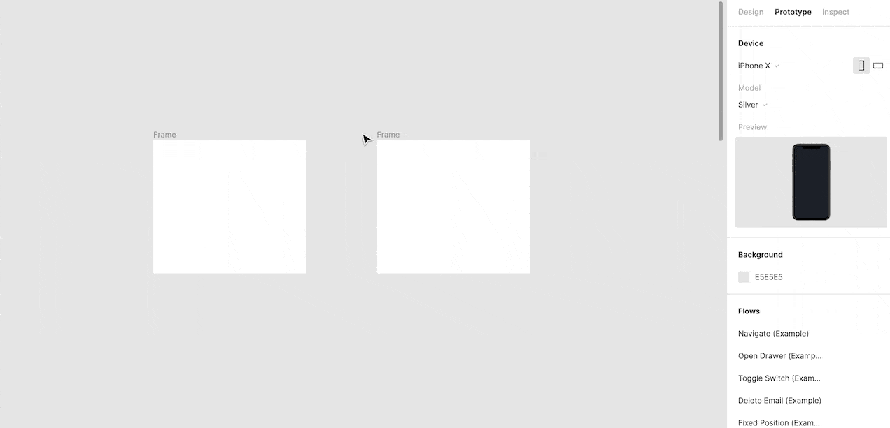

**Create connections**

1. Select the hotspot for the connection.
2. Click the plus icon to create the connection.
3. Drag it to the destination.
4. If there are no existing connections, Figma will make the first frame a starting point.

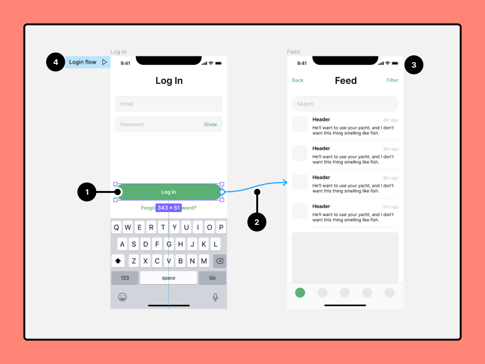

---

### Add Interactions

Interactions are the primary feature used when building a prototype. Use them to show different behaviors, effects, and navigational patterns. They work by connecting two layers, then determining how those layers will interact with each other by adding a trigger, action, and animation. Interactions can be simple with instate animations. Or they can be more complex with animated elements that move or change properties.

**Trigger:** The event that causes a change (on tap/click, on drag, while hovering, while pressing, key/gamepad, mouse enter, mouse leave, mouse down (click), mouse up (release)).

**Action:** The change that is happening (navigate to, change to, open overlay, swap overlay, close overlay, back, scroll to, open link).

**Animation:** The behavior of the change (instant, dissolve, smart animate, move in, move out, push, slide in, slide out).

1. Open the Prototype tab in the right sidebar
2. Add interactions
3. Set interaction details
4. Apply an animation
5. Preview your animation

---

### Animated interactions

Use animations to add movement to your interactions (dissolve, move in, move out, push, slide in, slide out). Select different easing curves and adjust the time to customize the animation.

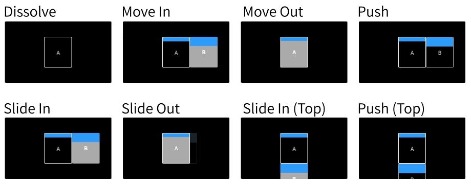

**What are easing curves?** Easing curves determine the speed during the beginning, middle, and end of the animation. A linear animation will move at the same speed the entire time. While an animation set to "ease in" will be slower in the beginning, then speed up. Adding an easing curve makes the animation feel softer and more realistic.

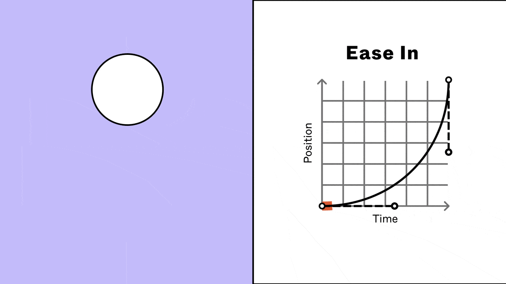

---

### Fixed Position

Fix an element's position in your prototype so it will stay in the same location while scrolling. This is helpful for elements that you wish to always be in view (e.g. top/bottom navigation, FAB, CTA). Configure this setting in the Design Panel under "Constraints".

**Example: fixed top & bottom navigation**

Select layer(s) you wish to fix and choose "Fix position when scrolling"

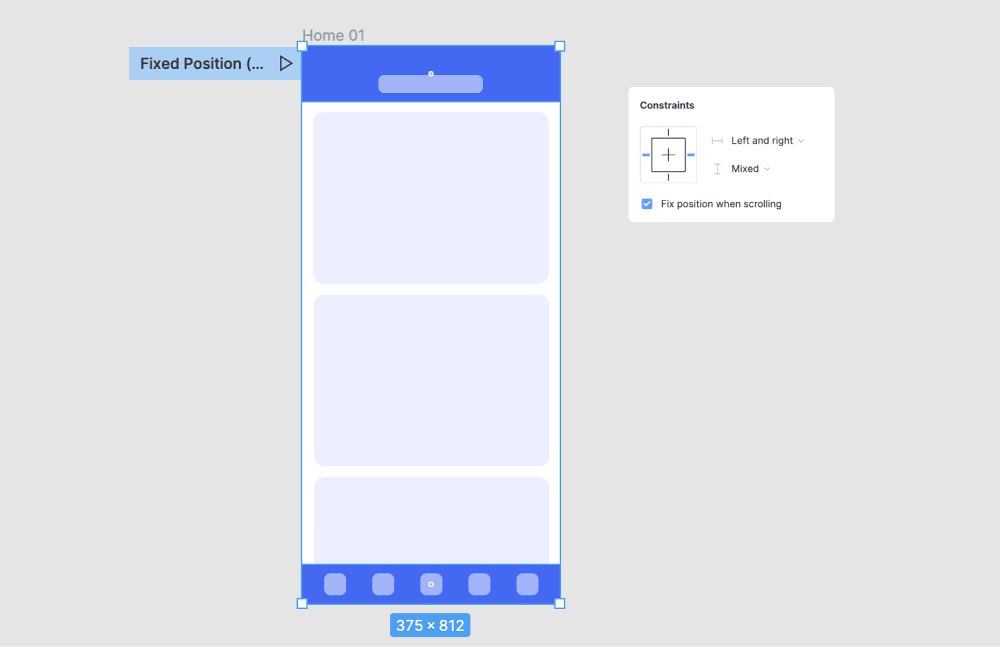

---

### Add overflow scrolling

Overflow scrolling allows you to scroll through individual frames inside your prototype. This is helpful when prototyping UI regions or components that have their own scrolling behavior (e.g. lists, carousels, menus, tables). To use overflow scrolling, you must have a frame (not group) with nested content "overflowing" past the bounds. This content will then appear masked with "clipped content" turned on.

**Example: carousel**

Select frame with overflowing content and choose "Horizontal Scrolling"

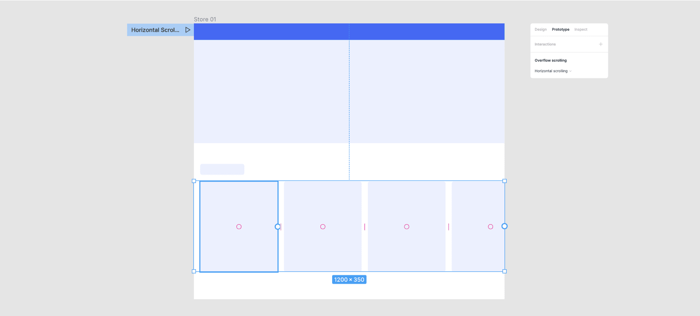

---

### Use interactive components

Add interactions between variants in a component set. Instances of those variants will then follow their predetermined interactions in any prototype. This is particularly helpful for common, stateful, components (e.g. toggles, buttons, inputs). Defining interactions in advance makes prototyping faster and reduces the number of screens needed. Not familiar with variants? Learn more about them in Figma Variants 101

<YouTube
  title="Figma tutorial: Interactive components"
  url="https://www.youtube.com/embed/ReNbXhaL3Xk"
/>

**Example: interactive checkbox**

Click the deselected icon to change to the selected icon with an instant animation. THEN click the selected icon to change to the default icon with an instant animation. NOTE: using interactive components allows the user to select any combination of items, in any order, with no additional prototyping.

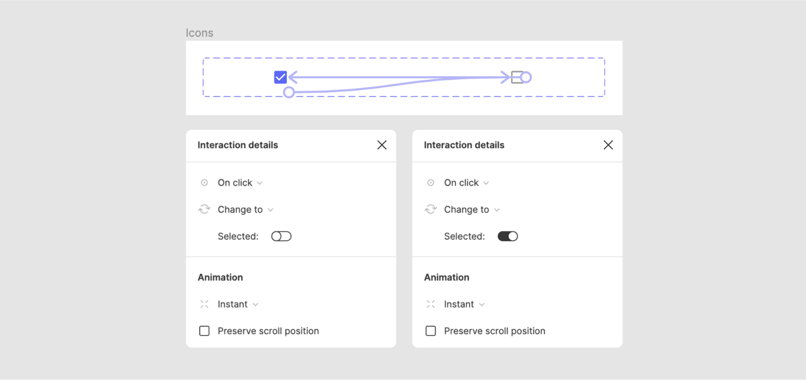

---

### Adjust prototype settings

<ol type="A">
<li>Select a Device and Model</li>
<li>Preview your prototype</li>
<li>Select Background color</li>
<li>Set the prototype's Starting Frame</li>
</ol>

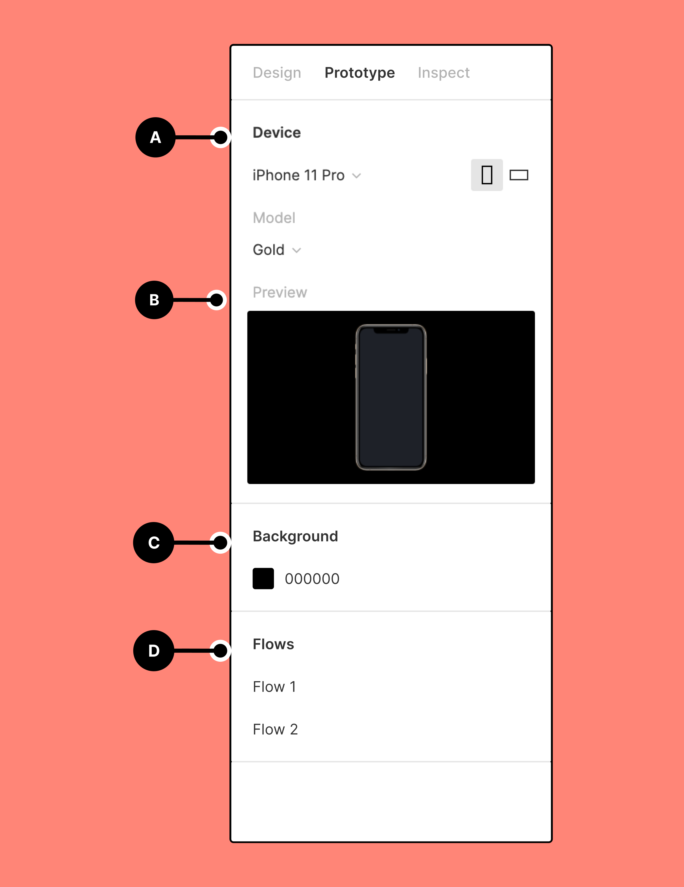

---

### Present Prototype

Use presentation view to preview static designs, or interact with prototype connections you've created. Your design must be within a frame to preview it in Presentation view.

To access presentation view from any Figma design file, click play in the toolbar.

If there are prototyping connections, Figma will only display those frames with connections. Click through each screen or interact with any hotspots.

If there are no prototyping connections, you can navigate through frames on the current page.

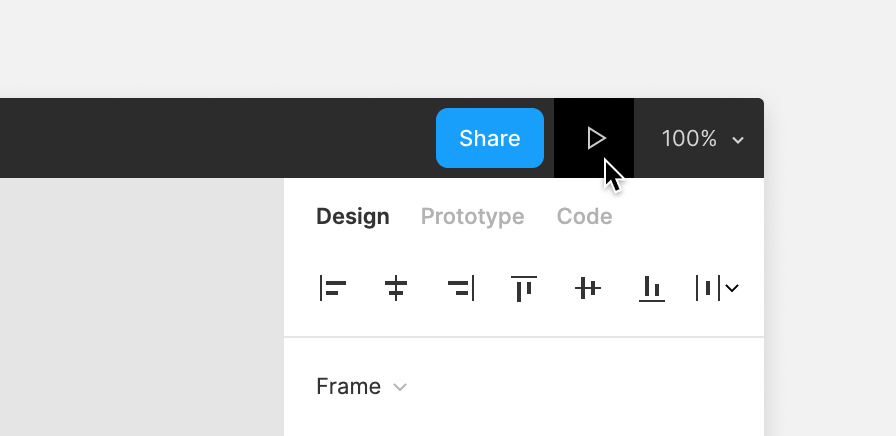

---

### Presentation View

<ol type="A">
  <li>Click to show and hide the left sidebar</li>
  <li>Click to enter comment mode and add comments to the prototype</li>
  <li>View and select flows</li>
  <li>View a flow's description</li>
  <li>Set the prototype view Options and hide the toolbar or comments</li>
  <li>Click to enter fullscreen mode</li>
  <li>Figma will present the device against the Background Color you selected</li>
  <li>View the Device you selected in your prototype settings</li>
  <li>View your cursor or touch indicator (mobile device prototypes only)</li>
  <li>Interact with hotspots or enter keyboard shortcuts within your prototype</li>
  <li>Use and to move between screens. Or use your arrow keys on your keyboard</li>
  <li>Use the Restart button or press R to return to the starting point</li>
</ol>

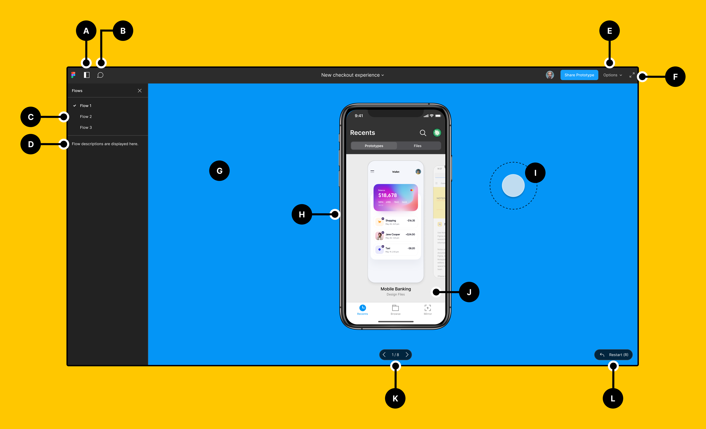 -->
