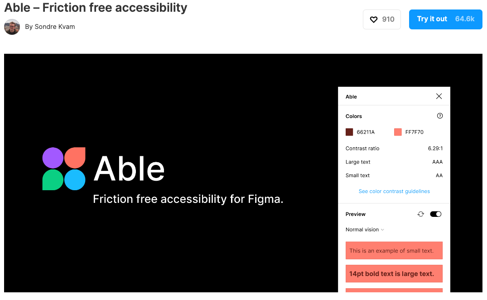
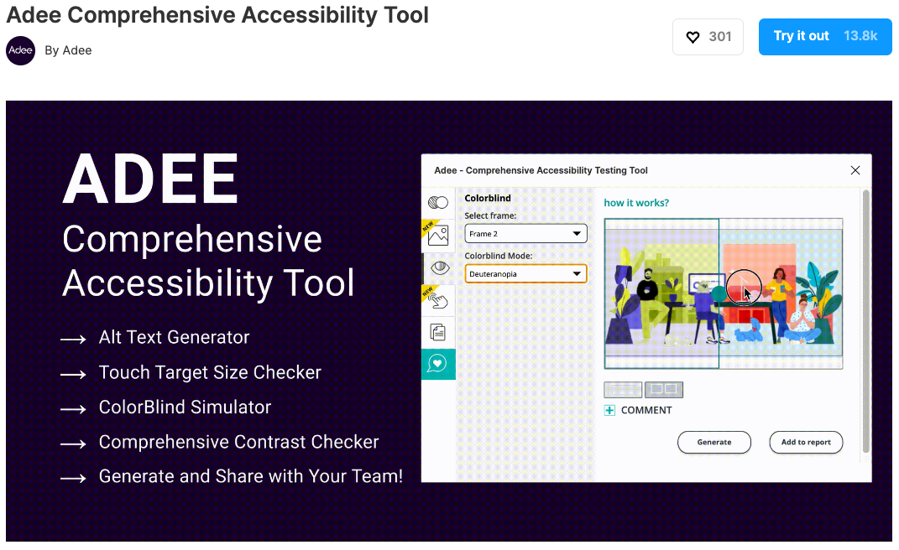

# Week 13 - Accessability

## Introduction

Mobile apps continue to proliferate, adding convenience to our lives–but that doesn’t always translate to a better experience for everyone. Many apps are not created with all users in mind, which can make them frustrating, difficult, or even impossible for people with disabilities to use. Fortunately, there is a roadmap for making mobile apps and mobile versions of websites accessible.

The Web Content Accessibility Guidelines [WCAG](https://www.accessibilitychecker.org/guides/wcag/), which all accessibility standards are based on, applies to both web pages and web applications, including native and hybrid apps. These guidelines provide detailed instructions on how website and app owners can make their platforms accessible to users with varying disabilities, ensuring they are not discriminated against in day-to-day life.

<!--  -->

WCAG forms part of the Web Accessibility Initiative (WAI) of the World Wide Web Consortium (W3C). This initiative was created to ensure that disabled users don’t encounter any barriers when browsing websites and engaging with mobile apps, which are now an essential part of our lives.

## Who needs an accesible mobile app?

You may not know this but a large percentage of users who have tried to download and engage with your app have a disability. And when they can’t use your app in the way they were hoping, they simply delete it, and your brand loses another customer.

The following people require an accessible mobile app:

People with cognitive impairments. This includes conditions such as ADD, dyslexia, and Alzheimer’s. These users are either easily distracted, or they cannot follow too many different screens or themes.

Users with visual impairments. This includes color blindness as well as complete blindness. People with visual impairment rely on contrast and visual alternatives to process content.

People with auditory impairments. Anyone with partial or complete loss of hearing won’t be able to process all app content if it’s inaccessible – auditory alternatives are required.

Users with mobility impairments. Users with a mild or severe mobile impairment won’t be able to move dexterously or tap with purpose when using an app.

## WCAG Principles That Apply to Mobile App Accessibility

The Web Content Accessibility Guidelines are based on 4 specific principles. It’s important to keep each of these principles in mind during the mobile app accessibility process.

Perceivable. Any information, as well as the components of your mobile app, needs to be presented in the most perceivable way possible.

Operable. Any app interface components, including the navigation, needs to be operable, regardless of ability.

Understandable. Any and all information and app functionality must be understandable to all users.

Robust. Lastly, all mobile app content must be robust enough to be easily interpreted by a range of different user agents, including assistive technologies.

## Mobile Application Accessibility Checklist

When it comes to making sure your mobile app is accessible to disabled users, there are a few key aspects you should focus on.

### Keep Different Screen Sizes in Mind

When designing any app, it’s important to remember that users will have different screen sizes. To accommodate those with smaller screens, you will need to keep information on each page to a minimum, adjust the position of form fields, and use a reasonable content size.

### Pay Attention to Color Contrast

Since many mobile apps will be used outdoors and by disabled users, color contrast is an essential accessibility consideration. Text should have a color contrast ratio of at least 4.5:1, while larger text should be at least 3:1.

### Simplify App Gestures

Any gestures required to operate a mobile app should be kept as simple as possible to accommodate users with disabilities. Opt for tap or swipe gestures as opposed to more complex ones.

### Adjust Tap Target Sizes

If your app displays multiple elements at once, they should be large enough and spaced out so that app users can easily tap them. This includes elements such as buttons.

### Make Data Entry Easy

Since text entry can be a tricky and time-consuming task for many users, it’s essential to provide easy methods for data entry. For one, you can reduce the amount of text required by adding checkboxes and auto-filling information such as the date and time. Providing autofill and data sharing functionality is also recommended.

### Keep Layouts Consistent

Any information that’s present across multiple screens on your app should be consistent. Even if you need to place your navigation in a hamburger menu on certain screens, make sure the menu items are in the same order.

## Figma Plugins to help design accessible apps

Add color contrast and color blindness to your workflow with as little effort as possible. Open Able and we will automatically compare the contrast between two layers you select. This way, you can keep Able open, and casually select layers to compare without re-running or updating the plugin!

Adee is a comprehensive and powerful accessibility testing tool. You can test color contrast and apply changes, simulate 8 color blind simulations and generate them, test touch target sized to make sure they meet the various device standards and share test results with your team! ... and more!

## Resources

[Apple's Human interface Guidelines - Accessibility](https://developer.apple.com/design/human-interface-guidelines/foundations/accessibility/)

[Google's Material Design - Accessibility](https://m2.material.io/design/usability/accessibility.html#understanding-accessibility)

[WCAG 2](https://www.w3.org/WAI/standards-guidelines/wcag/)

::: tip To Do for Next Week

- Complete Parts 2 -4 of your Final Project
- Review content from this week
- Complete Figma Quiz
- Prepare for Part 5 of your Final Project
- Sign-up for your teams presentation time
  :::
